# Tutorial: Multiplication On A Circle With Modulo

In this tutorial, we are implementing the *Multiplication On A Circle With Modulo* algorithm within Unreal Engine. We also provide you with a possible [completed scene](https://github.com/ctechfilmuniversity/lecture_ss24_procedural_generation_and_simulation/blob/main/docs/01_sessions/01/pgs_t1_multicircle/pgs_t1_multicircle.zip).

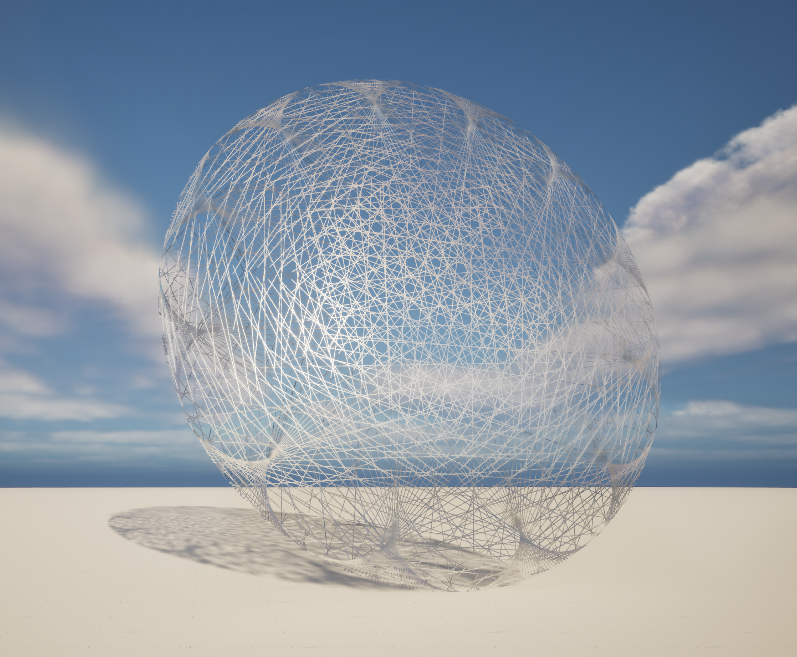  
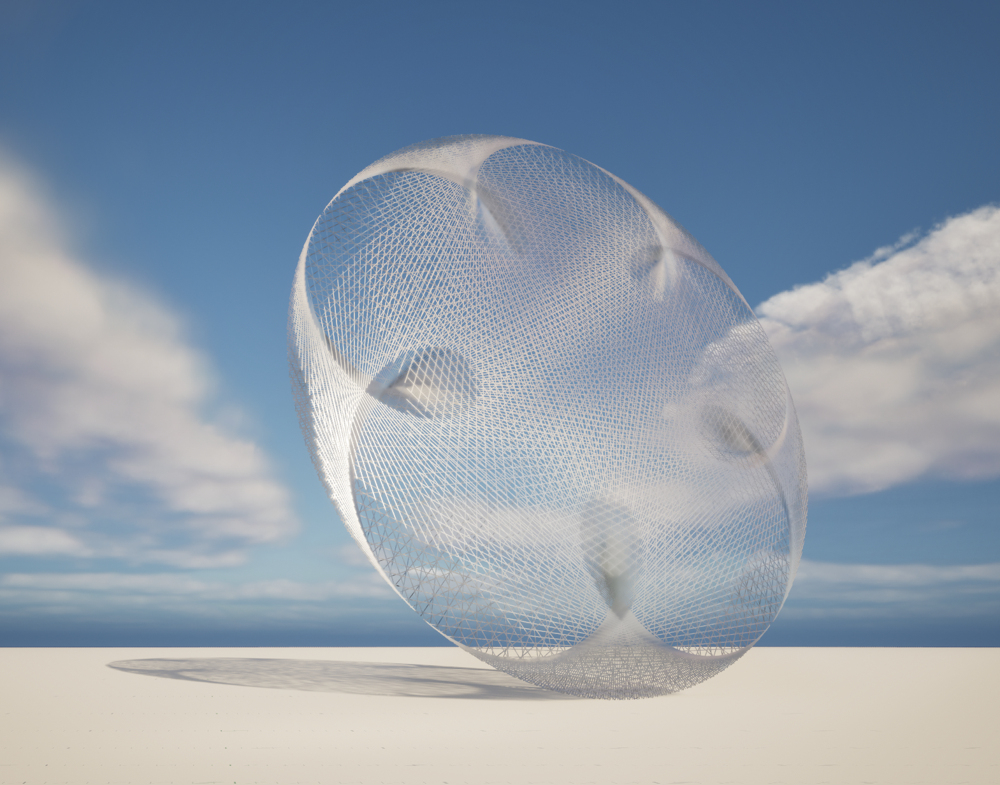  
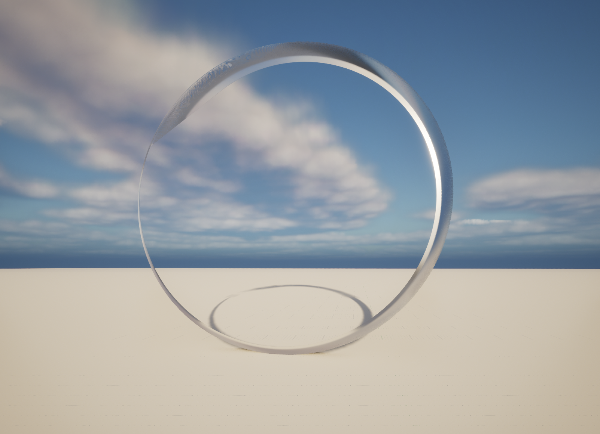  
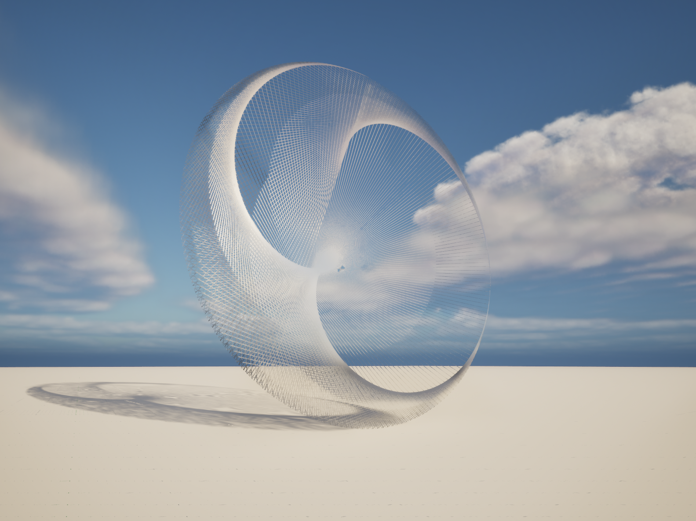  

* [Tutorial: Multiplication On A Circle With Modulo](#tutorial-multiplication-on-a-circle-with-modulo)
    * [Requirements](#requirements)
    * [Open Issues](#open-issues)
    * [Steps](#steps)
        * [Actor](#actor)
        * [Blueprint](#blueprint)
            * [Trigger](#trigger)
            * [Drawing (Mesh) Lines In A Circle](#drawing-mesh-lines-in-a-circle)
        * [Result](#result)
    * [Connect The Right Points Around Circle](#connect-the-right-points-around-circle)


## Requirements

This tutorial is written with version 5.3.

## Open Issues

There are several aspects that I haven't figured out yet:

- How to adjust the loaded static mesh and how to include a custom made static mesh (I tried for about an hour and gave up).
- How to create an additional mesh for the circumference in the same blueprint (I tried for about 30 min and gave up).
- How to capsule the computation of the position of a point on the circumference in a function (haven't tried it; the documentation about this looks pretty straight forward).
- How to propagate the variable to the UI of the actor outside of the blueprint view (I haven't looked into this yet).

## Steps

As of now, this is not a precise step by step tutorial but we intentionally leave some details for you to figure out. We are also giving you the Unreal file and you can always check with that file if you get stuck. 

### Actor

We can add an `Actor` to the scene via the add actor menu: `Basic -> Actor`

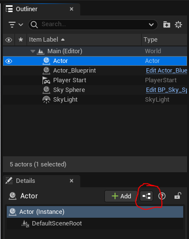

By clicking _this_ button (see picture), we can turn the actor into a reusable blueprint class that can have scripting behaviour.

### Blueprint

#### Trigger

To trigger script execution, a blueprint has four default triggers when created:
- `Event BeginPlay`: Once the playbutton is pressed in the scene
- `Event ActorBeginOverlap`: Once another actor overlaps with this actor (like a triggerzone)
- `Event Tick`: Once every frame
- `ConstructionScript`: Once the actor is placed / updated in the scene (before the scene is played)

We want to use `ConstructionScript` in our case.

#### Drawing (Mesh) Lines In A Circle

##### Drawing One Line

Our basic logic to drawing a mesh line _(mesh means that the line will be an actual 3D object, not a 2D line across for example the HUD)_ is using the nodes `Add Spline Mesh Component` and `Set Start and End`


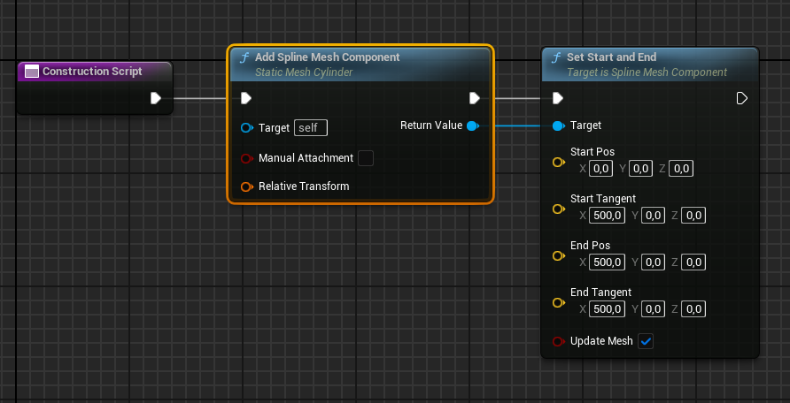

_Make sure to drag a connecting line from the `Add Spline Mesh Component` into the grid to get a node search where you can find `Set Start and End`. If you just use right click to find the node, it won't work - it has to be created in the context of the `Add Spline Mesh Component` node!_

You won't see anyting. We still need to tell the `Add Spline Mesh Component` which mesh to wrap around the created spline. Click on the component and you will find the `Static Mesh` option in the `Details` window:

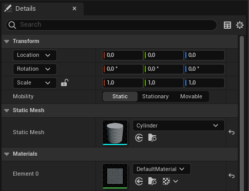

Set a mesh.

##### Drawing Multiple Lines

To draw multiple lines, create multiple spline mesh components, we can use the `For Loop` node.

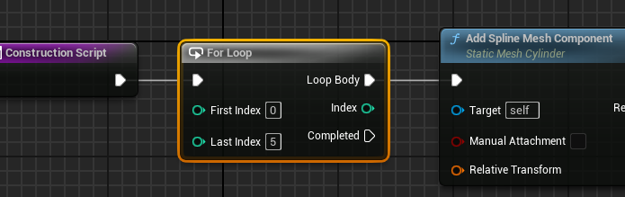

By right clicking on the `Last Index` parameter we can promote the aparameter to a variable we can then use to also calculate things with later.

Once promoted, you can rename the variable in the `Details` window.

##### Drawing Lines In Circle

To arrange things in a circle (where the center point is at [0, 0]), the logic is as follows:
``` c#
for(int i = 0; i < count; ++i) {
    float circleposition = (float)i / (float)count;
    float x = Mathf.Sin( circleposition * Mathf.PI * 2.0f ) * radius;
    float y = Mathf.Cos( circleposition * Mathf.PI * 2.0f ) * radius;
    float z = 0.0f;
    Vector3 position = new Vector3( x, y, z);
}
```

We can implement the algorithm using the math nodes Unreal Engine provides: 

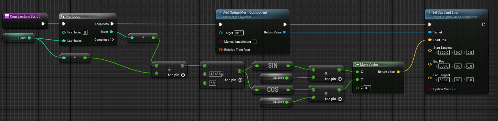

_Note: Make sure to convert your integer variables to floats. Else you won't be aple to multiply them with decimal values like PI!_

Lastly, we want the lines arranged in a circle to all end at [0, 0].

So we will create a new `Make Vector` node with the end coordinates so that we can also use these coordinates to easily calculate the direction of our start vector.

This is important so the tangents of the spline align with the direction of the vector and our mesh won't look weird.

Thankfully, can easily do that using the `Get Unit Direction (Vector)` node:

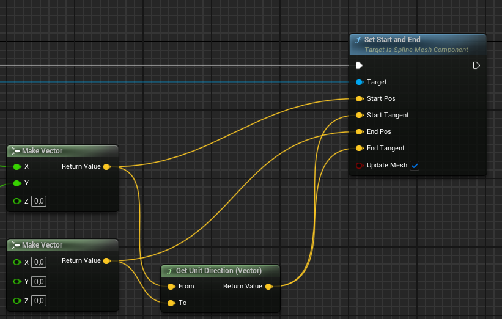

### Result

If done right, your actor should now look somewhat like this:

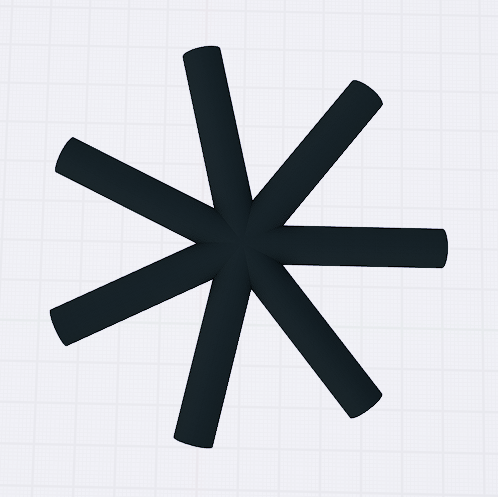

of course, the look depends on the `n of lines`, your `radius` and the mesh specified in the `Spline Mesh Component`.


## Connect The Right Points Around Circle

Now it is time for you to adjust your blueprint to get the pretty lines we have seen in class with the algorithm. 

Except for the `Modulo` node, you already have all the nodes you will need to get the desired result on top of this page.

Get yourself a `Modulo` node by right-.clicking and searching for "%".

Now, look at this explaination of the algorithm and figure out how to adjust your blueprint accordingly:

_"To create a modular multiplication circle, you pick two numbers; let's call them **mod** and **mult**. The circle we create will have **mod number of points**. To each point, we just assign each point a number from 0 to mod−1. For example, if mod=60, then we number the points from 0 to 59, starting at the top of the circle and going clockwise._

_[...]_

_So then for each point in the circle (call this the starting point), take the **number representing that point, multiply it by mult and find the remainder when you divide it by mod**. Find the **point represented by the remainder (the ending point), and connect the two points**."_

_Explaination taken from:  Yashas Lokesh https://yashaslokesh.github.io/mod-mult-circle.html_