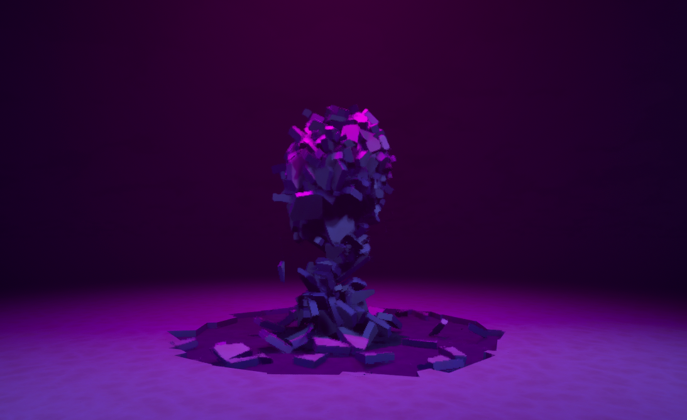

**Procedural Generation and Simulation**  

Prof. Dr. Lena Gieseke \| l.gieseke@filmuniversitaet.de  

# Intro To Chaos

This document will not function as self-contained tutorial but is really only meant to be accompanying the live lecture.

* [Intro To Chaos](#intro-to-chaos)
    * [Overview](#overview)
    * [Reversing Gravity](#reversing-gravity)
        * [The Fracturing](#the-fracturing)
            * [Geometry and Materials](#geometry-and-materials)
            * [Fracture Mode](#fracture-mode)
        * [Geometry Collection Floor](#geometry-collection-floor)
            * [Properties](#properties)
        * [Master Field Settings](#master-field-settings)
            * [Animation](#animation)
            * [Properties](#properties-1)
        * [Floor Expansion](#floor-expansion)
        * [Better Lighting](#better-lighting)

## Overview

* Fracturing
    * Shift-B Stop showing bone colors
    * Explode (shift + e, shift + q) to see transforms
    * Outliner
    * Play
    * Select All, Fracture Again
    * View Settings, see different levels, select level under Fracture Level (cycle through with shift + w)
    * Various selection modes, e.g. inverse, siblings, etc.
    * Reset
* Clusters
* Materials
* Fields
    * Content (under Settings enable Show Engine Content), search for fs_
    * Anchor fields, hold containing piece where they are
    * Sleep disable: freeze in place (inside of the field), e.g. for jittering pieces on the floor
    * MS Masterfield: force as parameter are put, e.g. radially or directionally, set Directional Magnitude and enable Use Directional Vector
    * Bomb field: same as master field but already 

## Reversing Gravity

* New Level, Basic Scene, Delete Player, Move Light out of the way
* Control + L: Adjust Time of Day
    * Edit Project Settings: Turn off Auto Exposure

### The Fracturing

#### Geometry and Materials

* Create a Cube, name it floor
    * Location: 0, 0, 400
    * Rotation: 0, 0, 0
    * Scale: 15, 15, 15
* Create material M_floor
    * Add Noise node
        * https://dev.epicgames.com/documentation/en-us/unreal-engine/utility-material-expressions-in-unreal-engine?application_version=5.5#noise
        * Scale 0.01
        * Output Min 0.1
        * Output Max 0.5
    * Add two color and one lerp node
        * Set the colors
    * Connect colors and noise in lerp, connect color to Base Color
* Duplicate material M_floor 2x, M_floor_bottom, M_floor_inside

#### Fracture Mode

##### Fracture

* Create new Geometry Collection
    * Select floor
    * Generate, New, Save as GC_floor
* Create Static Mesh from it for second floor layer
    * Select All
    * Utilities, ToMesh, save as SM_floor
    * Add to scene
        * Location: 0, 0, -20
    * Edit SM_floor
        * Collision
            * Collision Complexity set to Use Complex Collision As Simple
* Back To Fracture Mode and GC_floor
* Material, Add Material Slot
    * Add M_floor_inside
* Select All
* Fracture, Radial
    * Angular Steps 20
    * Radius 500
    * Radial Steps 8
    * Radial Variability 40
    * Angular Variability 3
    * Axial Variability 0.7
    * Internal Material set to M_floor_inside
    * Fracture (Level 1 ca. 150 Bones)
* Select All
* Fracture, Uniform
    * Min & Max Voronoi Sites 100
    * Internal Material set to M_floor_inside
    * Fracture (Level 2 ca. 500 Bones)
* Select Interactive
    * Select pieces in the middle in viewport
* Fracture, Uniform
    * Min & Max Voronoi Sites 50
    * Internal Material set to M_floor_inside
    * Fracture (Level 3 ca. 400 Bones)
* Select Interactive
    * Select pieces that are too big
* Fracture, Uniform
    * Min & Max Voronoi Sites 3
    * Group Fracture disabled
    * Internal Material set to M_floor_inside
    * Fracture (Level 4 ca. 60 Bones)
* Select All
* Utilities, Tiny Geo
    * Relative Volume 0.03
    * Merge

##### Clean Up Clusters

* Remove the existing clusters
    * Cluster, Select all, Flatten
* Regenerate clusters automatically
    * Select All
    * Cluster, Auto
        * Cluster Sites 200 (the more cluster sides, the smaller the breakage)
        * Auto Cluster (ca. 200 Bones)
    * Select All
    * Cluster, Auto
        * Cluster Sites 75
        * Auto Cluster (ca. 75 Bones)
    * Select All
    * Cluster, Auto
        * Cluster Sites 25
        * Auto Cluster (ca. 25 Bones)

Final values approximately:
* Level 0: 1
* Level 1: 25
* Level 2: 90
* Level 3: 250
* Level 4: 650

### Geometry Collection Floor

Location: 0, 0, 0
Rotation: 0, 0, 0
Scale: 1, 1, 1
  
Two Materials: ground and inside

#### Properties

* General
    * Object Type set to Kinematic
* Damage
    * Damage Model to User-Defined Damage Threshold
    * Damage Threshold 
        * 0: 500000
        * 1: 400000
        * 2: 100000
        * 3: 0

### Master Field Settings

* Content Browser, FS_MasterField

Location: 0, 0, 400
Rotation: 0, 0, 0

#### Animation

##### Add Level Sequence

* Drop the Level Sequence LS_destruction into the Sequencer
* Set View Range to 20
* Set Show Time As to Seconds

We have to let Unreal know that whenever we are running the simulation, we also want to run the sequence:

* Select LS_destruction, Open Level Blueprint
* Right-click, Create a Reference LS_destruction, drag from it, Play Sequence Player
* Connect the output of Event Begin Play to the created Play Node
* Compile

##### Add Master Field to Sequence
  
* Drop the FS_Masterfield into the Sequencer
* Now we animate the scale of the FS_Masterfield to expand over time
    * In the Sequencer click + from the FS_Masterfield, select Transform
* Set two keyframes
    * Second 0, Scale 10
    * Second 16, Scale 15
* Select key at 0, hit 4 to make transition linear

#### Properties

* Delay Amount 0,0
* Apply Linear and Angular Velocities
    * Radial Magnitude -20
    * Use Directional Vector enabled
    * Directional Magnitude 15
    * Torque Mult 1
    * Velocity Falloff Min Max 0.5 1
* Noise
    * Noise Min Max 1 2.5
* Advanced Field Settings
    * Force Dynamic Switch enabled
    * Timing and Lifespan
        * Field Lifespan 1000 (represents a "infinite" lifespan)

### Floor Expansion

* Duplicate SM_floor 8x and expand existing tile
    * Location 0, 1400, 0
    * Location 0, -1400, 0
    * Location -1400, 1400, 0
    * Location -1400, -1400, 0
    * Location -1400, 0, 0
    * Location 1400, 1400, 0
    * Location 1400, -1400, 0
    * Location 1400, 0, 0

### Better Lighting

* Add 3 Spotlights
    * Intensity 1500
    * Attenuation Radius 5000
* Delete the Directional light
* ExponentialHeight Fog
    * Volumetric Fog enabled
    * Fog Density 0.1
