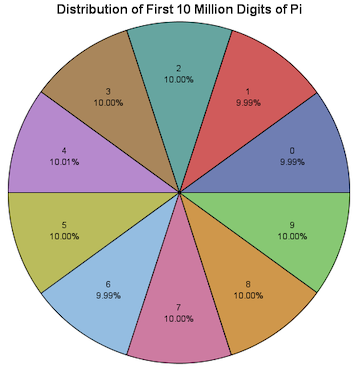
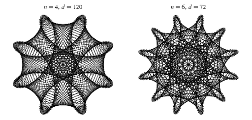
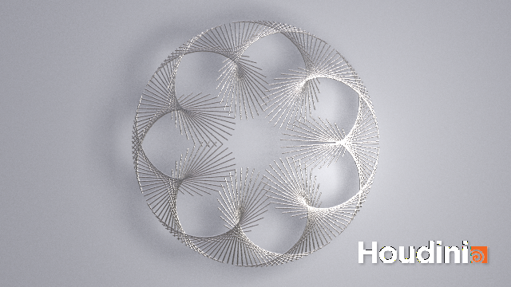
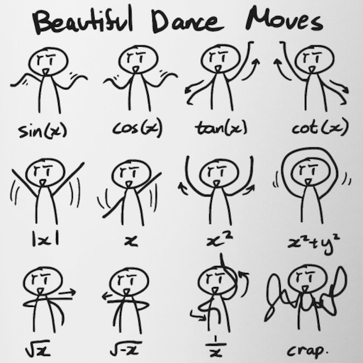

name: inverse
layout: true
class: center, middle, inverse
---


# Procedural Generation and Simulation

### Prof. Dr. Lena Gieseke | l.gieseke@filmuniversitaet.de  

#### Film University Babelsberg KONRAD WOLF


???
* https://www.nytimes.com/interactive/2025/03/18/arts/design/mondrian-flowers.html?smid=nytcore-ios-share&referringSource=articleShare
* 


---
layout:false

## Today

.center[]

---

## Today

.center[]


---
layout: false

## Today

--
* Beautiful Numbers

--
* Beautiful Curves


---
template: inverse

# Beauty in Maths

---
template:inverse

# $e^{i\pi} + 1 = 0$


???
  

where

* $e$ is Euler's number, the base of natural logarithms,
* $i$ is the imaginary unit, which by definition satisfies $i^{2} = −1$, and
* $\pi$ is pi, the ratio of the circumference of a circle to its diameter.


---
## Euler's Identity

The formula is considered to be an exemplar of vast mathematical beauty.


???
  

* Its beauty arises from its simplicity while expressing highly complex behavior and its profound connection between the most fundamental numbers in mathematics.

https://www.britannica.com/video/222290/Your-Daily-Equation-11-Eulers-Identity-or-The-Most-Beautiful-of-all-Equations

--

Stanford University mathematics professor Keith Devlin has said,  

> ...like a Shakespearean sonnet that captures the very essence of love, or a painting that brings out the beauty of the human form that is far more than just skin deep, Euler's equation reaches down into the very depths of existence. [4] 

--

Beauty *on a mathematical level* is *not* our topic but..  

--
  
...*visual representations and characteristics* of numbers and equations.

---
template: inverse

# Golden Ratios


???
  

* What is the golden ratio?

---
## The Golden Ratio

We have a *golden* ratio if the ratio of two quantities is the same as the ratio of their sum to the larger of the two quantities.

$\frac{a+b}{a} = \frac{a}{b}$


???
  

* A ratio describes one quantity in relationship to another one, e.g. how long the width of an image is in relationship to its height. 


--

Line segments in the golden ratio:

.center[  
.imgref[[[wiki]](https://en.wikipedia.org/wiki/Golden_ratio)]]


---
## The Golden Rectangle

.left-even[  
.imgref[[[wiki]](https://en.wikipedia.org/wiki/Golden_ratio)]]


???
  

* Whether this is a *beautiful* ratio or not is up to personal taste. Be careful though to believe the widespread understanding that the golden ratio is the *natural blueprint* for beauty. There is very little *scientific* evidence for that. You can find ratios similar to the golden ratio in the world, such as in human faces, the Parthenon, etc. but the emphasis is on *similar* and also there are various other prominent ratios out there. With the golden ratio we might have a case of *you find what you are looking for*.

--

.right-even[ 

<br >

]

---
## The Golden Rectangle

.left-quarter[  
]
.right-quarter[
     
This ratio is there also defined as $\varphi$:

$\frac{a+b}{a} = \frac{a}{b} \stackrel{\mathrm{def}}{=} \varphi$
]


???
  

* $\varphi$ is a very special number - why?

---
.header[The Golden Rectangle]
## Phi

$\frac{a+b}{a} = \frac{a}{b} \stackrel{\mathrm{def}}{=} \varphi$
  
--
  
<br >
One of the special properties of the Golden Ratio is that *it can be defined in terms of itself*:

--

$1+\frac{1}{\varphi}=\varphi$


---
.header[The Golden Rectangle]

### Derivation of $1+\frac{1}{\varphi}=\varphi$

--

This ratio is defined as $\varphi$:

(1) $\frac{a+b}{a} = \frac{a}{b} \stackrel{\mathrm{def}}{=} \varphi$

--

One method for finding the value of $\varphi$ is to start with the left fraction. 

(2) $\frac{a+b}{a}=\frac{a}{a}+\frac{b}{a} = 1+\frac{b}{a}$

--

We can derive from (1) $\frac{a}{b} = \varphi$ that $\frac{b}{a} = \frac{1}{\varphi}$ and put that into (2)

(3) $1+\frac{b}{a}=1+\frac{1}{\varphi}$

--

Setting that equal to the right side of (1), we get

$1+\frac{1}{\varphi}=\varphi$.

.footnote[[wiki](https://en.wikipedia.org/wiki/Golden_ratio)]

---
.header[The Golden Rectangle]
## Phi

$\varphi$'s definition with itself leads to a *continued fraction*:

$1+{\cfrac {1}{1+{\cfrac {1}{1+{\cfrac {1}{1+{\cfrac {1}{1+\ddots }}}}}}}}$

--

This is not valid and $\varphi$ can't be expressed as a regular fraction.

---
.header[The Golden Rectangle]
## Phi

A number which can not be constructed from ratios (or fractions) of integers is an *irrational number*.   

--

Their decimal expansions neither terminate nor become periodic.
  
--

<br >
  
Rational Number:

$1.5 = \frac{3}{2}$  → *This is a ratio*

--
  
Irrational Number:

$\pi = 3.14159... = \frac{?}{?}$  → *No ratio possible*
  

---
.header[The Golden Rectangle]
## Phi


You can solve $1+\frac{1}{\varphi}=\varphi$ for $\varphi$ algebraically with the quadratic formula to 

--

$\frac{1+{\sqrt{5}}}{2} = 1.618\,033\,988\,7\dots$  
  

???
  

Multiplying by φ  gives
φ + 1 = φ^2 
which can be rearranged to
φ^2 − φ − 1 = 0

* Because $\varphi$ is the ratio between positive quantities, $\varphi$ is necessarily positive
* https://en.wikipedia.org/wiki/Golden_ratio

---
.header[The Golden Rectangle]
## Phi

In summary, we can represent $\varphi$ as

|                    |                                  $\varphi$                                  |
| ------------------ | :-------------------------------------------------------------------------: |
| Decimal            |                          1.6180339887498948482...                           |
| Continued fraction | $1+{\cfrac {1}{1+{\cfrac {1}{1+{\cfrac {1}{1+{\cfrac {1}{1+\ddots }}}}}}}}$ |
| Algebraic          |                          $\frac{1+{\sqrt{5}}}{2}$                           |


???
  

* You can find $\varphi$ everywhere in nature - mathematically

---
## $\varphi$ in Nature


???
  

* Imagine you are a plant and you can spread leaves all around your stem. Now, being a plant, needing Photosynthese and such, you want all of your leafes to soak up as much sun (and rain) as possible. So when you sprout a new leaf, you don’t want it to block your other leaves.

--
.center[]


---
## $\varphi$ in Nature


.center[  
.imgref[[[gofiguremath]](http://gofiguremath.org/natures-favorite-math/the-golden-ratio/the-golden-angle/)]]


---
## $\varphi$ in Nature

.center[]

.footnote[[[gofiguremath]](http://gofiguremath.org/natures-favorite-math/the-golden-ratio/the-golden-angle/)]

---
## $\varphi$ in Nature

.center[]

.footnote[[[gofiguremath]](http://gofiguremath.org/natures-favorite-math/the-golden-ratio/the-golden-angle/)]

---
## $\varphi$ in Nature

.center[]

.footnote[[[gofiguremath]](http://gofiguremath.org/natures-favorite-math/the-golden-ratio/the-golden-angle/)]

---
## $\varphi$ in Nature

.center[]

.footnote[[[gofiguremath]](http://gofiguremath.org/natures-favorite-math/the-golden-ratio/the-golden-angle/)]

---
## $\varphi$ in Nature

.center[]

.footnote[[[gofiguremath]](http://gofiguremath.org/natures-favorite-math/the-golden-ratio/the-golden-angle/)]

---
## $\varphi$ in Nature

.center[]

.footnote[[[gofiguremath]](http://gofiguremath.org/natures-favorite-math/the-golden-ratio/the-golden-angle/)]


???
  

* What you want is to turn for every new leave a certain degree as the following (the numbers indicate the order in which the leaves grew).

---
## $\varphi$ in Nature

.center[  
.imgref[[[gofiguremath]](http://gofiguremath.org/natures-favorite-math/the-golden-ratio/the-golden-angle/)]]


???
  

* The same problem applies if you imagine to be a sunflower and you want to pack as many seeds as possible, while all of them getting as much sun as possible.

---
## Golden Angle

The flowers are making a turn to grow a new leaf or place a new seed with the *golden angle*.

.center[  .imgref[[[gofiguremath]](http://gofiguremath.org/natures-favorite-math/the-golden-ratio/the-golden-angle/)]]


???
  

* In geometry, the golden angle is the smaller of the two angles created by sectioning the circumference of a circle according to the golden ratio; that is, into two arcs such that the ratio of the length of the smaller arc to the length of the larger arc is the same as the ratio of the length of the larger arc to the full circumference of the circle: [[23]](https://en.wikipedia.org/wiki/Golden_angle)

---
## Golden Angle

.left-even[$~137.5°$

* Solution to *how far to turn from the last leaf* in degrees
]


---
## Golden Angle

.left-even[$~137.5°$

* Solution to *how far to turn from the last leaf* in degrees
* That is what plants do:]

???
  

* each new branch fits into the largest still-existing gap between older branches, cutting a constant fraction off that gap.
* Let δ=2zπ be the angle between two branches. We see that z can't be a rational, otherwise after enough steps we'd have gaps that will never be filled. Let's instead construct a sequence of rationals zn converging to the real z
* At the n-th step we'd have zn=pnqn, which means, counting from 0, that the qn-th branch coincides with the 0-th and that we've done pn turns around the center.

http://jacquerie.github.io/sunflower/

--

.right-even[
    
.imgref[[[LeerZelfBeleggen]](https://leerzelfbeleggen.com/wp-content/uploads/2018/08/Fibonacci-trading-leren-traden-met-de-geheime-formule-voorbeelden.jpeg)]]

---
## Golden Angle

Such an arrangement of leaves, which applies the golden angle, is also called *phyllotaxis* (*leaf arrangement* in Greek) in botany. 


???
  

* Phyllotaxis is the botanical study of the arrangement of phylla (leaves, petals, seeds, etc.) on plants.

---
.header[Golden Angle]

## Phyllotaxis

There is a simple algorithm for it by Helmut Vogel.

--

.center[ .imgref[[[gofiguremath]](http://gofiguremath.org/natures-favorite-math/the-golden-ratio/the-golden-angle/)]]

---
.header[Golden Angle]

## Phyllotaxis

There is a simple algorithm for it by Helmut Vogel.


[.center[]](https://editor.p5js.org/legie/sketches/iVLdC_coE)


???
  

* https://editor.p5js.org/legie/sketches/iVLdC_coE
* If we change the angle from the golden angle to an arbitrary angle between 0..360 we get vastly different designs for only very small changes. The following code maps the angle to turn to the mouse position in x. Try the code for yourself!
* https://www.sciencedirect.com/science/article/abs/pii/0025556479900804


---
.header[Golden Angle | Phyllotaxis]

## Polar Coordinates

--

Many visuals such as spirals are represented in polar coordinates $(r, \theta)$.

--

.right-even[  
.imgref[[[wiki]](https://de.wikipedia.org/wiki/Datei:Ebene_polarkoordinaten.svg)]]

.left-even[

<br >
Hence, polar coordinates are a two-dimensional coordinate system.]

???
  

* In mathematics, a spiral is a curve which starts from a point and when moving farther away, it revolves around the startpoint. The phyllotaxis code we have seen above is actually also creating spirals. Spirals are usually represented in polar coordinates $(r, \theta)$.

---
.header[Golden Angle | Phyllotaxis]

## Polar Coordinates

.left-even[  
.imgref[[[wiki]](https://de.wikipedia.org/wiki/Datei:Ebene_polarkoordinaten.svg)]]


???
  

* (here with $\phi$ as name for the angular coordinate, often called the polar angle)
  
--

.right-even[
Each point on a plane is determined by 

]

---
.header[Golden Angle | Phyllotaxis]

## Polar Coordinates

.left-even[  
.imgref[[[wiki]](https://de.wikipedia.org/wiki/Datei:Ebene_polarkoordinaten.svg)]]


.right-even[
Each point on a plane is determined by 
* Distance from a reference point, usually the center point
]

???
  

* Quick reminder, what is the Polar Coordinate System? In mathematics, the polar coordinate system is a two-dimensional coordinate system in which each point on a plane is determined by a distance from a reference point and an angle from a reference direction.


---
.header[Golden Angle | Phyllotaxis]

## Polar Coordinates

.left-even[  
.imgref[[[wiki]](https://de.wikipedia.org/wiki/Datei:Ebene_polarkoordinaten.svg)]]


.right-even[
Each point on a plane is determined by 
* Distance from a reference point, usually the center point
* Angle from a reference direction, usually the horizontal axis
]

???
  

* Quick reminder, what is the Polar Coordinate System? In mathematics, the polar coordinate system is a two-dimensional coordinate system in which each point on a plane is determined by a distance from a reference point and an angle from a reference direction.


---
.header[Golden Angle | Phyllotaxis]

## Polar vs. Cartisian Coordinates

.center[]
.imgref[[[wiki]](https://de.wikipedia.org/wiki/Datei:Ebene_polarkoordinaten.svg)]


---
.header[Golden Angle | Phyllotaxis]

## Polar vs. Cartisian Coordinates

.left-even[]
.imgref[[[wiki]](https://de.wikipedia.org/wiki/Datei:Ebene_polarkoordinaten.svg)]

.right-even[
Hence,  
  
$x = r \cos{\phi}$  
$y = r \sin{\phi}$
]


---
.header[Golden Angle | Phyllotaxis]

## Polar vs. Cartisian Coordinates

.left-even[]
.imgref[[[wiki]](https://de.wikipedia.org/wiki/Datei:Ebene_polarkoordinaten.svg)]

.right-even[
Hence,  
  
$x = r \cos{\phi}$  
$y = r \sin{\phi}$

<br />
and

$r = \sqrt{{x^2 + y^2}}$  
$\phi = \tan^{-1}{\left (\frac{y}{x}\right )}$

]


???
  

* TODO: Next term: zeige Herleitung


---
.header[Golden Angle | Phyllotaxis]

## Polar Coordinates


> Most appropriate when there is a *direction* and *length* from a *center point*.


???
  

* Polar coordinates are most appropriate in any context where the phenomenon being considered is inherently tied to *direction* and *length* from a *center point*, such as with spirals. Please make sure that you know what polar coordinates are and how to use them. We are going to need them all the time.

--

* $r$ as the distance from the origin,
* $\theta$ as the angle (in radians) from the horizontal axis


???
  

In polar coordinates different, e.g., spiral designs can be compactly expressed with

* $a$ and $b$ as constants that allow for shaping the different designs

---
.header[Golden Angle]

## Phyllotaxis

There is a simple algorithm for it by Helmut Vogel.


[.center[]](https://editor.p5js.org/legie/sketches/iVLdC_coE)


???
  

* https://editor.p5js.org/legie/sketches/iVLdC_coE
* If we change the angle from the golden angle to an arbitrary angle between 0..360 we get vastly different designs for only very small changes. The following code maps the angle to turn to the mouse position in x. Try the code for yourself!
* https://www.sciencedirect.com/science/article/abs/pii/0025556479900804


---
.header[Golden Angle | Phyllotaxis]

## Vogel Algorithm

Place n seeds, using polar coordinates $(r, \theta)$, with

--

<br />

$r(n) = \sqrt{n}$  

--

$\theta(n) = n \theta$

--

<br />

with $\theta ≈ 137.5^\circ$ as the golden angle 


???
  

Thus, as n increases by one, the position rotates through the golden angle and the radius increases as the square root of n. 


* All points are on a curve called the generative spiral (r = √θ), a form of Fermat spiral which winds ever-tighter as it curls outwards.

---
.header[Golden Angle | Phyllotaxis | Vogel Algorithm]

```js
//https://editor.p5js.org/legie/sketches/iVLdC_coE
function draw() {

    // Move to the center of the canvas
    translate(width * 0.5, height * 0.5);

    let r = c * sqrt(n);
    let theta = n * 137.5;
    
    // Convert to cartesian coordinates
    // for being able to use x, y as position
    let x = r * cos(theta);
    let y = r * sin(theta);

    fill(n % color_ramp, 1 , 1);
    ellipse(x , y , c * 1.25 , c * 1.25);

    n++
}
```


???
  

* https://editor.p5js.org/legie/sketches/iVLdC_coE


---
.header[Golden Angle | Phyllotaxis]

.center[[](https://editor.p5js.org/legie/sketches/jnrQubUwZ)]


???
  

* Fractions for the `ratio` value lead to spikes, while getting closer to an irrational number produces dense distributions:
* https://editor.p5js.org/legie/sketches/jnrQubUwZ


---
.header[Golden Angle]

## Phyllotaxis


???
  

* What to do with this? Well, now it is up to being creative. Just connecting the element by lines already give interesting designs:

--
.center[    ]  
.center[.imgref[[[codeproject]](https://www.codeproject.com/Articles/1221341/The-Vogel-Spiral-Phenomenon)]]


???
  

* Of course forumlas such as the phyllotaxis one above have been used over and over,... and over again. We have seen these visuals. That doesn't mean that there aren't plenty of options left to work with these fascinating structures. What I am trying to say is that by just simply plotting the base examples, you will not get a creativity medal. You will have to really think about a visualization / application to make them interesting anew.


---
template:inverse

## $0, 1, 1, 2, 3, 5, 8, 13, 21, 34, 55, 89, ...$


???
  

* Do you recognize the following sequence of numbers? How is the sequence constructed?
* Fibonacci Sequence

---
## Fibonacci Sequence

Each number is the sum of the two preceding ones, starting from $0$ and $1$. That is, 


???
  

* In mathematics, the Fibonacci numbers, commonly denoted $F_n$, form a sequence, called the Fibonacci sequence, such that each number is the sum of the two preceding ones, starting from $0$ and $1$. That is, 

--


--


???
  

* Knowledge of the Fibonacci sequence was expressed from the Indian mathematician [Acharya Pingala](https://en.wikipedia.org/wiki/Pingala) in connection with a study of poetic metres and verse in Sanskrit as early c. 450 BC–200 BC. Outside India, the Fibonacci sequence first appears in the book [Liber Abaci](https://en.wikipedia.org/wiki/Liber_Abaci) (1202) by [Fibonacci](https://en.wikipedia.org/wiki/Fibonacci) using it to calculate the growth of rabbit populations. [7][8][9][10]


---
## Fibonacci Sequence & Phi

???
  

* There is a special relationship between the Golden Ratio and Fibonacci Numbers in that the ratio of two successive Fibonacci numbers is close to the golden ratio:

--

.center[  .imgref[[[hydrogen2oxygen]](https://hydrogen2oxygen.net/en/2012/06/21/the-fibonacci-sequence-is-the-mathematical-first-cousin-of-the-golden-ratio/)]]

---
## Fibonacci Sequence & Golden Ratios

---
.header[Fibonacci Sequence & Golden Ratios]

<br />

Geometrically the Fibonacci Sequence can be expressed as follows:

.center[  .imgref[[[wiki]](https://commons.wikimedia.org/wiki/File:34*21-FibonacciBlocks.png)]]


---
.header[Fibonacci Sequence & Golden Ratios]

The above segmentation of an rectangle approximates the *golden spiral*. 

.center[  .imgref[[[wiki]](https://commons.wikimedia.org/wiki/File:34*21-FibonacciBlocks.png)]]


???
  

* But wait. What is a *spiral* and why is it *golden*? Don't we need $\varphi$ for anything to be golden?

---
## Golden Spiral

The special value for the growth factor $b$ is based on $\varphi$, the golden ratio. The golden spiral gets wider (or further from its origin) by a factor of $\varphi$ for every quarter turn it makes.

.center[  
.imgref[[[wiki]](https://commons.wikimedia.org/wiki/File:FakeRealLogSpiral.svg)]]


---

.center[  
.imgref[[[wiki]](https://commons.wikimedia.org/wiki/File:GoldenSpiralLogarithmic_color_in.gif)]]


???
  

* Golden spirals are self-similar. The shape is infinitely repeated when magnified.


---

## Fibonacci Sequence & Mandelbrot

--

The number of spiral arms at the bulbs manifest a Fibonacci sequence.

.center[  
.imgref[[[wiki]](https://en.wikipedia.org/wiki/Mandelbrot_set#/media/File:Fibonacci_sequence_within_the_Mandelbrot_set.png)]]

.footnote[[[Spektrum der Wissenschaft](https://www.spektrum.de/kolumne/in-der-mandelbrot-menge-steckt-die-fibonacci-folge/2094057)]]


???
* 
https://www.spektrum.de/kolumne/in-der-mandelbrot-menge-steckt-die-fibonacci-folge/2094057


---
template:inverse

# Famous Irrational Numbers


---
## Famous Irrational Numbers

--

* $\varphi = 1.61803398874989484820...$
    * The most irrational of them all  
--
* $\pi = 3.1415926535897932384626433832795...$

--
    * The rockstar of the irrational numbers
--
    * The popular approximation of $\frac{22}{7} = 3.1428571428571$ is close but not accurate
--
    * Over a quadrillion decimal places have been calculated and *still there is no pattern!!!*
--
* $e = 2.7182818284590452353602874713527$
    * Euler's Number
    * Base of the Natural Logarithms

???
  

* Many square roots, cube roots, etc. are also irrational numbers.
    * $\sqrt{3} = 1.7320508075688772935274463415059...$
    * $\sqrt{99} = 9.9498743710661995473447982100121...$
    * But e.g. $\sqrt{4} = 2$ (rational), and $\sqrt{9} = 3$ (rational), so not all roots are irrational.

---
.header[Famous Irrational Numbers]
## Pi

$\pi = 3.14159 26535 89793 23846 26433 83279 50288 41971 ...$

???
  

* $\pi$ is a real crowd-pleaser. Why is that?

--

> Omnipresent in formulas for areas and volumes of geometrical shapes based on circles.


???
  

$\pi$ appears in formulae for areas and volumes of geometrical shapes based on circles, such as ellipses, spheres, cones, and tori. Below are some of the more common formulae that involve $\pi$.

---
.header[Famous Irrational Numbers]
## Pi

.left-even[
  
.imgref[[[wiki]](https://en.wikipedia.org/wiki/Pi#/media/File:Pi_eq_C_over_d.svg)]]

.right-even[
With radius r 

* Circumference: $2\pi r$
* Area of a circle: $\pi r^2$
* Sphere volume: $\frac{4}{3}\pi r^3$
* Sphere surface area $4\pi r^2$
]


???
  

* $\pi$ appears in many, many other formulas in all areas of mathematics and physics.  
* Its omnipresence and usefulness plays a big role for $\pi$'s popularity. But its inherent characteristic are also truly captivating.

---
.header[Famous Irrational Numbers | Pi]


.center[  
.imgref[[[sas blogs]](https://blogs.sas.com/content/iml/2015/03/12/digits-of-pi.html#prettyPhoto)]]


???
  

* The digits of $\pi$ are uniformly randomly distributed, meaning that its digits 0 through 9 appear equally often, as do pairs of digits, trios of digits, and so forth. If you don't believe it you can count digits in its first [10 million decimal places](https://introcs.cs.princeton.edu/java/data/pi-10million.txt).
* The digits of $\pi$ pass every test for randomness, yet $\pi$ is a precise mathematical value that describes the relationship between the circumference of a circle and its diameter. This dichotomy between *very random* and *very structured* blows my mind. [[20]](https://blogs.sas.com/content/iml/2015/03/12/digits-of-pi.html#prettyPhoto)


---
.header[Famous Irrational Numbers | Pi]


.center[  
.imgref[[[fineartamerica]](https://fineartamerica.com/featured/flow-of-life-flow-of-pi-cristian-ilies-vasile.html)]]


???
  

* https://mk.bcgsc.ca/pi/piday2024/#l1home
* In honor of $\pi$ day, which is on March, 14th according to the north american date formating of 03.14., several artists visually represent $\pi$ each year anew in a creative and beautiful manner.
* http://mkweb.bcgsc.ca/
* Here, the digits of $\pi$ are represented as a path traced by links between successive digits. Each digit is assigned a segment around the circle and a link between segment $i$ and $j$ corresponds to the appearance of $ij$ in $\pi$. For example, the $14$ in $3.14...$ is drawn as a link between segment $1$ and segment $4$. [[21]](http://mkweb.bcgsc.ca/pi/art/method.mhtml)

  
[[mkweb]](http://mkweb.bcgsc.ca/pi/art/method.mhtml)

As more digits are added to the path, the image becomes a weaving mandala.


---

## Fibonacci Sequence & Pi

.center[  
.imgref[[[© Georg-Johann Lay / Mandelbrotmenge / public domain; Bearbeitung: Spektrum der Wissenschaft (Ausschnitt)]](https://www.spektrum.de/kolumne/pi-ist-ueberall-auch-in-der-mandelbrotmenge/1996588)]]


.footnote[[[Spektrum der Wissenschaft]](https://www.spektrum.de/kolumne/pi-ist-ueberall-auch-in-der-mandelbrotmenge/1996588)]


???
  

* Wenn man sich die Figur genau ansieht, kann man erkennen, dass an der Stelle (−¾, 0) ein einzelner Punkt zu sein scheint, der zwei Bereiche der Mandelbrotmenge scharf voneinander trennt. Das wollte der Informatikstudent Dave Boll im Jahr 1991 genauer untersuchen. Dafür betrachtete er winzige Abweichungen von dieser Stelle (etwa den Punkt (–¾, 0,001)) und berechnete, wie viele Wiederholungen n man braucht, bis der Wert von zn zwei übersteigt. (Man wählt häufig die – willkürlich festgelegte – Zahl 2, weil die rekursive Gleichung beim Erreichen dieses Werts ganz sicher nicht mehr beschränkt ist.) Als Boll verschiedene Abweichungen der Größe 0,1; 0,01; 0,001 und so weiter von dem Punkt (–¾, 0) untersuchte, erlebte er eine Überraschung:
* Je näher der Wert an den interessanten Punkt rückt, desto mehr Nachkommastellen von Pi entfalten sich in n. Damit hatte Boll nicht gerechnet – ebenso wenig wie die Mathematikerinnen und Mathematiker, die er damit konfrontierte. Doch bevor er mit einem Erklärungsversuch aufwartete, sah er sich zunächst einen anderen Punkt der Mandelbrotmenge an: den »Hintern« des Apfelmännchens mit den Koordinaten (¼, 0). Er wollte herausfinden, ob Pi auch dort auftaucht. Als er die gleiche Analyse an der neuen Stelle durchführte, erhielt er folgende Zahlenreihe:
* Wieder schien die Folge gegen die Nachkommastellen von Pi zu streben – wenn auch langsamer als zuvor. Wie sich herausstellte, gibt es weitere Punkte in der Mandelbrotmenge, an denen man Pi auf ähnliche Weise konstruieren kann. Um herauszufinden, wo die Kreiszahl herkommt, muss man die Werte der iterativen Gleichung, der das fraktale Muster zu Grunde liegt, untersuchen. Denn in ihnen versteckt sich eine trigonometrische Funktion, die π an diesen völlig unerwarteten Stellen erzeugt.
* Wir hatten bereits gesehen, dass die iterative Funktion für c = ¼ (also der Hintern des Apfelmännchens) niemals Werte annimmt, die größer sind als ½. Die Zahlen nähern sich zwar immer weiter ½ an, je häufiger man sie in die Gleichung einsetzt, doch ohne den Wert jemals zu erreichen. Setzt man nun statt ¼ c = 0,26 in die iterative Gleichung ein, erhält man folgende (gerundete) Zahlenfolge: 0,26; 0,328; 0,367; 0,395; 0,416; 0,433; 0,448; 0,46; 0,472; 0,483, 0,493; 0,503; 0,513; 0,523; 0,534; 0,545; 0,557; 0,57; 0,585; 0,602; 0,623; 0,648; 0,68; 0,722; 0,781; 0,87; 1,017; 1,294; 1,934; 3,999; 16,251; … Anfangs wachsen die Werte nur sehr langsam an, bis sie schließlich explosionsartig ansteigen.

https://www.spektrum.de/kolumne/pi-ist-ueberall-auch-in-der-mandelbrotmenge/1996588


---
template:inverse

# Curves


???
  

* Next to spirals as curve designs, there are several similarly simple functions that create aesthetically pleasing curves. At first sight, the Wikipedia and Wolfram pages of these functions can appear a bit intimidating. But I would like to show you that it is actually not that hard to get a grip on these functions.

Let's have a look into the rose curve.


---
## Spirals

.center[]


???
* https://openprocessing.org/sketch/1086160
* https://openprocessing.org/sketch/1642008

---
## The Rose Curve

.left-even[ .imgref[[[wiki]](https://en.wikipedia.org/wiki/Rose_\(mathematics\)]]

--

.right-even[A multi-lobed curve with varying number of lobes.]

---
## The Rose Curve

What does [wiki](https://www.wikiwand.com/en/articles/Rose_(mathematics) say?

What does [Wolfram](https://mathworld.wolfram.com/RoseCurve.html) say?


???
  

* This page is still somewhat simple and well-arranged. Sometimes these pages overflow with explanations, different representations, history and proofs, etc.. Fear not! What you always want to look out for is the *coordinates* you can plot, be it polar or cartesian coordinates (we know how to go from one to the other so it does not really matter what we get).

**What is the Polar Coordinate System? **
* In mathematics, the polar coordinate system is a two-dimensional coordinate system in which each point on a plane is determined by a distance from a reference point and an angle from a reference direction.

  
[[wiki]](https://de.wikipedia.org/wiki/Datei:Ebene_polarkoordinaten.svg)

(here with $\phi$ as name for the angular coordinate, often called the polar angle)

Hence,  
  
$x = r \cos{\phi}$  
$y = r \sin{\phi}$

and

$r = \sqrt{{x^2 + y^2}}$  
$\phi = \tan^{-1}{\left (\frac{y}{x}\right )}$

Polar coordinates are most appropriate in any context where the phenomenon being considered is inherently tied to *direction* and *length* from a *center point*, such as with spirals. Please make sure that you know what polar coordinates are and how to use them. We are going to need them all the time.


--

<br >

Rose curves are defined by 

$r = a \cos(k\theta)$

with the angular frequency of $k$ and an amplitude of $a$. 

---
.header[The Rose Curve]

## Parameter Theta

> Set of points?


???
  

* What do we loop?

--

$\theta$ is an angular coordinate:

.left-even[  
.imgref[[[wolfram]](https://mathworld.wolfram.com/PolarAngle.html)]]  


???
  

* or polar angle if we are in polar coordinates

--

.right-even[.imgref[[[wikimedia]](https://commons.wikimedia.org/wiki/File:7_Petal_rose.svg)]]

???
  

* What do we have to do to draw this?


---
.header[The Rose Curve]

## Parameter Theta

.left-even[.imgref[[[wikimedia]](https://commons.wikimedia.org/wiki/File:7_Petal_rose.svg)]]


.right-even[
In order to draw the whole rose, 


]

---
.header[The Rose Curve]

## Parameter Theta

.left-even[.imgref[[[wikimedia]](https://commons.wikimedia.org/wiki/File:7_Petal_rose.svg)]]


.right-even[
In order to draw the whole rose, 

* we need to iterate $\theta$ over the circumference of a circle, 

]

---
.header[The Rose Curve]

## Parameter Theta

.left-even[.imgref[[[wikimedia]](https://commons.wikimedia.org/wiki/File:7_Petal_rose.svg)]]


.right-even[
In order to draw the whole rose, 

* we need to iterate $\theta$ over the circumference of a circle, 
* hence $2\pi$ in radians or $360^\circ$ in degree.
]

---
.header[The Rose Curve]

## Parameter Theta

.left-even[.imgref[[[wikimedia]](https://commons.wikimedia.org/wiki/File:7_Petal_rose.svg)]]

.right-even[In order to draw the whole rose, 

* we need to iterate $\theta$ over the circumference of a circle, 
* hence $2\pi$ in radians or $360^\circ$ in degree.

> For each theta value, we compute a point to draw.

]

???
  

* https://editor.p5js.org/legie/sketches/p7nFMtCEa
* // Version Circle

---
## The Rose Curve

```js
function draw() {

    // Moving whatever we are drawing to the center
    // of the canvas to have the center as origin
    translate(width * 0.5, height * 0.5);

    beginShape();
    for (let theta = 0; theta < TWO_PI; theta+= 0.01) {

        let x = ...
        let y = ...
        vertex(x, y);
    }

    endShape(CLOSE);
}
```


???
  

* Therefore, a code basis for drawing the rose in p5 could look as follows (feel free to follow along with the code in p5)


---
## The Rose Curve

$r = a \cos(k\theta)$

--

--

> Look for a formula or representation that can be expressed in Cartesian coordinates.


--

<br >

The formula as Cartesian parametric equations  
  
<br/>

$x= r \cos(\theta) = a \cos(k\theta )\cos(\theta )$  
$y= r \sin(\theta) = a \cos(k\theta )\sin(\theta )$  


???
  

for various $k = n / d$.

* For the rose curve, the parametric equations are right under *General overview* ready for us to use (how convenient!)


--

<br >


*Let's work with that...*  

---
.header[The Rose Curve]

## Parameter r

$x= r \cos(\theta) = a \cos(k\theta )\cos(\theta )$  
$y= r \sin(\theta) = a \cos(k\theta )\sin(\theta )$  

--

<br >

> On a side note: for simplicity you can always start with assuming a radius of 1 or ignore scaling constants. 


???
  


Hence, a rose is the set of points in cartesian coordinates that can be specified by

$x=\cos(k\theta )\cos(\theta )$  
$y=\cos(k\theta )\sin(\theta )$  


---
## The Rose Curve

```js
function draw() {

    // Moving whatever we are drawing to the center
    // of the canvas to have the center as origin
    translate(width * 0.5, height * 0.5);

    let k = 1;

    beginShape();
    for (let theta = 0; theta < TWO_PI; theta+= 0.01) {

        let x = cos(k*theta) * cos(theta);
        let y = cos(k*theta) * sin(theta);
        vertex(x, y);
    }
    endShape(CLOSE);
}
```


???
  

* https://editor.p5js.org/legie/sketches/p7nFMtCEa
* Version 0
* Version 1 -> use r for scale
* 2k petals if k is even, and
* k petals if k is odd


## Parameter k

If k is an integer, the curve will be rose-shaped with

* 2k petals if k is even, and
* k petals if k is odd.


* Nice, we want that controllability for our rose, so let's add that to the code and compute the (cartesian) coordinates. All code snippets here are optimized for readability and understanding - some things could be implemented more efficiently, e.g. computing `cos(k*theta)` twice...


---
## The Rose Curve

.left-even[]
.right-even[
*Why don't we see all the designs on the wiki page?*
]


???
  

* Let's map k to the with position of the mouse to explore the design space:

```js
let k = floor(map(mouseX, 0, width, 1, 20));
```

* But *wait*, you will say. *Why don't we see all the designs from the wiki preview image*?


---
## The Rose Curve

We should not just use $k$ but $k = \frac{n}{d}$.

---
## The Rose Curve

```js
function draw() {
    background(255);
    translate(width * 0.5, height * 0.5);

    let r = width * 0.4;
    let n = floor(map(mouseX, 0, width, 1, 10));
    let d = floor(map(mouseY, 0, height, 1, 10));  
    let k = n / d;

    beginShape();
    for (let theta = 0; theta < TWO_PI; theta+= 0.01) {

        let x = r * (cos(k*theta) * cos(theta));
        let y = r * (cos(k*theta) * sin(theta));
        vertex(x, y);
    }
    endShape(CLOSE);
}
```


???
  

* https://editor.p5js.org/legie/sketches/p7nFMtCEa
* Version 2
* What is now the problem?

---
.header[The Rose Curve]

## Number of Loops


.left-quarter[ .imgref[[[wiki]](https://commons.wikimedia.org/wiki/File:Rose_Curve_animation_with_Gears_n4_d5.gif)]]


???
  

* But wiki is not really clear about how many loops we need. Now we have two options: 1. read the wiki page in detail to gain a better understanding or 2. find another resource which gives us the infos we are looking for more directly. As I am lazy, I go for option 2 and my second place to look at for maths is usually Wolfram.

And, we are successful! [Wolfram](https://mathworld.wolfram.com/Rose.html) says on first sight something about *closing the curve*: 

> If $n=r/s$ is a rational number, then the curve closes at a polar angle of $\theta=\pi s p$, where $p=1$ if $rs$ is odd and $p=2$ if rs is even.

Unfortunately, and this happens usually when you use multiple resources, the parameter are named differently. But, we can easily translate them by setting n = k, r = n, s = d

--

.right-quarter[We seem to need more *loops* to draw the whole shape.]


???
  

* TODO: find explanation on wiki page

---
.header[The Rose Curve]

## Number of Loops

> If k = n / d is a rational number, then the curve closes at a polar angle of  $\theta=\pi d p$, where $p=1$ if $nd$ is odd and $p = 2$ if $nd$ is even.

--

Meaning, we need $\theta=2d\pi$ loops!

```js
...

for (let theta = 0; theta < TWO_PI * d; theta+= 0.01) {

    ...
}
...
```


???
  

* Now, have fun exploring the design space. If you couldn't follow the above explanation, feel free to ask [Dan](https://www.youtube.com/watch?v=f5QBExMNB1I).

---
## The Maurer Rose

--



--

.imgref[[[wolfram]](https://mathworld.wolfram.com/MaurerRose.html)]  


???
  

* E.g. the [maurer rose](https://en.wikipedia.org/wiki/Maurer_rose) and the [starr rose](https://mathworld.wolfram.com/StarrRose.html) are versions of the basic rose algorithm (even though the starr rose will take some more figuring out...)

---
## The Heart Curve

--

.center[  .imgref[[[wolfram]](https://mathworld.wolfram.com/HeartCurve.html)]]


???
  

* If you feel adventourus, for example implement the heart curve: [wiki](https://en.wikipedia.org/wiki/Heart_symbol#Parametrisation), [wolfram](https://mathworld.wolfram.com/HeartCurve.html), [shiffman](https://www.youtube.com/watch?v=oUBAi9xQ2X4)


---
## Multiplication on a Circle With Modulo 

.center[]


???
  

* Start on a circle
* Distribute evenly a number of points on the circle
* Label them 1.. (numbers continue) -> Number of points on the circle is one parameter
* Iterate over the numbers, multiply by 2 -> Number to multiply is the other parameter)
    * 0*2 = 0
    * 1*2 = 2
    * 2*2 = 4
    * 2*3 = 6
    * For results > the number of points, we take the modulo with the number of points
        * E.g. 10 points on the circle
        * Multiplier 2 for point 7 = 14
        * 14 modulo 10 = 4
* Connect start number with its result
* Easier
    


https://www.redblobgames.com/x/1847-mathologer-modulo-circle/#N=500&M=2&color=angle  
https://demonstrations.wolfram.com/ModularMultiplicationOnACircle/
https://github.com/sebasvega95/mod-mult-circle-p5/blob/master/sketch.js
https://en.wikipedia.org/wiki/Cardioid#Cardioid_as_envelope_of_a_pencil_of_lines

---
template:inverse

## Next

---
.header[Next]

##  Function Design

Next we are going to have a look into how to design and put together functions ourselves.

.center[  
.imgref[[[webcomicms]](https://webcomicms.net/clipart-9428627-math-related-pictures)]]


---
template:inverse

### The End

# 👋🏻
