name: inverse
layout: true
class: center, middle, inverse
---

# Procedural Generation and Simulation

### Prof. Dr. Lena Gieseke | l.gieseke@filmuniversitaet.de  

#### Film University Babelsberg KONRAD WOLF

---
layout: false

## Today

--
* Animation  

--
* Dynamic Systems

--
    * Unreal Example

---
## Dynamic Systems

.center[<iframe width="512" height="512" src="https://editor.p5js.org/legie/full/trK1-4U7S"></iframe>]

---
## Dynamic Systems

.center[]

---

.center[]

---
template: inverse

### Chapter 
# Dynamics

---
layout: false

## Animation

> Technically animation is the depiction of spatially and temporally varying structures and behavior. 

--

Latin roots are

--

* *Animation* from *animatus*, the past participle of *animare*, meaning *to give life to*

--
* *Animare* from *anima*, meaning *breath* or *soul*

???
  

*Animation* comes from the Latin *animatus*, the past participle of *animare*, meaning *to give life to*. *Animare* comes from the Latin word *anima*, meaning *breath* or *soul*. From *anima* comes, among other words, also *animal* for example. A characteristic of animals is their ability to move. When a cartoon is drawn and filmed in such a way that lifelike movement is produced, it is animated. An animated film seems to have a life of its own.
* For visual properties, animation can be understood as the depiction of spatially and temporally varying structures and behavior. You can animate the position of an object, its form and Gestalt and also its environment with e.g. animating lights and cameras.

---

## Animation

.left-even[  
.imgref[[[Heider and Simmel]](https://doi.org/10.2307%2F1416950)]]

???
  

* https://www.youtube.com/watch?v=VTNmLt7QX8E

--
.right-even[
> Movement is one of, if not the most crucial aspect, for humans to assign liveness to objects!
]

???
  

* explores with which sentiments the animation of simple geometric objects is perceived.
* Which story does unfold here?

---
.header[Animation]

## How To Animate?

???
  

* what are the two main principles to animate objects?

--
* Keyframes

???
  

* You can define an animation explicitly, meaning you tell each object precisely where to go. 

--
* Kinematic solver

???
  

* Direct / Inverse kinematic? *geometry of motion*
    * A kinematics problem begins by describing the geometry of the system and declaring all initial conditions of any known values within the system such as of the position. Then, any unknown parts of the system, such as the position in the next frame can be derived from the geometry of the system.
    * Path animation
    * There are two types of indirect kinematic animation, namely *forward kinematics* and *inverse kinematics*.
--
* Dynamic solver

???
  

* This constitutes a *physically motivated animation* and implements how *forces* act on masses.
* As part of a dynamic system, objects can have influencing properties such as a mass or agency, but overall they do not know where to go next but mainly react to their environment.

--

A solver analysizs and predicts behavior...

---
template:inverse

#  Keyframe Animation

---
.header[Animation]

##  Keyframe Animation

A keyframe in traditional animation is a drawing that defines the starting and ending points of any smooth transition.  

--

 

A sequence of keyframes defines an overall movement. 

???
  

* The drawings are called *frames* because their position in time were measured in frames on a strip of film.
* Keyframes have the advantage that they give direct control to the animator.

---
.header[Animation]
##  Keyframe Animation

To create a smooth and fluent animation the remaining frames are filled with *inbetweens*. 
  
 .imgref[[[script-tutorials]](https://www.script-tutorials.com/css-animation-guide-for-novices/)]

???
  

* Once again, there are different interpolation formulas, which are crucial for the final look.
* If you want to know how to set keyframes in Houdini, check out this 2 minutes [video](https://vimeo.com/116173730). The most important tool to work with keyframes is the Graph Editor or [Graph View](https://www.sidefx.com/docs/houdini/ref/panes/changraph.html), which exists in some form or the other in all 3D animation packages.
* Keyframe animation is truly an art in itself. It takes practice and overall a lot of time and effort. To me personally it has always been the hardest aspect of doing 3D. I think, I have just no eye for it, I only know when it is wrong but I have no understanding and intuition about what to change to make it right. I have spent countless hours with practicing to animate walk cycles, with very disappointing results. Why am I telling you this? Because I want you to internalize to never underestimate what it takes to create a keyframe animation in regard to time, effort and experience. Ideally, have an expert around to do it for you!

---
.header[Animation]

## Kinematic Solver

--

Also known as *kinematic animation*.  
  

--

Kinematic solver are based on the *geometry of motion*.  

--

* The geometry of the system and all initial conditions are given

--
* Any unknown parts of the system, such as the next position, are solved from the geometry of the system  

???
  

* A kinematics problem begins by describing the geometry of the system and declaring all initial conditions of any known values within the system such as of the position. 
* Then, any unknown parts of the system, such as the position in the next frame can be derived from the geometry of the system. 
  
---
.header[Kinematic Solver]

## Direct Kinematic Animation

--
  
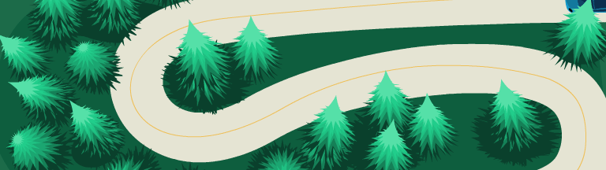  

.imgref[[[coherent-labs]](https://coherent-labs.com/posts/create-motion-path-animation-animate/)]

E.g. path animation is an example for *direct kinematic animation*.

???
  

*  For path animation an object follows a specified path from control points. Aspects to look out for are the orientation of the object and whether velocity control, meaning slow-in/slow-outs, are needed.  
*  In Houdini this is done with the [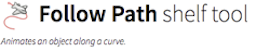](http://www.sidefx.com/docs/houdini/shelf/constraintpath.html)

[[3]](https://en.wikipedia.org/wiki/Kinematics)  

---
.header[Kinematic Solver]

## Indirect Kinematic Animation

Objects derive their movement from the movement of other objects.
  

???
  

* For indirect kinematic animation there is no direct information such as a path for certain object of the scene, but these objects derive their movement from the movement of other objects, e.g. with a hierarchy of joints. 
  

---
.header[Kinematic Solver]

## Indirect Kinematic Animation

.left-even[Objects derive their movement from the movement of other objects.
  
E.g. with a hierarchy of joints: 
] 
  
.right-even[

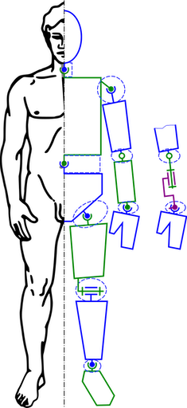 .imgref[[[wiki]](https://en.wikipedia.org/wiki/Inverse_kinematics#/media/File:Modele_cinematique_corps_humain.svg)]]

???
  

* For indirect kinematic animation there is no direct information such as a path for certain object of the scene, but these objects derive their movement from the movement of other objects, e.g. with a hierarchy of joints. 
  
---
.header[Kinematic Solver]

## Indirect Kinematic Animation

There are two types of indirect kinematic animation:

* *Forward kinematics* 
* *Inverse kinematics*

---
.header[Kinematic Solver | Indirect Kinematics]

## Forward Kinematic Animation

--

We are moving the joints (e.g. from an arm) and get back a position and a orientation in scene space (e.g. for a hand).

--

.left-even[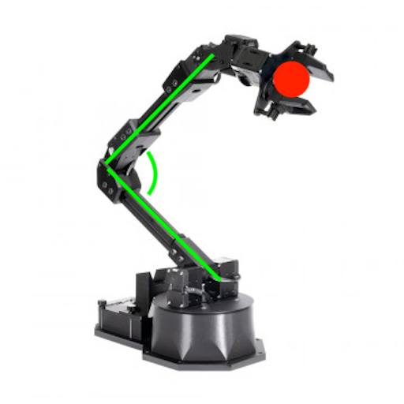.imgref[[[generationrobots]](https://www.generationrobots.com/de/403512-roboterarm-reactorx-200.html)]]  

   
  
--
  
 
*The joints in green are rotated and the postion of the hand is moved by that.*

???
  

* For forward kinematics we map the space of the joints to the cartesian space of the scene.
* 

---
.header[Kinematic Solver | Indirect Kinematics]

## Inverse Kinematic Animation

--

We are moving a target handle, also called the *end effector* (e.g. a hand) and from that the orientation of the joints (e.g. for an arm) is derived. 
--

.left-even[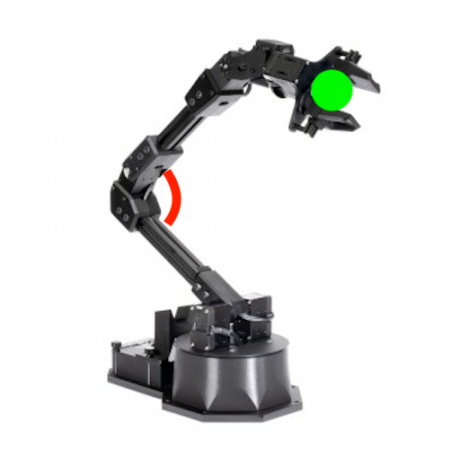 .imgref[[[generationrobots]](https://www.generationrobots.com/de/403512-roboterarm-reactorx-200.html)]]  
  
  
--
  
 

*The handle in green is moved in space and the rotation of the joint is computed from that.*

???
  

* For inverse kinematic, it is the other way around. We are mapping the cartesian space of the scene to the space of the joints.
* The addition of constraints, limits, collision detections, etc. play a crucial part in inverse kinematic. E.g when building a human leg system, you want to make sure that you can rotate the knee joints only about 135° in the direction of the back of the leg.

---
.header[Kinematic Solver | Indirect Kinematics]

## Inverse Kinematic Animation

.center[  *An inverse Kinematic setup*].imgref[[[grandscratchybluetonguelizard]](https://gfycat.com/grandscratchybluetonguelizard)] 

???
  

* The addition of constraints, limits, collision detections, etc. play a crucial part in inverse kinematic. E.g when building a human leg system, you want to make sure that you can rotate the knee joints only about 135° in the direction of the back of the leg.
* Now, onwards to the topic we are actually interested in: moving suff without lifting a finger. Or something like that. Well, at least without creating a zillion keyframes...

---

## Animation in Unreal

* [Full-Body Inverse Kinematics](https://dev.epicgames.com/documentation/en-us/unreal-engine/control-rig-full-body-ik-in-unreal-engine?application_version=5.5)

  .imgref[[[epicgames]](https://dev.epicgames.com/documentation/en-us/unreal-engine/physics-in-unreal-engine)] 

---

## Animation in Unreal

<iframe width="791" height="445" src="https://www.youtube.com/embed/FgJ1stTScxI" title="Animating in Unreal Engine 5.1 | Unreal Fest 2022" frameborder="0" allow="accelerometer; autoplay; clipboard-write; encrypted-media; gyroscope; picture-in-picture; web-share" referrerpolicy="strict-origin-when-cross-origin" allowfullscreen></iframe>

???
  

* [Animating Characters and Objects](https://dev.epicgames.com/documentation/en-us/unreal-engine/animating-characters-and-objects-in-unreal-engine?application_version=5.5)
* [Animating in Engine: Settings, Preferences & Hotkeys](https://dev.epicgames.com/community/learning/tutorials/W5vD/unreal-engine-animating-in-engine-settings-preferences-hotkeys)
* [Ask A Dev](https://www.youtube.com/@livinfreestyle6727/videos)

---

## Animation in Unreal

<iframe width="741" height="417" src="https://www.youtube.com/embed/KCp70qzmGgY" title="Bringing MetaHumans to Life with NVIDIA ACE | Unreal Fest 2024" frameborder="0" allow="accelerometer; autoplay; clipboard-write; encrypted-media; gyroscope; picture-in-picture; web-share" referrerpolicy="strict-origin-when-cross-origin" allowfullscreen></iframe>

---
template:inverse

# Dynamics

---
## Dynamic Solver

.center[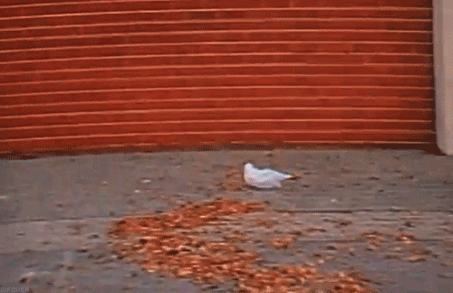].imgref[[[tlemco]](https://tlemco.medium.com/tylers-life-hacks-01-e87f6fb3397a)]

---
## Dynamic Solver

--

A dynamic solver computes the reaction of masses, e.g. their motion, under the influence of *forces* over time. 

???
  

* Why do we use dynamics systems for particle setups?
    * Particle systems are easily made of thousands of particles and most sane people would not want to set keyframes for every single particle.

--
  
> What is the position of an object at a specific time?

--

 
  
Key components:

--

* Time

--
* Forces

--
* Objects (might have a certain mass)

---
.header[Dynamics]

## Forces

???
  

* Intuitively, the application of a force can be described as a *push* or a *pull*.

--

A force is any interaction that, when unopposed, will change the motion of an object.  

--

 

A force has potentially both *magnitude* and *direction*, making it a **vector**.

--

> How changes a *force* the position of an object?

???
  

* **This now the question we want to answer**
* For using the magic of forces, we first have to dig into some mathematical backgrounds
* A force can cause an object with mass to change its *velocity* (which includes to begin moving from a state of rest), that is to *accelerate*.
* We are now going through the math that is needed to compute how a force changes the position of an object. For that we start the other way around, by investigating first what is happening when we change the position of an object.

--

 
Forces can also be dynamic, meaning they can change over time.  
  

---

.header[Dynamics]

## Time

Changes over time

???
As dynamic forces might change over time, we need to account for and track the evolution of system states over time.

--

* Account for and track the evolution of system states

--

 

*Stateful*: meaning past states (such as previous states of the forces) might influence future states.

---
## Dynamic Solver

Let's imagine, we have a function over time, $f(t)$, that computes how forces change the position of a object.

--

> How to find the position of the object at time t?

--

Calculus!

---
.header[Dynamic Solver]

## Calculus

  
> Calculus is the mathematical study of change, in the same way that Geometry is the study of shape, and Algebra is the study of operations and their application to solving equations. [[5]](https://books.google.de/books?id=-WC_AAAAQBAJ&printsec=frontcover&hl=de&source=gbs_ge_summary_r&cad=0#v=onepage&q&f=false)
  

???
  

* *the study of change*
  
--
* Calculus is the study of change
* Calculus helps us to describe the object's position as a function over time...

???
 

Computations regarding moving objects and changing positions are part of *[Calculus](https://en.wikipedia.org/wiki/Calculus)*.  

---
## Dynamic Solver

Let's imagine, we have a function over time, $f(t)$, that computes how forces change the position of a object.

> How to find the position of the object at time t?

--

Integration! 

---
.header[Dynamic Solver]

## Integration

An integral is the continuous analog of a sum. 

--

Integration determines the accumulation of a function over a time period:

--

.center[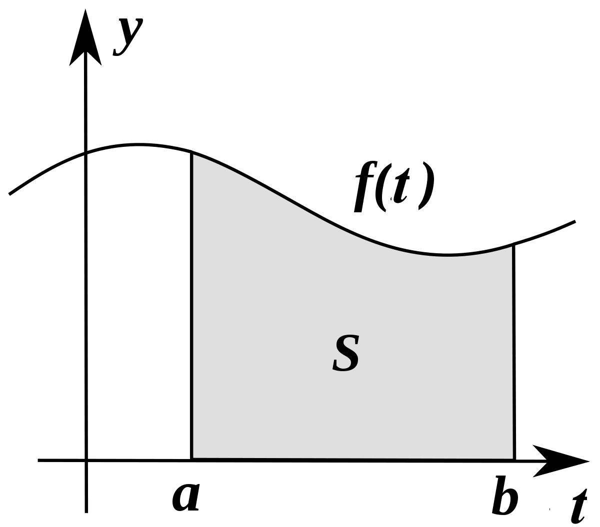].imgref[[[socratic]](https://socratic.org/questions/what-is-an-integral)]

???
  

* The definite integral of a function f over an interval [a,b] represents the area defined by the function and the x-axis from point a to point b, as seen below.

---
.header[Dynamic Solver]

## Integration

An integral is the continuous analog of a sum.  
Integration determines the accumulation of a function over a time period:

.center[ ]

???
  

* The definite integral of a function f over an interval [a,b] represents the area defined by the function and the x-axis from point a to point b, as seen below.
* Imagine integration like filling a tank from a tap. The input (before integration) is the flow rate from the tap (velocity). Integrating the flow (adding up all the little bits of water) gives us the volume of water (new position) in the tank. Imagine the flow starts at 0 and gradually increases (maybe a motor is slowly opening the tap). As the flow rate increases, the tank fills up faster and faster. With a flow rate of 2x, the tank fills up at x2. We have integrated the flow to get the volume
* dx tells us with which variable we are integrating

--

The integration of $f(t)$ computes how forces changed the position of a object over a period of time.

---
.header[Dynamic Solver | Integration]

## How To Integrate?

--

...

--

 

Use a existing solver system, e.g. Unreal.

---
template:inverse

# Dynamics in Unreal

---

## Dynamics in Unreal

Unreal's physics engine > version 5: [Chaos Physics](https://dev.epicgames.com/documentation/en-us/unreal-engine/physics-in-unreal-engine)

???
* Replaces PhysX engine

--

.center[ .imgref[[[Unreal Docs]](https://dev.epicgames.com/documentation/en-us/unreal-engine/physics-in-unreal-engine)]]

---

## Dynamics in Unreal

Unreal's physics engine > version 5: [Chaos Physics](https://dev.epicgames.com/documentation/en-us/unreal-engine/physics-in-unreal-engine)

--
* In parts documented well
  
--
  
* Easy start, many intro tutorials; hard to go beyond, few in-depth tutorials

--
* At times unstable

---
## Dynamics in Unreal

  .imgref[[[epicgames]](https://dev.epicgames.com/documentation/en-us/unreal-engine/physics-in-unreal-engine)] 

---
## Dynamics in Unreal

[Chaos Physics](https://dev.epicgames.com/documentation/en-us/unreal-engine/physics-in-unreal-engine)
* Destruction
* Networked Physics
* Rigid Body Dynamics
* Physical Animation
* Cloth Physics
* Ragdoll Physics
* Vehicles
* Fluid Simulation
* Hair Physics
* Flesh Simulation

???
  

* Replaces PhysX engine

---

## Dynamics in Unreal

[Chaos Physics](https://dev.epicgames.com/documentation/en-us/unreal-engine/physics-in-unreal-engine)
* Some of the features are accessed through Niagara
 

---
## Dynamics in Unreal

[Niagara Visual Effects System](https://dev.epicgames.com/documentation/en-us/unreal-enginetutorials-for-niagara-effects-in-unreal-engine)

--

 

.left-even[

For particle-based effects
* Smoke
* Fire
* Sparks
* Magic
* Rain
* Explosions
]

.right-even[
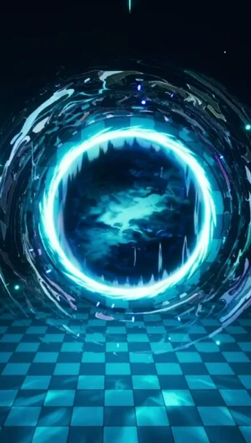  

]

---
## Dynamics in Unreal

[Niagara Visual Effects System](https://dev.epicgames.com/documentation/en-us/unreal-enginetutorials-for-niagara-effects-in-unreal-engine)

 

* Node-based
* Supports GPU and CPU simulations
* Modular: Reusable blocks that define properties
* Interactive, e.g. reacting to gameplay
* Integrates with Blueprints, Materials, and Skeletal Meshe

???
  

* https://dev.epicgames.com/documentation/en-us/unreal-engine/key-concepts-in-niagara-effects-for-unreal-engine

---
## Dynamics in Unreal

[Niagara Visual Effects System](https://dev.epicgames.com/documentation/en-us/unreal-enginetutorials-for-niagara-effects-in-unreal-engine)

  
* [Fluids](https://dev.epicgames.com/documentation/en-us/unreal-engine/fluid-simulation-in-unreal-engine---overview)

.center[  .imgref[[[epicgames]](https://dev.epicgames.com/documentation/en-us/unreal-engine/creating-visual-effects-in-niagara-for-unreal-engine)]]

???

## Destruction

* Geometry Collection
* Fracturing
* Clustering
* Fields
* Caching

.footnote[[My GameDev Pal, [Chaos Destruction in 300 Seconds](https://www.youtube.com/watch?v=paNTx_uviWg)]]

## Geometry Collection

.center[]

.footnote[[My GameDev Pal, [Chaos Destruction in 300 Seconds](https://www.youtube.com/watch?v=paNTx_uviWg)]]

???
  

* Geometry collections that define which objects are going to be destroyed
* Destruction within the kill system starts with the geometry collection asset. This can be built from one or more static meshes or blueprints containing static meshes. The easiest way to create a geometry collection is to drag the static mesh to which you want to apply chaos destruction into your level or use the default. Edit the cube and scale and Z-axis to form resemble a pillar. 

## Fracturing

.center[]

.footnote[[My GameDev Pal, [Chaos Destruction in 300 Seconds](https://www.youtube.com/watch?v=paNTx_uviWg)]]

???
  

* Fracturing which defines how these collections are destroyed

## Fracturing

.center[]

.footnote[[My GameDev Pal, [Chaos Destruction in 300 Seconds](https://www.youtube.com/watch?v=paNTx_uviWg)]]

???

* There are several types of methods available to define how we want to break it up during destruction
* Combining these will lead to more interesting looking destruction. 
* All these methods are based off the Voronoi pattern 

## Clustering

.center[]

.footnote[[My GameDev Pal, [Chaos Destruction in 300 Seconds](https://www.youtube.com/watch?v=paNTx_uviWg)]]

???
  

* Clustering that defines the different levels in which collections are destroyed.
* Fracture hierarchy window has opened up. This is a useful tool for debugging and selecting specific parts of your fracture, allowing you to switch between bone index and then view the fracture one of our regions even further. Simply selected, choose the fracture type settings and press fracture. As you can see, both visually and in the fracture hierarchy, our region has been fractured
into another subregion containing 20 or more fractures. What this has done is create an additional level of destruction. As it stands, our palette has three of these level zero. The initial state of our pillar level one, our first 20 region fracture and level to our second 20 region fracture. In order to visualize one of these levels at a time. You can use the shift W key to go down the level or shift s to go up a level. These levels of destruction are also referred to as clusters. The cluster tools are often used to control the visual quality and performance of a fractured mesh. A common use case is specifying different damage thresholds for each cluster in your fracture. To do this, navigate to the physics section of your geometry collection in the details panel and under the cluster settings, you'll see a damage threshold array. The array represents the level of your cluster, which the damage threshold corresponds to. So in our case, the value an index zero defines the amount of damage required to break apart our pillar.
In our first t fracture cluster, an index one defines the damage to further break out pillar into the level two cluster. If we set index zero to 800 and index one to 1 million, you can see that our second cluster never breaks apart. But if we set our index one to something like 200, then both of them break. Note that you can set these values in the details panel on the per basis as we did here, or you could set them directly in the geometry collection asset when clustering. It can be useful to see
03:52
the number of fractures within each cluster to do this. 

## Clustering

.center[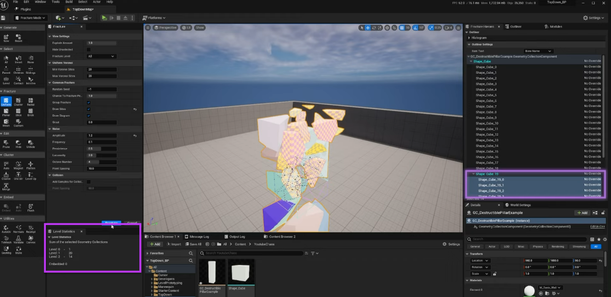]

.footnote[[My GameDev Pal, [Chaos Destruction in 300 Seconds](https://www.youtube.com/watch?v=paNTx_uviWg)]]

## Clustering

.center[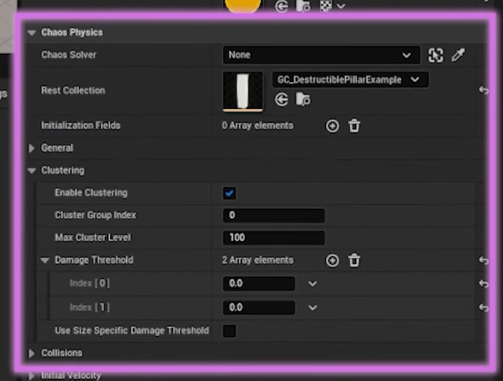]

.footnote[[My GameDev Pal, [Chaos Destruction in 300 Seconds](https://www.youtube.com/watch?v=paNTx_uviWg)]]

## Fields

.center[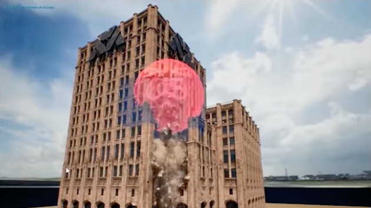]

.footnote[[My GameDev Pal, [Chaos Destruction in 300 Seconds](https://www.youtube.com/watch?v=paNTx_uviWg)]]

* Fields apply behaviors and effects onto collections within regions of space. 
* These fields are used to effect simulations of chaos objects by occupying a region of space and applying different behaviors and breakage effects in that space. There are three main types of physics fields, transient fields which are created executed and destroyed at runtime
04:16
during a function, call or event. These are used to add a temporary effect to the physics simulation. Then we have construction fields which are created in the construction script or the field blueprint. And finally, we have the persistent fields which are created and remain active until they're explicitly removed. Each of these fields applies to a specific physics type. Fields can also use different types of metadata to add additional information on how they behave. We'll create a cluster strain field
04:40
which will decay and break away the central pillar, resulting in its eventual collapse As field systems are currently in beta. You need to enable this plugin manually in the plugins window.

## Fields

.center[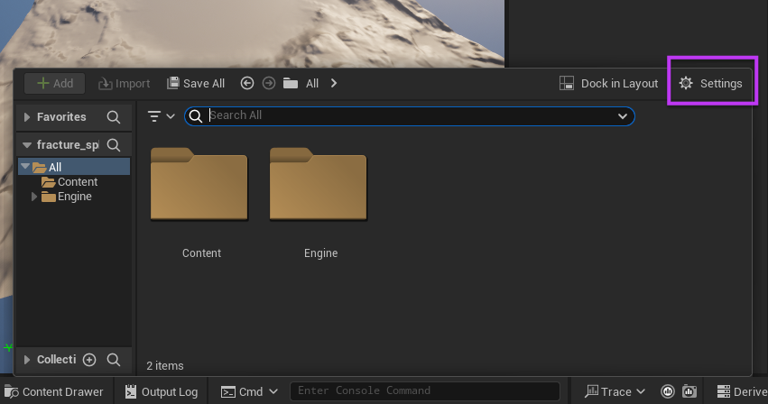]

## Fields

.center[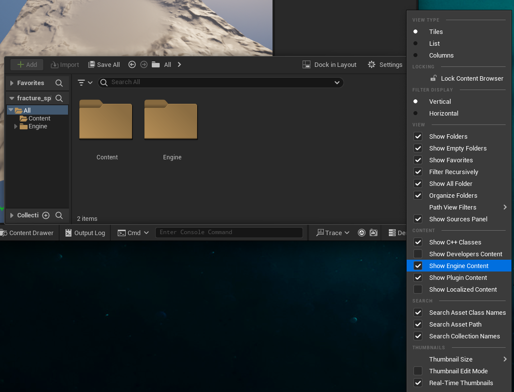]

## Fields

.center[]

* Search in the content browser for *bomb*

## Fields

.center[]

## Chaos Cache Manager

.center[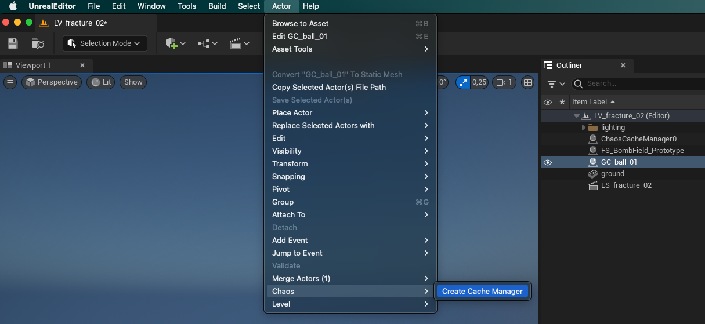]

* With the Geometry Collection selected

## Chaos Cache Manager

.center[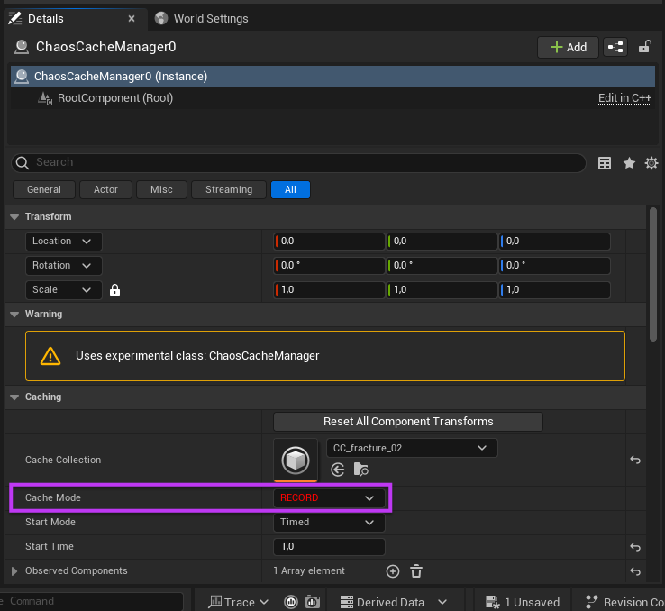]

1. Cache Mode: RECORD
2. Cache Mode: Static Pose

---
template:inverse

# Hands On!

---

.center[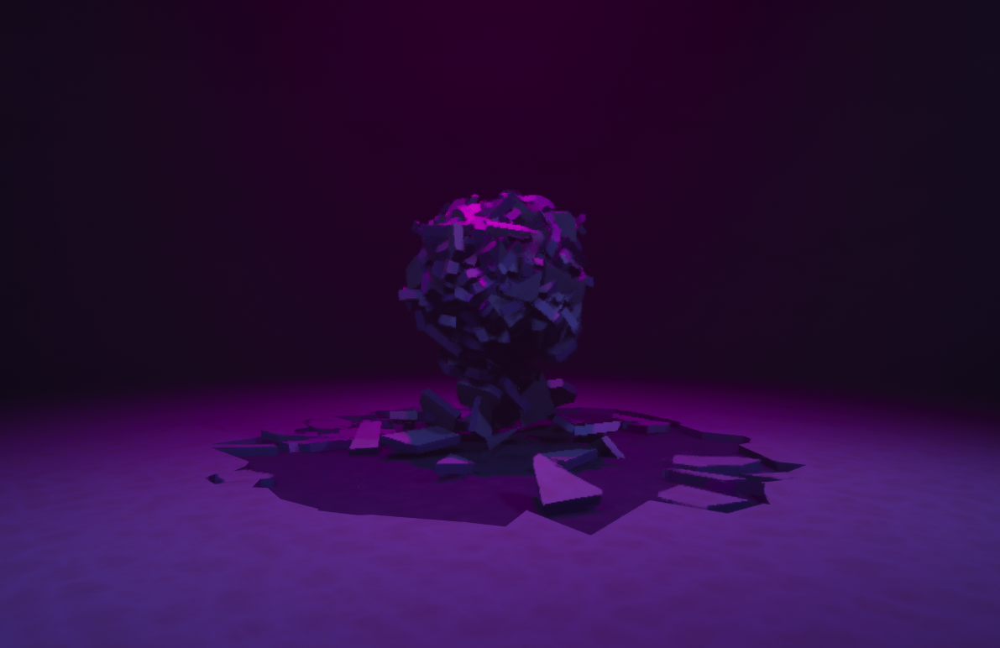]

---
template:inverse

## The End

# 👋🏻
