name: inverse
layout: true
class: center, middle, inverse
---


# Procedural Generation and Simulation

### Prof. Dr. Lena Gieseke | l.gieseke@filmuniversitaet.de  

#### Film University Babelsberg KONRAD WOLF

---
layout: false

## Today

* Re-cap Noise, Dynamics
* Homework

--

* Mathematical Foundations
    * Solver
    * Forces

--
* Particles
    * Niagara


---
template: inverse

# Chapter Noise


---
## Applications for Noise

--

.left-even[
* Design Element
  

]


???
  

* Almost all natural systems appear to combine structure with randomness even though they in fact follow complex creation rules on different scales. As proper simulations of the underlying rules are usually quite expensive to compute, a simple addition of noise is used fake natural systems.  
* The mushrooms appear to us to grow pretty random even though their growth is greatly controlled by factors such as light and foil properties.


---
## Applications for Noise

.left-even[
* Design Element
* Faking Complex Systems
  

]
.right-even[.imgref[
[[thisiscolossal]](https://www.thisiscolossal.com/wp-content/uploads/2016/11/mush-1.gif)]]


???
  

* Almost all natural systems appear to combine structure with randomness even though they in fact follow complex creation rules on different scales. As proper simulations of the underlying rules are usually quite expensive to compute, a simple addition of noise is used fake natural systems.  
* The mushrooms appear to us to grow pretty random even though their growth is greatly controlled by factors such as light and foil properties.

---
## Applications for Noise

.left-even[
* Design Element
* Faking Complex Systems
  

* Textures and Materials
* Height Fields
]
.right-even[.imgref[
[[thisiscolossal]](https://www.thisiscolossal.com/wp-content/uploads/2016/11/mush-1.gif)]]

---

## Randomness

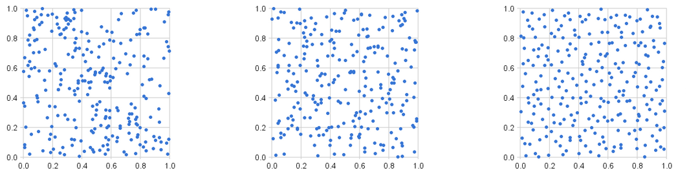 

.footnote[Marcolli, M. 2020. Lumen naturae: Visions of the abstract in art and mathematics. The MIT Press, Cambridge, MA., Norvig, P. 2012. [Warning Signs in Experimental Design and Interpretation](https://norvig.com/experiment-design.html). Online.]


???
  

> Which of these plots used the uniform distribution?


*  In one of the plots each of the blue points is sampled with equal probability from the entire square. Which one is it?
* Most people say the rightmost plot is "most random". Those with some statistical sophistication suspect it may be too random, and pick the middle plot. In fact, it is the leftmost plot that is a uniform random sample of 250 points on the unit square. In the middle plot, the grid is divided into the 25 squares shown by the light lines, and ten points are placed (with a random uniform distribution) in each of the 25 squares. The plot on the right is formed in a similar way, except it is composed of 64 smaller squares (not shown by lines), each of which has 4 points placed at random. People don't like the leftmost plot because it has several clumps of points that seem non-random. In fact, true randomness consists of a mixture of clumps and non-clumps. Randomness is different from homogeneity. 

--
   
> Humans are good at detecting patterns, but poor at detecting randomness!
  


---

## Procedural Noise

Engineering of the appearance of randomness.

--

 vs.  .imgref[[[scratchapixel]](https://www.scratchapixel.com/lessons/procedural-generation-virtual-worlds)]

--

We want small variations locally and large variations globally.


---
.header[Procedural Noise]

## Requirements For Procedural Noise

.left-even[
* Spatial correlation
* No Periodicity
* A Defined Distribution
* Reproducibility
]

.right-even[
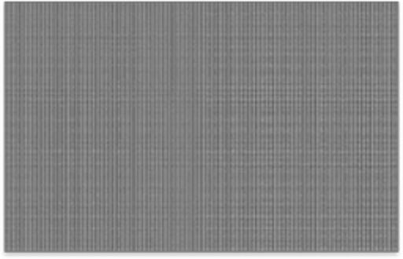  
]


???
  

* Minimal position shifts should not result in huge value differences, creating a smooth behavior. This means that local value changes are gradual, while global changes can be large.
* No Periodicity - At least, we do not want to see it.
* We want some control over the function, e.g. how smooth it is.
* The noise should look the same every time we compute is, e.g. in every frame we render unless we explicitly want a change e.g. for an animation.


---
.header[Noise Function Designs]

## (Lattice) Value Noise

--

.left-even[
* Fixed grid (the *lattice*)
* Random number for each grid point
* Interpolate in-between
    * Many interpolation algorithms available
    * Ensures spatial correlation
]

.right-even[
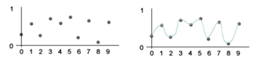
]


???
  
Lattice
* Relates the noise to space
* Defines the basic scale

---
.header[Noise Function Designs]

## Gradient Noise (Perlin Noise) 

--

.center[.imgref[[[scratchapixel]](https://www.scratchapixel.com/lessons/procedural-generation-virtual-worlds/perlin-noise-part-2)]]

--

Through the use of random vectors, the distribution of frequencies in the Perlin noise is more regular than the value noise's frequency spectrum.

???
  

* To get uneven frequency changes under control, we can define random normalized gradients, meaning random vectors, on a grid for each sample point instead of simply using values. Then, we interpolate a smooth function between those vectors.
* This causes the curve to go up on one side of the lattice point and down on the other side of that same point such as
* The worst case in regard to a uneven frequency distribution happens when two successive lattice points have gradients that aim at opposite directions (one points up and the other points down). Then the noise function will have a "S" like shape between the two points.

---
.header[Noise Function Designs]

## (Lattice) Gradient Noise

.center[[](https://www.shadertoy.com/playlist/fXlXzf&from=0&num=12) .imgref[[[iquilezles]](https://www.shadertoy.com/playlist/fXlXzf&from=0&num=12)]]


???
  

* Through the use of random vectors, the distribution of frequencies in the Perlin noise is more regular than the value noise's frequency spectrum.


## `noise()`

In almost all environments we are using you have pre-defined noise functions such as 

```glsl
// 1D
noise(x); 

//2D
noise(x, y);
```


```glsl
value = amplitude * noise(frequency * x + offset);
```

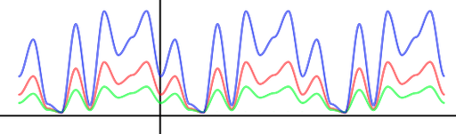

???
  

* For full control over your results, check which algorithm the `noise()` function is based and whether the noise creates the distribution you want. If not you can always go back to defining your own noise function. 


---
## Component Frequencies

.center[  .imgref[[[thebookofshaders]](https://thebookofshaders.com/11/)]]


???
  

* In the above example we can observe well that organic patterns have *multiple levels* of detail with self-similar structures.

---
## Component Frequencies

.center[ .imgref[[[hugo.elias]](https://web.archive.org/web/20150316212611/http://freespace.virgin.net/hugo.elias/models/m_perlin.htm)]]

--
* Defining a relationship between frequency, amplitude and successive octaves

--
* Ususally, for each level you *increase the frequency* and *decrease the amplitude*.

---
## Component Frequencies

.center[ .imgref[[[hugo.elias]](https://web.archive.org/web/20150316212611/http://freespace.virgin.net/hugo.elias/models/m_perlin.htm)]]

* Turbulent noise
* Fractal Brownian Motion (fBM)
* Fractal Noise
* Multi-Octave Noise


---
.header[Component Frequencies]

## Perlin’s Turbulence Noise

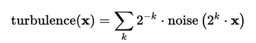

  
Levels to add are:

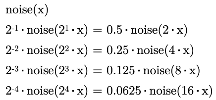 


---
.header[Component Frequencies]

## Noise Terminology


.left-even[
* Amplitutude & Frequency
* Octaves
* Persistence / Gain
* Lacunarity
* Point spacing
]

.right-even[
 

]

---
.header[Component Frequencies]

## Noise Terminology


.left-even[
* Amplitutude & Frequency
* Octaves: *Number of layers to be added*
* Persistence / Gain: *Factor to scale the amplitude each octave*
* Lacunarity: *Factor to scale the frequency each octave*
* Point spacing: *Size of the lattice*
]
.right-even[
 

]


???
  

 * Amplitutude: "Size" of waves
* Frequency: Period of noise / "repetition" of waves


---
## Worley Noise

--


.center[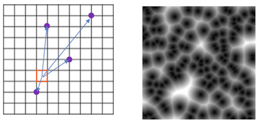]

???
  

* Worley noise is based on a distance field, for which you compute for each pixel the distance to a set of points. Then, we take the closest distance to all points found and use that as color information, e.g. black and white.
* This set of points are often randomly distributed feature points. 

---
## Worley Noise


.center[]


???
  

* Recapping: we subdivide the space into tiles; each pixel will calculate the distance to the point in their own tile and the surrounding 8 tiles; store the closest distance. The result is a distance field that looks like the following example:
* https://iquilezles.org/articles/smoothvoronoi/

---
## Worley Noise

.center[]  
.imgref[[[thebookofshaders]](https://thebookofshaders.com/12/)]


---
## Voronoi Diagram


---
## Voronoi Diagram


.left-even[  
.imgref[[[wiki]](https://en.wikipedia.org/wiki/Voronoi_diagram#/media/File:Euclidean_Voronoi_diagram.svg)]]


.right-even[
* Each point in a region is guaranteed to be closer to the region’s generating point than any of the other *n* possible generating points.
]


???
  

* A Voronoi diagram has the following characteristics:
* https://www.shadertoy.com/view/ldB3zc

---
## Voronoi Diagram

.left-even[.imgref[[[wiki]](https://de.wikipedia.org/wiki/Datei:Voronoi_growth_euclidean.gif)]]

.right-even[
* Living forms are shaped by this tension between an inner force to expand and grow, and limitations by outside forces.]


???
  

* You could also understand the algorithm from the perspective of the points (not the pixels). This would mean that each point grows its area until it finds the growing area from another point. This mirrors some of the growth rules in nature.  


---

## Curl Noise


.center[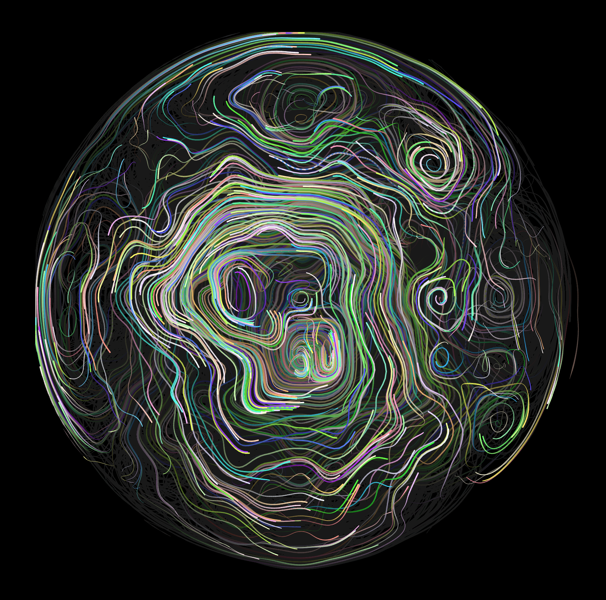
.imgref[[[Richard Bourne]](https://openprocessing.org/sketch/1601829)]]


---

## Curl Noise


A pseudo-fluid noise algorithm:

.center[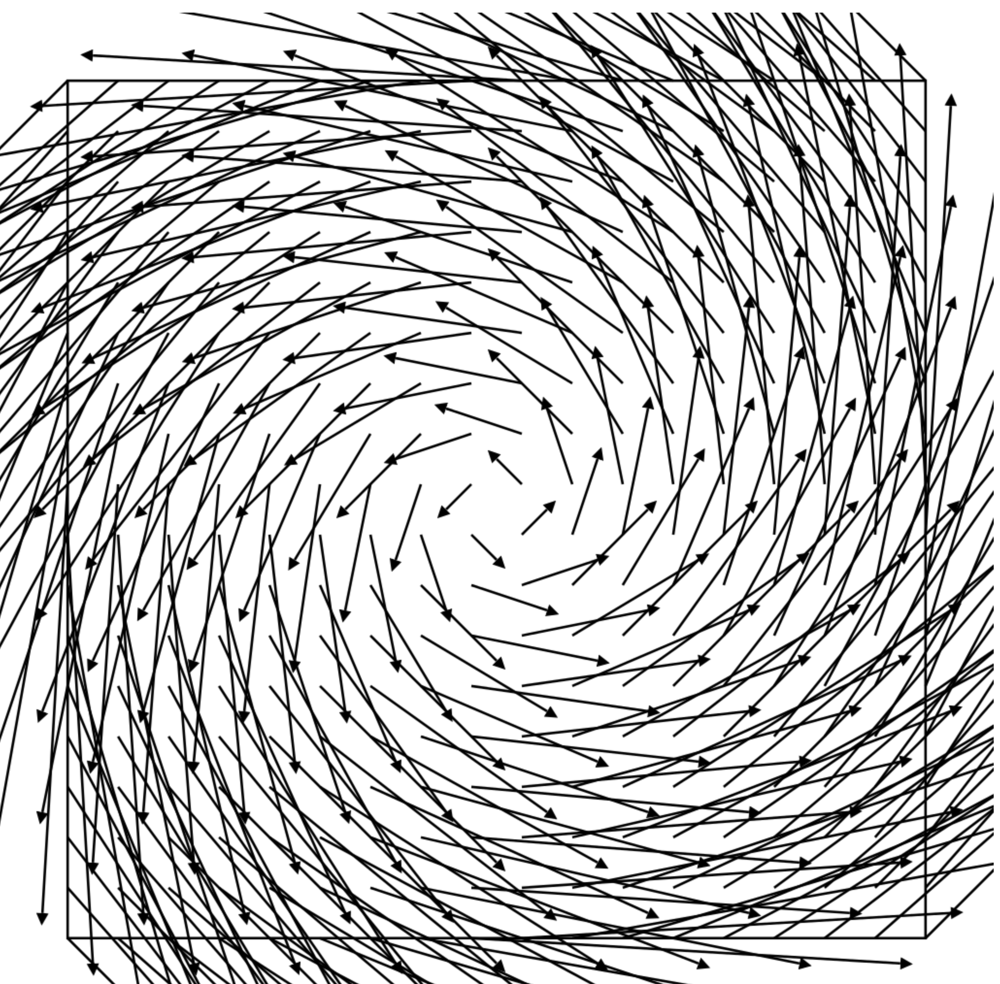]

.footnote[[Unity Graphics Programming vol.1, [freder.github](https://freder.github.io/UnityGraphicsProgrammingBook1/html-translated/vol2/Chapter%206%20_%20Curl%20Noise-Explanation%20of%20Noise%20Algorithms%20for%20Pseudo-Fluids.html)]]


---
template: inverse

# Chapter Dynamics

---
layout: false

## Animation

.left-even[[](https://www.youtube.com/watch?v=VTNmLt7QX8E)  
.imgref[[[Heider and Simmel]](https://doi.org/10.2307%2F1416950)]]

???
  

* https://www.youtube.com/watch?v=VTNmLt7QX8E

--
.right-even[
> Movement is one of, if not the most crucial aspect, for humans to assign liveness to objects!
]

???
  

* explores with which sentiments the animation of simple geometric objects is perceived.
* Which story does unfold here?

---
.header[Animation]

## How To Animate?


???
  

* what are the two main principles to animate objects?

--
* Keyframes

???
  

* You can define an animation explicitly, meaning you tell each object precisely where to go. 

--
* Kinematic solver

???
  

* Direct / Inverse kinematic? *geometry of motion*
    * A kinematics problem begins by describing the geometry of the system and declaring all initial conditions of any known values within the system such as of the position. Then, any unknown parts of the system, such as the position in the next frame can be derived from the geometry of the system.
    * Path animation
    * There are two types of indirect kinematic animation, namely *forward kinematics* and *inverse kinematics*.
--
* Dynamic solver

???
  

* This constitutes a *physically motivated animation* and implements how *forces* act on masses.
* As part of a dynamic system, objects can have influencing properties such as a mass or agency, but overall they do not know where to go next but mainly react to their environment.

--

A solver analyses and predicts behavior...


---
## Dynamic Solver

A dynamic solver computes the reaction of masses, e.g. their motion, under the influence of *forces* over time. 

  
> What is the position of an object at a specific time?

  

--

<br />
  
Key components:

--

* Time
* Forces
* Objects (might have a certain mass)


???

Force
* Intuitively, the application of a force can be described as a *push* or a *pull*.
* A force is any interaction that, when unopposed, will change the motion of an object.  
* A force has potentially both *magnitude* and *direction*, making it a **vector**.
* Forces can also be dynamic, meaning they can change over time. 


Time
* As dynamic forces might change over time, we need to account for and track the evolution of system states over time.
* Account for and track the evolution of system states
* *Stateful*: meaning past states (such as previous states of the forces) might influence future states.


---
## Dynamic Solver

.center[].imgref[[[tlemco]](https://tlemco.medium.com/tylers-life-hacks-01-e87f6fb3397a)]


---
## Dynamic Solver

> How changes a *force* the position of an object?


???
  

* **This now the question we want to answer**
* For using the magic of forces, we first have to dig into some mathematical backgrounds
* A force can cause an object with mass to change its *velocity* (which includes to begin moving from a state of rest), that is to *accelerate*.
* We are now going through the math that is needed to compute how a force changes the position of an object. For that we start the other way around, by investigating first what is happening when we change the position of an object.

--

Let's imagine, we have a function over time, $f(t)$, that computes how forces change the position of a object.

--

> How to find the position of the object at time t?

--

Calculus!

???
  
* *the study of change*
> Calculus is the mathematical study of change, in the same way that Geometry is the study of shape, and Algebra is the study of operations and their application to solving equations. [[5]](https://books.google.de/books?id=-WC_AAAAQBAJ&printsec=frontcover&hl=de&source=gbs_ge_summary_r&cad=0#v=onepage&q&f=false)
* Calculus is the study of change
* Calculus helps us to describe the object's position as a function over time...


Computations regarding moving objects and changing positions are part of *[Calculus](https://en.wikipedia.org/wiki/Calculus)*.  


---
.header[Dynamic Solver]

## Integration


An integral is the continuous analog of a sum. 

--

Integration determines the accumulation of a function over a time period:

--


.center[].imgref[[[socratic]](https://socratic.org/questions/what-is-an-integral)]


???
  

* The definite integral of a function f over an interval [a,b] represents the area defined by the function and the x-axis from point a to point b, as seen below.

---
.header[Dynamic Solver]

## Integration


An integral is the continuous analog of a sum.  
Integration determines the accumulation of a function over a time period:

.center[ ]


???
  

* The definite integral of a function f over an interval [a,b] represents the area defined by the function and the x-axis from point a to point b, as seen below.
* Imagine integration like filling a tank from a tap. The input (before integration) is the flow rate from the tap (velocity). Integrating the flow (adding up all the little bits of water) gives us the volume of water (new position) in the tank. Imagine the flow starts at 0 and gradually increases (maybe a motor is slowly opening the tap). As the flow rate increases, the tank fills up faster and faster. With a flow rate of 2x, the tank fills up at x2. We have integrated the flow to get the volume
* dx tells us with which variable we are integrating


--

The integration of $f(t)$ computes how forces changed the position of a object over a period of time.


---
.header[Dynamic Solver | Integration]

## How To Integrate?

Use a existing solver system, e.g. Unreal.


---
template: inverse

# Homework

---
## Homework

### Task 04.01 - Collect Noisy Inspiration

### Task 04.02 - Tutorial Fancy Cubes

--

> Are there any questions regarding the final project?


---
.header[Dynamic Solver]

## Integration


Integration determines the accumulation of a function over a time period:


.center[ ]

--

> The integration of $f(t)$ computes how forces changed the position of a object over a period of time.

???
  
An integral is the continuous analog of a sum.  
Integration determines the accumulation of a function over a time period:
  

* The definite integral of a function f over an interval [a,b] represents the area defined by the function and the x-axis from point a to point b, as seen below.
* Imagine integration like filling a tank from a tap. The input (before integration) is the flow rate from the tap (velocity). Integrating the flow (adding up all the little bits of water) gives us the volume of water (new position) in the tank. Imagine the flow starts at 0 and gradually increases (maybe a motor is slowly opening the tap). As the flow rate increases, the tank fills up faster and faster. With a flow rate of 2x, the tank fills up at x2. We have integrated the flow to get the volume
* dx tells us with which variable we are integrating


---
.header[Dynamic Solver | Integration]

## How To Integrate?

Use a existing solver system, e.g. Unreal.
  
---
.header[Dynamic Solver | Integration]

## How To Integrate?
  
Analytical solution

--
* Accurate
  
--
  
* Needed for real-world physical simulations
  
--
   
* [Integration rules](https://iacedcalculus.com/integration-rules/)

???
  

* Finding an integral is the reverse of finding a derivative

--
  
Approximation


???
  

*  Additionally, we might not be able to solve the integral analytically, as it is very likely that a system e.g. of many particles and forces is too complex for that
* We can approximate the analytical solution with numerical integration, which also requires to make small steps over time. A method, which is also called the method of small steps is the Euler method.

--
* Working with additions and sums instead of functions
* Just fine for CGI

--

How to integrate really depends on the scenario.  

---
.header[Dynamic Solver | Integration | Approximation]

## Euler Integration


???
  

* Now, instead of integrating the acceleration function (because we don't know how), we can approximate the velocity function by following its slope in small time steps. 

--

Follow $f(t)$ in small, discrete time steps

.left-even[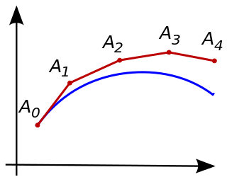].imgref[[[wiki]](https://www.wikiwand.com/en/Euler_method)]

--

* Start at a know point, e.g., zero
* Take a step in the direction of change
* Repeat

---
.header[Dynamic Solver | Integration | Approximation]

## Euler Integration

The smaller the time-steps the smoother the integration. Smaller steps might lead to performance issues:

.center[]


???
  


* For computing a dynamic system, e.g. a particle simulation, we start with the forces, the forces create acceleration, the acceleration is integrated to find the velocity and the velocity is integrated again to find the position. That position is then assigned to the moving element / particle.

Or:

**v'** = **v** + **a** · **Δt**  
**p'** = **p** + **v'** · **Δt**  


---
.header[Dynamic Solver | Integration | Approximation | Euler Integration]

## Direction of Change?

--

Move a short distance along a line tangent to the curve, which represents the derivative and with that the slope of the function at that point:

.center[]


???
  

* We start at an initial condition, e.g. zero and travel a small step along the line of the slope (the line tangent to that point) and add that velocity to the initial velocity. Then we travel on the tangent of that point a small step, finding the next velocity, and again and again. This is called Euler Integration.
* the slope of the tangent line to the curve can be computed at any point on the curve, once the position of that point has been calculated
* https://www.wikiwand.com/en/Euler_method

* For computing a dynamic system, e.g. a particle simulation, we start with the forces, the forces create acceleration, the acceleration is integrated to find the velocity and the velocity is integrated again to find the position. That position is then assigned to the moving element / particle.

Or:

**v'** = **v** + **a** · **Δt**  
**p'** = **p** + **v'** · **Δt**  


---
.header[Dynamic Solver | Integration]

## Approximations

Alternatives to Euler integration are, e.g., [Verlet Integration](https://en.wikipedia.org/wiki/Verlet_integration) or [Runge-Kutta Integration](https://en.wikipedia.org/wiki/Runge%E2%80%93Kutta_methods).


--
  
<br />

Approximations differentiate in 

* Mathematical complexity
* Accuracy
* Performance
* Stability


???
* If you have precision and / or performance issues, you might be able to change the integration computation.

---

## Dynamic Solver

In summary, a dynamic solver integrates a function $f(t)$ over time. The functions describes, e.g., how forces change the position of an object.

--

<br />

> How does such a function over time look like?

--

<br />

*On a Side Note:* In the following, we are only considering the movement of object(s).

---
template:inverse


### Dynamic Solver

## Mathematical Fundamentals


---
.header[Dynamics | Mathematical Fundamentals]

## Forces


???
  

* Intuitively, the application of a force can be described as a *push* or a *pull*.

--

A force is any interaction that, when unopposed, will change the motion of an object.  

--

<br >

A force has potentially both *magnitude* and *direction*, making it a **vector**.

--


<br >

> How can a *force* change the position of an object?


---
.header[Dynamics | Mathematical Fundamentals]

## Forces

A force is any interaction that, when unopposed, will change the motion of an object.  


<br >

A force has potentially both *magnitude* and *direction*, making it a **vector**.


<br >

> **How can a *force* change the position of an object?**


???
  

* **This now the question we want to answer**
* For using the magic of forces, we first have to dig into some mathematical backgrounds
* A force can cause an object with mass to change its *velocity* (which includes to begin moving from a state of rest), that is to *accelerate*.
* We are now going through the math that is needed to compute how a force changes the position of an object. For that we start the other way around, by investigating first what is happening when we change the position of an object.


---
.header[Dynamics | Mathematical Fundamentals]

## Movement

--

.center[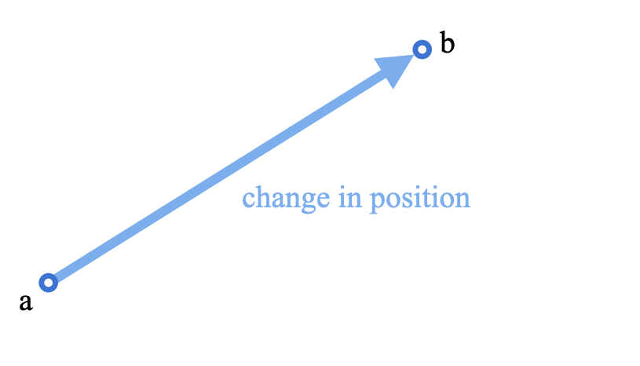]  


???
  

* Let's say we want to get from **a** to **b**. For that we add a vector to **a**, which moves it to **b**.


---
.header[Dynamics | Mathematical Fundamentals]

## Movement


.center[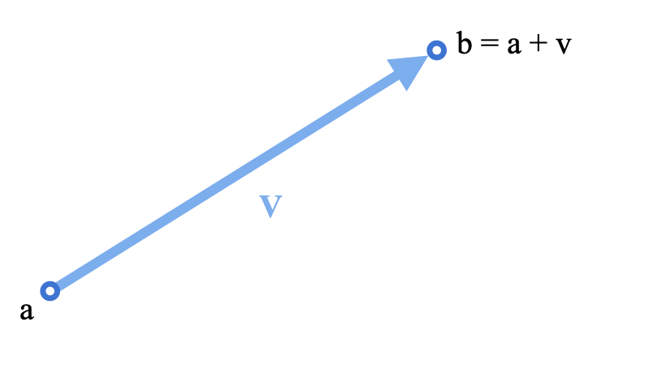]  


---
.header[Dynamics | Mathematical Fundamentals]

## Movement


.center[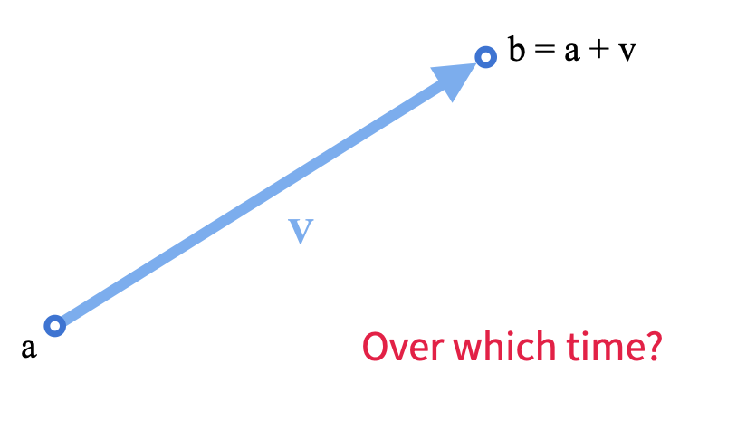]  


---
.header[Dynamics | Mathematical Fundamentals]

## Movement


.center[]  

---
.header[Dynamics | Mathematical Fundamentals]

## Movement


.center[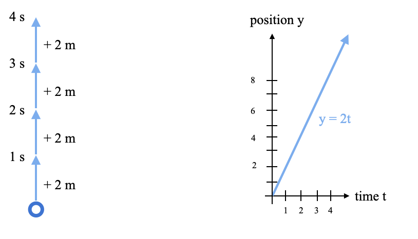]  

---
.header[Dynamics | Mathematical Fundamentals]

## Velocity

--

.left-even[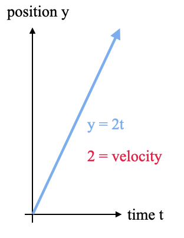]  

--

.right-even[
  
<br />
  
> The velocity of an object is the rate of change of its position over time.

] 


???
  

* Velocity is equivalent to a specification of an object's speed and direction of motion (e.g. 60 km/h to the north)
* In short, velocity is a *rate of change*.

---
.header[Dynamics | Mathematical Fundamentals]

## Velocity


.left-even[]  

.right-even[
  
<br />
  
> The velocity of an object is the **rate of change** of its position **over time**.

] 


???
  

* Velocity is equivalent to a specification of an object's speed and direction of motion (e.g. 60 km/h to the north)
* In short, velocity is a *rate of change*.

---
.header[Dynamics | Mathematical Fundamentals]

## Velocity


.left-even[]  

.right-even[
  
<br />
  
> The velocity of an object is the **rate of change** of its position **over time**.  
  
<br />
  
*Velocity (Geschwindigkeit) is telling us where to go.*
] 


???
  

* Velocity is equivalent to a specification of an object's speed and direction of motion (e.g. 60 km/h to the north)
* In short, velocity is a *rate of change*.

---
.header[Dynamics | Mathematical Fundamentals]

## Velocity Vector


.left-quarter[
* Speed
* Direction]  
.right-quarter[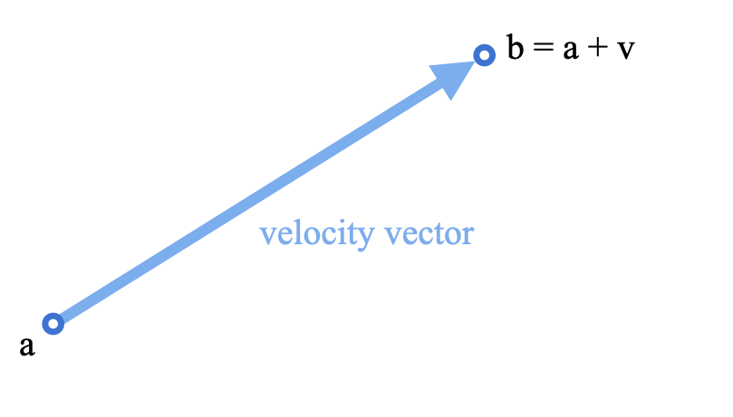]  


???
  

* The magnitude represents the speed, and direction, direction.


---
.header[Dynamics | Mathematical Fundamentals]

## Velocity


.left-even[]  

.right-even[

The velocity of a line, meaning its rate of change, is the same as its **slope** $m$.
]  


???
* In variable format, it is commonly represented by the letter m. 
* Also called the line's **gradient** or **rate of change**, describing the steepness and direction of a line


---
.header[Mathematical Fundamentals | Velocity]

## Slope


.left-even[]  

.right-even[

]  


---
.header[Mathematical Fundamentals | Velocity]

## Slope


.left-even[]  

.right-even[

]  

---
.header[Mathematical Fundamentals | Velocity]

## Slope


.left-even[]  

.right-even[

]  

---
.header[Mathematical Fundamentals | Velocity]

## Slope


.left-even[]  

.right-even[
$m = ?$
]  


---
.header[Mathematical Fundamentals | Velocity]

## Slope


.left-even[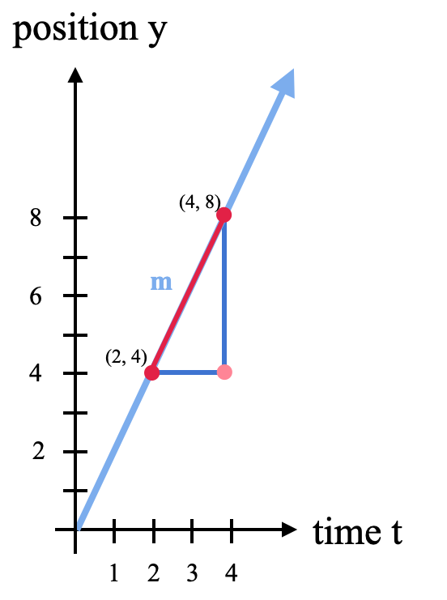]  

.right-even[
$m = ?$
]  


---
.header[Mathematical Fundamentals | Velocity]

## Slope


.left-even[]  

.right-even[
$m = \frac{\text{change in y}}{\text{change in t}}$
]  


---
.header[Mathematical Fundamentals | Velocity]

## Slope


.left-even[]  

.right-even[
$m = \frac{\text{change in y}}{\text{change in t}} = \frac{\Delta y}{\Delta t}$
]  


???
* The symbol Δ (delta) is an abbreviation for *"change in"*.


---
.header[Mathematical Fundamentals | Velocity]

## Slope


.left-even[]  

.right-even[
$m = \frac{\text{change in y}}{\text{change in t}} = \frac{\Delta y}{\Delta t} = \frac{y_2 - y_1}{t_2 - t_1}$
]  


---
.header[Mathematical Fundamentals | Velocity]

## Slope


.left-even[]  

.right-even[
$m = \frac{\text{change in y}}{\text{change in t}} = \frac{\Delta y}{\Delta t} = \frac{y_2 - y_1}{t_2 - t_1}$  
  
<br />

$m = \frac{\Delta y}{t_2 - t_1} = \frac{\Delta y}{4 - 2} = \frac{\Delta y}{2}$  
]  


---
.header[Mathematical Fundamentals | Velocity]

## Slope


.left-even[]  

.right-even[
$m = \frac{\text{change in y}}{\text{change in t}} = \frac{\Delta y}{\Delta t} = \frac{y_2 - y_1}{t_2 - t_1}$  
  
<br />

$m = \frac{y_2 - y_1}{t_2 - t_1} = \frac{8 - 4}{4 - 2} = \frac{4}{2} = 2$  
]  

---
.header[Mathematical Fundamentals | Velocity]

## Slope


.left-even[]  

.right-even[
$m = \frac{\text{change in y}}{\text{change in t}} = \frac{\Delta y}{\Delta t} = \frac{y_2 - y_1}{t_2 - t_1}$  
  
<br />

$m = \frac{y_2 - y_1}{t_2 - t_1} = \frac{8 - 4}{4 - 2} = \frac{4}{2} = 2$  
]  

---
.header[Dynamics | Mathematical Fundamentals]

## Velocity


.left-even[]  

.right-even[

The velocity of a line, meaning its rate of change, is the same as its **slope** $m$.
  
<br />
  
$m = 2$  
]  


---
.header[Dynamics | Mathematical Fundamentals]

## Line Description


.left-even[]  

.right-even[
$y = mx + b$ 
]  

---
.header[Dynamics | Mathematical Fundamentals]

## Line Description


.left-even[]  

.right-even[
$y = mt + b$ 
  
* $m$: slope
* $b$: y-intercept
* $t$: the independent variable of the function
]  


---
.header[Dynamics | Mathematical Fundamentals]

## Line Description


.left-even[]  

.right-even[
$y = mt + b$ 
  
* $m$: slope
* $b$: y-intercept
* $t$: the independent variable of the function
   
<br />
$y = 2t$
]  


---
.header[Mathematical Fundamentals | Velocity]

## Line Description

.center[

]


???
  

* * Also called the line's **gradient** or **rate of change**, describing the steepness and direction of a line


---
.header[Mathematical Fundamentals | Velocity]

## Constant Velocity

.left-even[]  


<iframe width=480 height=450 src="https://editor.p5js.org/legie/full/2jszhHJ9T"></iframe>

???
* How is this velocity description limited?

  


---
.header[Dynamics | Mathematical Fundamentals]

## Dynamic Velocity

$y = 2(t - 0.5)^3$

--

<br />

.center[ .imgref[[[entagma]](https://entagma.com/particles-part-03-the-principle-of-particle-simulation/)]] 


???
  

* Similarly, imagine we are animating the position of one red particle in y, based on the formula *y = 2(t-0.5)^3*. We can visualize the particle's movement in regard to the time in x.


---
.header[Dynamics | Mathematical Fundamentals]

## Dynamic Velocity

$y = 2(t - 0.5)^3$


<br />

 .imgref[[[entagma]](https://entagma.com/particles-part-03-the-principle-of-particle-simulation/)]


> How to compute velocity if it changes over time?


---
.header[Mathematical Fundamentals | Velocity]

## Slope

 .imgref[[[entagma]](https://entagma.com/particles-part-03-the-principle-of-particle-simulation/)] 


We need to be able to compute the slope at a single point!


---
.header[Mathematical Fundamentals | Velocity]

## Slope


.left-even[]  

--

.right-even[

]  


---
.header[Mathematical Fundamentals | Velocity]

## Slope

.left-even[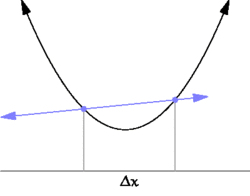  .imgref[[[wiki]](https://en.wikipedia.org/wiki/Derivative)]]


???
  

* For that, we shrink the difference to the neighboring point towards zero

--

.right-even[We shrink the difference between neighboring point towards zero!]


---
.header[Mathematical Fundamentals | Velocity]

## Slope

.left-quarter[  .imgref[[[wiki]](https://en.wikipedia.org/wiki/Derivative)]]


.right-quarter[

$m = \frac{\Delta f(x)}{\Delta x} = \frac{f(x + h) - f(x)}{(x + h) - (x)} = \frac{f(x + h) - f(x)}{h}$
  
]

---
.header[Mathematical Fundamentals | Velocity]

## Slope

.left-quarter[  .imgref[[[wiki]](https://en.wikipedia.org/wiki/Derivative)]]


.right-quarter[

$m = \frac{\Delta f(x)}{\Delta x} = \frac{f(x + h) - f(x)}{(x + h) - (x)} = \frac{f(x + h) - f(x)}{h}$
  
<br />
  
$m = \lim_{h \to 0}{ \frac{f(x + h) - f(x)}{h}} $

]


---
.header[Mathematical Fundamentals | Velocity]

## Slope

.left-quarter[  .imgref[[[wiki]](https://en.wikipedia.org/wiki/Derivative)]]


.right-quarter[

$m = \frac{\Delta f(x)}{\Delta x} = \frac{f(x + h) - f(x)}{(x + h) - (x)} = \frac{f(x + h) - f(x)}{h}$
  
<br />
  
$m = \lim_{h \to 0}{ \frac{f(x + h) - f(x)}{h}} $


  
<br />
  
$f'(x) = \lim_{h \to 0}{ \frac{f(x + h) - f(x)}{h}} $
]


---
.header[Mathematical Fundamentals | Velocity]

## Differentiation

--

*Differentiation* is a method to find an *exact value for the slope*, hence the rate of change at any given time t. 

--

> The first derivative of the function *y = f(t)* is a measure of the rate at which the value *y* of the function changes with respect to the change of the time *t*.


???
  

* This means in our context the first derivative of the function *y = f(t)* is a measure of the rate of change.


---
.header[Mathematical Fundamentals | Velocity]

## Differentiation

.left-even[

Position function: $y = 2(t-0.5)^3$ 

]


.right-even[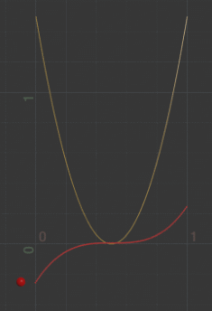  .imgref[[[entagma]](https://entagma.com/particles-part-03-the-principle-of-particle-simulation/)]] 


???
  

* The first derivative of the function y = f(t) is a measure of the rate at which the value y of the function changes with respect to the change of the time t.
* https://www.mathsisfun.com/calculus/derivatives-rules.html
* For many functions there are [differentiation rules](https://en.wikipedia.org/wiki/Differentiation_rules) to find a function's derivatives such as analytical solution in yellow shown above. If an analytical solution (meaning to calculate the exact solution by well-defined steps, such as the rules to derivate a function statement) is not possible, numerical approximations are used instead. We will come back to that.
* y = 2(t-0.5)^3 => 6*(t-0.5)^2


---
.header[Mathematical Fundamentals | Velocity]

## Differentiation

.left-even[

Position function: $y = 2(t-0.5)^3$ 
  
Velocity function: $y' = 6(t-0.5)^2$ 


]


.right-even[  .imgref[[[entagma]](https://entagma.com/particles-part-03-the-principle-of-particle-simulation/)]] 


???
  

* The first derivative of the function y = f(t) is a measure of the rate at which the value y of the function changes with respect to the change of the time t.
* https://www.mathsisfun.com/calculus/derivatives-rules.html
* For many functions there are [differentiation rules](https://en.wikipedia.org/wiki/Differentiation_rules) to find a function's derivatives such as analytical solution in yellow shown above. If an analytical solution (meaning to calculate the exact solution by well-defined steps, such as the rules to derivate a function statement) is not possible, numerical approximations are used instead. We will come back to that.
* y = 2(t-0.5)^3 => 6*(t-0.5)^2

---
.header[Mathematical Fundamentals | Velocity]

## Differentiation

.left-even[

Position function: $y = 2(t-0.5)^3$ 
  
Velocity function: $y' = 6(t-0.5)^2$ 

<br >
The velocity function is the first derivative of the position function.

]


.right-even[  .imgref[[[entagma]](https://entagma.com/particles-part-03-the-principle-of-particle-simulation/)]] 


???
  

* The first derivative of the function y = f(t) is a measure of the rate at which the value y of the function changes with respect to the change of the time t.
* https://www.mathsisfun.com/calculus/derivatives-rules.html
* For many functions there are [differentiation rules](https://en.wikipedia.org/wiki/Differentiation_rules) to find a function's derivatives such as analytical solution in yellow shown above. If an analytical solution (meaning to calculate the exact solution by well-defined steps, such as the rules to derivate a function statement) is not possible, numerical approximations are used instead. We will come back to that.
* y = 2(t-0.5)^3 => 6*(t-0.5)^2


---
.header[Dynamics | Mathematical Fundamentals]

## Movement


.center[]  


---
.header[Dynamics | Mathematical Fundamentals | Velocity]

## In Summary

The integration of $f(t)$ computes how forces changed the position of a object over a period of time.

.center[ ]


???
  

* The definite integral of a function f over an interval [a,b] represents the area defined by the function and the x-axis from point a to point b, as seen below.
* Imagine integration like filling a tank from a tap. The input (before integration) is the flow rate from the tap (velocity). Integrating the flow (adding up all the little bits of water) gives us the volume of water (new position) in the tank. Imagine the flow starts at 0 and gradually increases (maybe a motor is slowly opening the tap). As the flow rate increases, the tank fills up faster and faster. With a flow rate of 2x, the tank fills up at x2. We have integrated the flow to get the volume
* dx tells us with which variable we are integrating


---
.header[Dynamics | Mathematical Fundamentals | Velocity]

## In Summary

Velocity measures the change in position over a certain time.
  

--
  
<br />

> Hence, the integration of **v** computes how the position of a object changes over a period of time.
  

???
  
> The integral of the object’s velocity over time tells us the position when that time period ends.

* Strictly speaking, we need to integrate the velocity over the time step delta


--
  

<br />

**p' = p + v · Δt ** 

  
--
  
Velocity can be described as the first derivative of position.


--
(And position is the integral of the velocity)


---
## Mathematical Fundamentals

.center[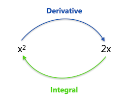]


???
  

* The inverse of derivation is integration


---
.header[Dynamic Solver | Integration | Approximation]

## Euler Integration


Move a short distance along a line tangent to the curve, which represents the derivative and with that the slope of the function at that point:

.center[]


???
  

* We start at an initial condition, e.g. zero and travel a small step along the line of the slope (the line tangent to that point) and add that velocity to the initial velocity. Then we travel on the tangent of that point a small step, finding the next velocity, and again and again. This is called Euler Integration.
* the slope of the tangent line to the curve can be computed at any point on the curve, once the position of that point has been calculated
* https://www.wikiwand.com/en/Euler_method

* For computing a dynamic system, e.g. a particle simulation, we start with the forces, the forces create acceleration, the acceleration is integrated to find the velocity and the velocity is integrated again to find the position. That position is then assigned to the moving element / particle.

Or:

**v'** = **v** + **a** · **Δt**  
**p'** = **p** + **v'** · **Δt**  


---
## Mathematical Fundamentals

**p'** = **p** + **v** · **Δt**    
  
--
  

> How can a *force* change the position of an object?
  
--
  

We are on our way...


---
.header[Dynamics | Mathematical Fundamentals]

## Acceleration

--

If there is a change in speed, direction or both, then the object has a changing velocity and is said to be undergoing an *acceleration* (*Beschleunigung*). 


???
  

* For example, a car moving at a constant 20 kilometers per hour in a circular path has a constant speed, but does not have a constant velocity because its direction changes. Hence, the car is considered to be undergoing an acceleration.

--

> Acceleration measures the the change in velocity over a certain time. **Acceleration can be described as the first derivative of velocity and the second derivative of position**.

---
.header[Dynamics | Mathematical Fundamentals]

## Acceleration

.left-even[

Position function: $y = 2(t-0.5)^3$ 
  
Velocity function: $y' = 6(t-0.5)^2$ 
  
Acceleration function: $y'' = 12t-6$ 

]


.right-even[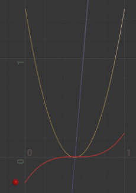  .imgref[[[entagma]](https://entagma.com/particles-part-03-the-principle-of-particle-simulation/)]] 


???
  

* Again, we can easily plot the analytical solution of the derivative of the velocity of the particle, or the second derivative of the position, hence its acceleration (in blue)
* * y = 2(t-0.5)^3 => 6*(t-0.5)^2 => 12t-6

---
.header[Dynamics | Mathematical Fundamentals]

## In Summary

--
* Velocity measures the change in position over time

--
* Acceleration measures the change in velocity over time  
  
--
  
**v'** = **v** + **a** · **Δt**  
**p'** = **p** + **v'** · **Δt**  


???
  

Roughly speaking:

* How do we find the next position?
**We add the velocity!**

* How do we find this velocity?
**We add the acceleration!**
  
--

<br >
  
After a given time step:
  
* The integral of the object’s acceleration computes the velocity
* The integral of the object’s velocity computes the position


???
  

We compute the integral analytically or approximate it.

*  The integral of the object’s velocity over time tells us the position when that time period ends.

---
.header[Dynamics]

## Mathematical Fundamentals

> How can a *force* change the position of an object?
  
--
  
<br />
  
**v'** = **v** + **a** · **Δt**  
**p'** = **p** + **v'** · **Δt**  

  
<br />
  

Almost there...


???
  

* Well, that is all fun and games but didn't we want to figure out how a *force* changes the position of an object? Remember that we earlier learned that a force is a vector that causes an object with mass to *accelerate*. To accelerate, acceleration...? It seems like we are getting closer. But first, some more background theory 😁! 

---
template:inverse

### Dynamic Solver

## Newton’s Second Law of Motion


---

## Newton’s Laws of Motion

--
1. An object at rest stays at rest and an object in motion stays in motion.

--
2. ...

--
3. For every action there is an equal and opposite reaction.


???
  

* 1.:...for a constant speed and direction - as we already know! A force will mix things up. For example, a ball tossed in the earth’s atmosphere slows down because of the air resistance, which is a force.
* 3.: This law is a bit tricky to understand. The third law states that all forces between two objects exist in equal magnitude and opposite direction: if one object A exerts a force **F**<sub>A</sub> on a second object B, then B simultaneously exerts a force **F**<sub>B</sub> on A, and the two forces are equal in magnitude and opposite in direction: **F**<sub>A</sub> = −**F**<sub>B</sub> [29, as cited in [8]]. The third law means that all forces are interactions between different bodies [30, 31, as cited in [8]] and thus that there is no such thing as a force that is not accompanied by an equal and opposite force. This law is sometimes referred to as the *action-reaction law*, with one force called the *action* and the other one as the *reaction*.  
* From a conceptual standpoint, Newton's third law is seen when a person walks: they push against the floor, and the floor pushes against the person. In swimming, a person interacts with the water, pushing the water backward, while the water simultaneously pushes the person forward — both the person and the water push against each other. The reaction forces account for the motion in these examples. These forces depend on friction; a person or car on ice, for example, may be unable to exert the action force to produce the needed reaction force to move [32, as cited in [8]].
* The good news is that in computer graphics we don't have to stay true to physics but only need to model the perceived visual results of the law such as a character walking.


---
## Newton’s Second Law of Motion

--

> Force equals mass times acceleration, hence **F** = **M** · **A**.  

--

With **F** as force, **M** as mass and **A** as acceleration.


???
  

* Why is this exciting? Well, now we have a formula that directly ties a force to acceleration, which we had already tied to a change of position, meaning, moving stuff. 
* The law says that acceleration is directly proportional to force and that acceleration is inversely proportional to mass. This means if you get pushed, the harder you are pushed, the faster you’ll move (or accelerate) and the bigger you are, the slower you’ll move!
    * The *mass* of an object is a measure of the amount of matter in the object (measured in kilograms).
    * *Weight*, though often mistaken for mass, is technically the force of gravity on an object. From Newton’s second law, we can calculate it as mass times the acceleration of gravity (w = m * g). Weight is measured in newtons.
    * *Density* is defined as the amount of mass per unit of volume (grams per cubic centimeter, for example).
    * An object that has a *mass* of one kilogram on earth and would have a *mass* of one kilogram on the moon. However, it would *weight* only one-sixth as much.

--


???
  

* We can also now express acceleration simply as..
* Once again, let's keep in mind that we work with a pretend pixel world. If we want to, objects can have a mass equal to 1.

--
  
<br />
With mass equal to 1, we have  **A** = **F**!

???
  
If we want to, objects can have a mass equal to 1. Then we have **A** = **F**, meaning that the acceleration of an object is equal to the force applied. 


---
## Newton’s Second Law of Motion


More precisely: *the net force equals mass times acceleration*, meaning that 

  

> Acceleration is equal to the **sum of all forces** divided by mass!


???
  

* If we have more than one force such as gravity and wind, we refer to a more precise formulation of the second law as *the net force equals mass times acceleration*, meaning in turn that acceleration is equal to the *sum of all forces* divided by mass.

---
## Newton’s Second Law of Motion

> How can a *force* change the position of an object?


???
  

* Ok, now. Back to the question: how does a force change the position of an object? We know that with a mass of one, the force equals the acceleration of the object. 


--
  
<br />
  
**v'** = **v** + **a** · **Δt**  
**p'** = **p** + **v'** · **Δt**  


---
## Newton’s Second Law of Motion

> How can a *force* change the position of an object?

  
<br />
  
**v'** = **v** + **F** · **Δt**   
**p'** = **p** + **v'** · **Δt**  
  


--
1. Add up all forces

--
2. Compute the velocity

--
3. Compute the position

--

*Compute*: integrate analytically or approximate it


???
  

* So, we start with the force or acceleration and want to compute the velocity and position from that.
* Seems like we somehow need to go the steps we took to get from position to acceleration the other way around.  
  
*What is this other way around?*    
*What is the inverse of a derivation?*

* The inverse of derivation is integration


---
## Mathematical Fundamentals


???
  

* Imagine integration like filling a tank from a tap. The input (before integration) is the flow rate from the tap (velocity). Integrating the flow (adding up all the little bits of water) gives us the volume of water (new position) in the tank. Imagine the flow starts at 0 and gradually increases (maybe a motor is slowly opening the tap). As the flow rate increases, the tank fills up faster and faster. With a flow rate of 2x, the tank fills up at x<sup>2</sup>. We have integrated the flow to get the volume. [[9]](https://www.mathsisfun.com/calculus/integration-introduction.html)  

---
.header[Dynamics | Mathematical Fundamentals]

## In Summary

.center[
**v'** = **v** + **a** · **Δt**  
**p'** = **p** + **v'** · **Δt**]
  
--
  
with

* Acceleration as the sum of all forces divided by mass

--
* Velocity as the integral of acceleration

--
* Position as the integral of velocity

---
## Dynamic Solver


> In a dynamic system we define forces, these forces create acceleration, from these we compute the velocity and from that the position.


???
* The same again in prosa

--

<br />
As dynamic forces might change over time, we need to integrate repeatedly in certain time steps for detecting any changes of the force.

???
  

*  Hence, at each time step we compute the force, add it to the velocity and add the velocity to the position. 

---
.header[Forces | Integration]


.center[  .imgref[[[entagma]](https://entagma.com/particles-part-03-the-principle-of-particle-simulation/)]] 

???
  
* The same again as visual
* So, we are in the situation that we want to integrate the acceleration function (blue) to get the velocity function (yellow). Then, we want to integrate the velocity function to get the position function (red) and with that the position of the object that is moved by a force.
* Remember, the acceleration function (blue) is defined by the rate of change of the velocity function (yellow). This rate of change is also described by the slope at a certain point of the yellow velocity graph.

---
.header[Dynamics]

## Example Shiffman's Nature of Code

--

```js
// https://editor.p5js.org/legie/sketches/zL3LSU3tH

function draw() {
    ...

    let gravity = createVector(0, 0.1);
    mover.applyForce(gravity);
    mover.update();

    ...
}
```


???
* https://editor.p5js.org/legie/sketches/zL3LSU3tH


---

```js
class Mover {
  constructor() {
    this.mass = 1;
    this.position = createVector(width / 2, 30);
    this.velocity = createVector(0, 0);
    this.acceleration = createVector(0, 0);
  }

  applyForce(force) {
    let f = p5.Vector.div(force, this.mass);
    this.acceleration.add(f);
  }

  update() {
    this.velocity.add(this.acceleration);
    this.position.add(this.velocity);

    this.acceleration.mult(0);
  }
...
}
```


???
* https://editor.p5js.org/legie/sketches/zL3LSU3tH


---
template:inverse

# Particle Systems

---
## Particle Systems


???
  

* The process of making the particles move is also called *simulation*.  
* I have already mentioned that with particles we almost always want to work with a dynamic system to make the particles move as we don't want to animate each particle manually.
* So what are we talking about here exactly?


--

> A particle system is a collection of many many minute particles that together represent a fuzzy object. Over a period of time, particles are generated into a system, move and change from within the system, and die from the system.  
  
— William Reeves, [*Particle Systems—A Technique for Modeling a Class of Fuzzy Objects*](https://dl.acm.org/doi/epdf/10.1145/964967.801167), ACM Transactions on Graphics 2:2 (April 1983), 92.


???
  

* Reeves created [these particle effects](https://www.youtube.com/watch?v=zXFNypyMJCc) in the 80s as the first one to do so.

---
## Particle Systems

.center[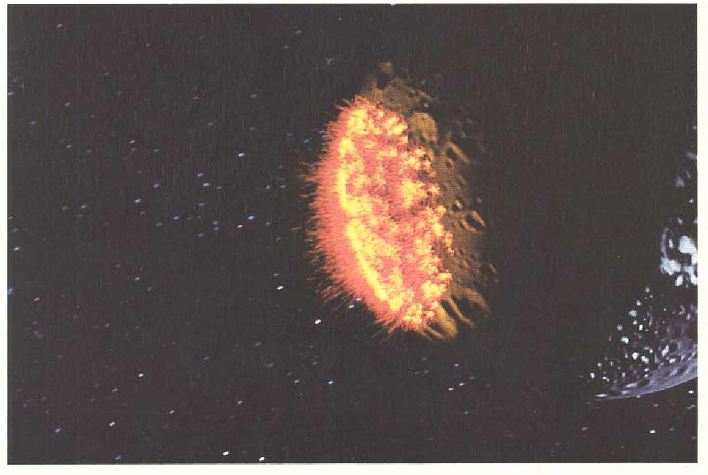]
  
— William Reeves, [*Particle Systems—A Technique for Modeling a Class of Fuzzy Objects*](https://dl.acm.org/doi/epdf/10.1145/964967.801167), ACM Transactions on Graphics 2:2 (April 1983), 92.

???
  

* From this quote we can gather that we have a large amount of particles ("many many"), that time ("over a period of time") and movement ("move") matter and that there is some sort of lifecycle ("are generated" and "die").
* Reeves is famous for his contributions to particle systems, a method used to model fuzzy objects in computer graphics. In this context, a fuzzy object is typically represented by a collection of particles that together create the appearance of a diffuse, soft-edged form. This approach allows for the realistic simulation of complex, dynamic phenomena that are difficult to model using traditional geometric techniques. In summary, when William Reeves refers to a "fuzzy object," he is likely discussing objects that have soft, undefined boundaries, often simulated using particle systems in computer graphics to achieve realistic visual effects for natural phenomena.

---
## Particle Systems

> A particle system is a collection of **many many** minute particles that together represent a fuzzy object.** Over a period of time**, particles are generated into a system, **move** and **change** from within the system, and **die** from the system.  
  
— William Reeves, *Particle Systems—A Technique for Modeling a Class of Fuzzy Objects*, ACM Transactions on Graphics 2:2 (April 1983), 92.

???
  

* From this quote we can gather that we have a large amount of particles ("many many"), that time ("over a period of time") and movement ("move") matter and that there is some sort of lifecycle ("are generated" and "die").
* Reeves is famous for his contributions to particle systems, a method used to model fuzzy objects in computer graphics. In this context, a fuzzy object is typically represented by a collection of particles that together create the appearance of a diffuse, soft-edged form. This approach allows for the realistic simulation of complex, dynamic phenomena that are difficult to model using traditional geometric techniques. In summary, when William Reeves refers to a "fuzzy object," he is likely discussing objects that have soft, undefined boundaries, often simulated using particle systems in computer graphics to achieve realistic visual effects for natural phenomena.


---
## Particle Systems


Such systems of *many* things can 

--
* represent a variety of natural systems such as birds flocking, fish schooling, ecosystems evolving, etc., and

--
* model irregular types of natural phenomena auch as fire, smoke, waterfalls, fog, grass, bubbles, etc.


---
## Particle Systems

.center[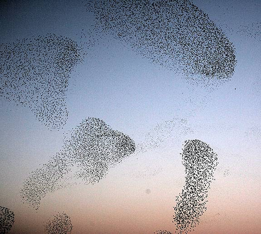].imgref[[[princeton.edu]](https://www.princeton.edu/news/2013/02/07/birds-feather-track-seven-neighbors-flock-together)]

---
## Particle Systems

.center[] .imgref[[[pinterest]](https://www.pinterest.de/pin/31243791139408749/)]


???
  

* These systems are dynamics systems, often simulating based on insights from physics and based on Newton’s laws of motion about how to apply forces.

---
## Particle Systems

.center[] .imgref[[[wallpapercave]](https://wallpapercave.com/w/wp9767060)]


---
.header[Particle Systems]

## The System

--

A single particle is an independent body that moves. 

--
  
<br />

For building a system of moving particles, you need:

--
1. A constructor initializing the system

--
2. Computation of acceleration, velocity and position for each particle

--
3. Application of the newly computed values


--
Step 2. and 3. are usually executed by your 3D environment. 


???
  

* We will use it in the exercise. If we were in Processing or p5 or such, we would also need to explicitly call a `display()` or render method for the particles in a fourth step.


---
.header[Particle Systems | Setup]

## Emitter

--

The source of the particles.

--
* A single burst of particles, a continuous stream of particles, or both  

--
* Controls the initial settings of the particles
  


???
  

* Such as their position, velocity, etc. 


---
.header[Particle Systems | Setup]

## Life Cycle

During its life, particles can be controlled in various ways.
  
<br />

--

After a certain amount of time, particles die of various possible reasons.
* Collision, running off screen, etc.  

--
  
<br />
Particles should have a well defined lifespan!


???
  

* In regard to life cycles make sure to actually delete the affected particles. For example (up to my current knowledge), when you work with Processing and objects wander off-screen they continue to exists as normal objects and are recomputed.


---
.header[Particle Systems]

## A System of Systems

A particle system is in itself an object.  
  
--
  
As such you can easily build a system of systems of systems of systems of systems...


???
which most effects do

--

.left-even[]

--

This principle relates to self-similar structures, fractals, turbulence noise, etc.


???
  

* We have already seen this principles in self-similar structures such as fractals or turbulence noise. But we can find this principle of *nesting* in all aspects of the world. E.g. an organ is a system of cells, a human body is a system of organs, a neighborhood is a system of human bodies, a city is a system of neighborhoods, and so own.


---
template:inverse

# Niagara


---
## Niagara

Workflow:

--
* System

???
  

* First create a Niagara System in which you can add one or more emitters. You can then set up the properties of each emitter.

--
* Emitters

???
  

* In the Niagara Editor, you can adjust your emitter by changing the properties of the modules already in it, or add new modules for the desired effect. You can also copy emitters and add multiple emitters into a single Niagara system. For an example of this, see the Sparks tutorial.

--
* Modules

???
  

* In your emitter, you can add existing modules from Niagara by clicking on the Plus (+) of the group where you want to add the module. Niagara comes with a lot of pre-existing modules, and for the majority of circumstances you will be able to create your effects without needing to do any custom module design.

However, if you want to create your own modules, it can be helpful to understand how the data flows through a module.

---
.header[Niagara]

## New Niagara System

.center[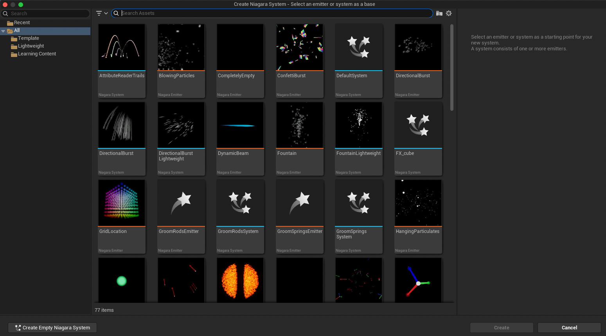]

---
.header[Niagara]

## New Niagara System

.center[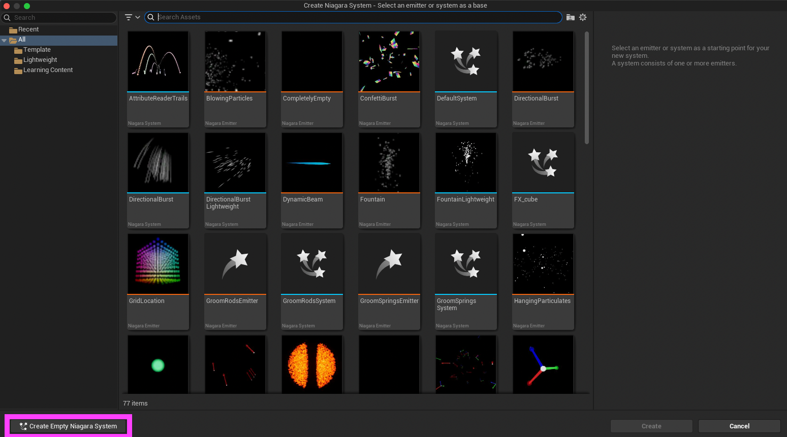]

---
.header[Niagara | The System]

.center[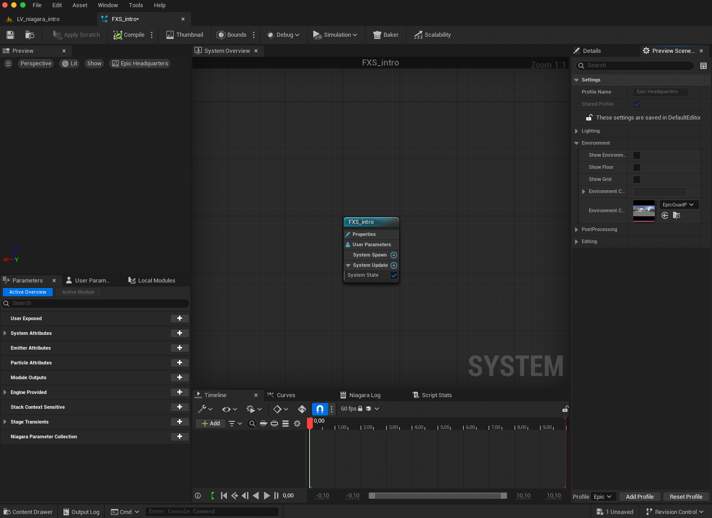]

---
.header[Niagara]

## The System

.left-quarter[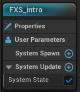]

--

.right-quarter[

* Global system parameters, e.g. CPU vs. GPU rendering


]


.footnote[[[Unreal Documentation](https://dev.epicgames.com/documentation/en-us/unreal-engine/overview-of-niagara-effects-for-unreal-engine)]]


???
  

* A Niagara system is a container for everything you will need to build that effect. Inside that system, you may have different building blocks that stack up to help you produce the overall effect.

You can modify some system-level behaviors that will then apply to everything in that effect.

* Like emitters, systems work in a stack paradigm, and also work with a Sequencer timeline — which you can use to control how the emitters in the system behave. A system is a container for emitters. The system combines these emitters into one effect. When editing a system in the Niagara Editor, you can modify and override any parameter, module or emitter that is in the system.
* The Timeline panel in the System Editor shows which emitters are contained in the system, and can be used to manage those emitters.


---
.header[Niagara]

## Emitter


.center[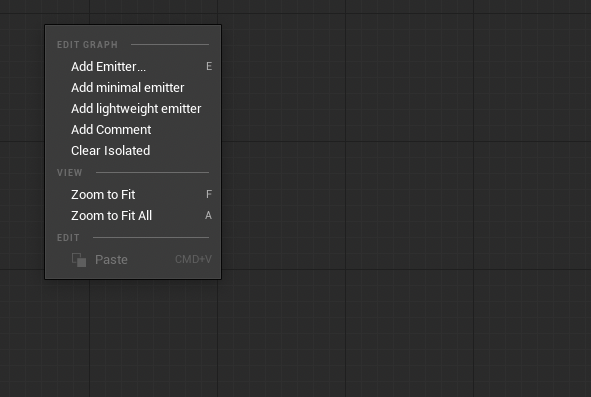]


---
.header[Niagara | Emitter]


.center[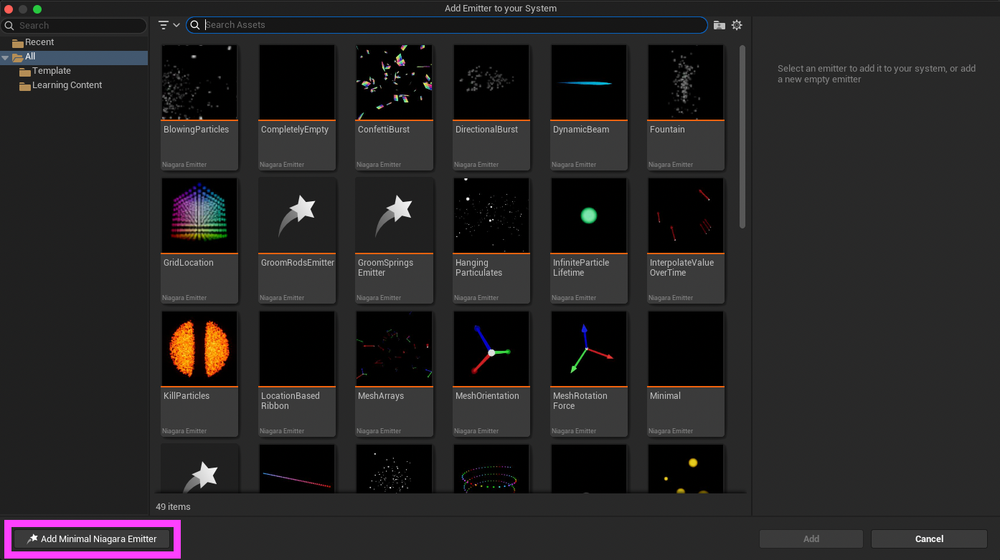]


---
.header[Niagara | Emitter]


.center[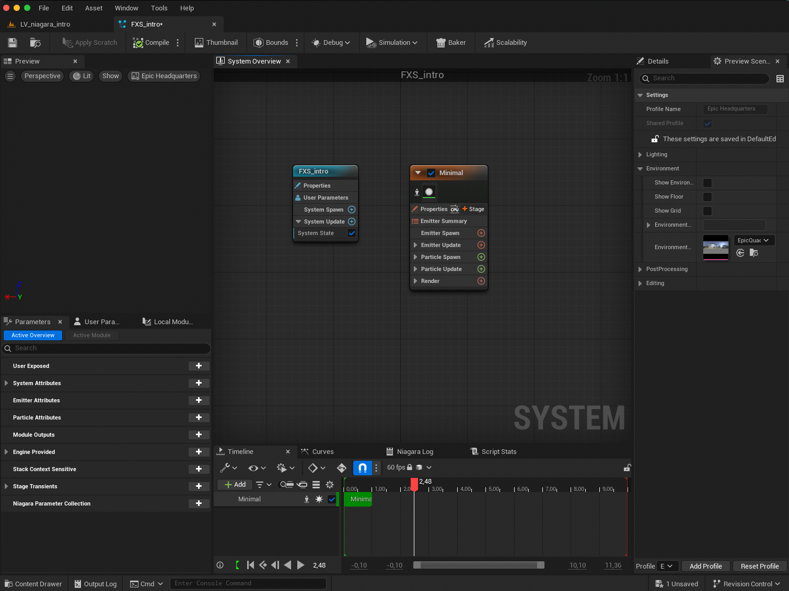]


---
.header[Niagara]

## Emitter


.left-quarter[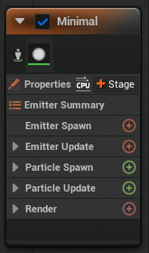]

--
.right-quarter[
Organized in a stack of behaviors]

???
* What is each category?
* 

---
.header[Niagara]

## Emitter


.left-quarter[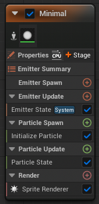]

.right-quarter[
* Emitter Spawn: First creation
* Emitter Update: On each frame
* Particle Spawn: Called once per particle, when that particle is first born
* Particle Update: Called once per particle, on each frame 
* Event Handler: Events to trigger behaviour, e.g. listeners
* Render: Define the display of the particle
]

???
  

The emitter is organized in a stack. Inside that stack is several groups, inside which you can put modules that accomplish individual tasks. The groups are as follows.


* Emitters are where particles are generated in a Niagara system. An emitter controls how particles are born, what happens to that particles as they age, and how the particles look and behave.
* Emitter Spawn
    * This group defines what happns when an emitter is first created on the CPU. Use this group to define initial setups and defaults.
* Emitter Update
    * This group defines emitter-level modules that occur every frame on the CPU. Use this group to define spawning of particles when you want them to continue spawning on every frame.
* Particle Spawn
    * This group is called once per particle, when that particle is first born. This is where you will want to define the initialization details of the particles, such as the location where they are born, what color they are, their size, and more.
* Particle Update (everything that affects particles over time)
    * This group is called per particle on each frame. You will want to define here anything that needs to change frame-by-frame as the particles age. For example, if the color of the particles is changing over time. Or, if the particles are affected by forces like gravity, curl noise, or point attraction. You may even want the particles to change size over time.
* Event Handler
    * In the Event Handler group, you can create Generate events in one or more emitters that define certain data. Then you can create Listening events in other emitters which trigger a behavior in reaction to that generated event.
* Render
    * The last group is the Render group. This is where you define the display of the particle and set up one or more renderers for your particles. You may want to use a Mesh renderer if you want to define a 3D model as the basis of your particles, upon which you could apply a material. Or, you may want to use a sprite renderer and define your particles as 2D sprites. There are many different renderers to choose from and experiment with.


* Within each group, there may be multiple stages, which are called at particular points in a system's life cycle. Emitters, systems, and particles all have Spawn and Update stages by default. Spawn stages are invoked in the first frame where that group exists. For example, systems invoke their Spawn stage when the system is first instantiated in the level and activated. Particles invoke their Spawn stage whenever the emitter emits a particle, and Spawn instructions will be executed for each new particle that is created. Update stages are invoked in every frame where the system, emitter or particle is active.

---
.header[Niagara | Emitter]

## Modules


.left-quarter[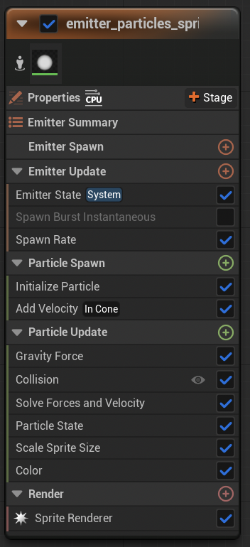]


---
.header[Niagara | Emitter]

## Modules


.left-quarter[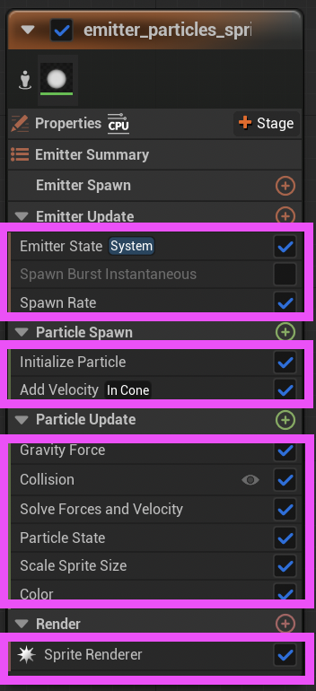]

--

.right-quarter[
* Processed sequentially from top to bottom

]


???
  

* Modules are the basic building blocks of effects in Niagara. You add modules to groups to make a stack. Modules are processed sequentially from top to bottom.
* You can think of a module as a container for doing some math. You pass some data into the module, then inside the module you do some math on that data, and then you write that data back out at the end of the module.
* Modules are built using High-Level Shading Language (HLSL), but can be built visually in a Graph using nodes. You can create functions, include inputs, or write to a value or parameter map. You can even write HLSL code inline, using the CustomHLSL node in the Graph.
* You can double-click any module from an emitter in Niagara to take a look at the math that's happening inside. You can even copy and create your own modules. For example, if you double-click on the Add Velocity module to take a look inside, you can inspect the data flow.

* Particle simulation in Niagara conceptually operates as a stack — simulation flows from the top of the stack to the bottom, and executes modules in order. Crucially, every module is assigned to a group that describes when the module is executed. For example, modules that initialize particles or that act when a particle spawns are in the Particle Spawn group.

* Emitters work in a stack paradigm—they serve as containers for modules, and can stack together to create various effects. An emitter is single-purpose, but it is also reusable. Parameters transfer up to the emitter level from modules, but you can modify modules and parameters in the emitter.

* Show add velocity node?


---
.header[Niagara | Emitter]

## Renderer


.left-quarter[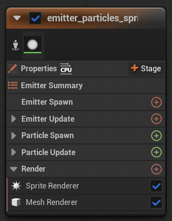]


---
.header[Niagara | Emitter]

## Renderer


.left-quarter[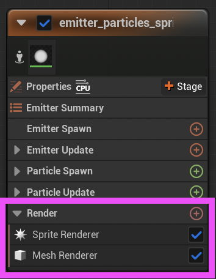]


.right-quarter[
* Sprites
* Meshes

]


---
.header[Niagara]

## Parameter

.left-quarter[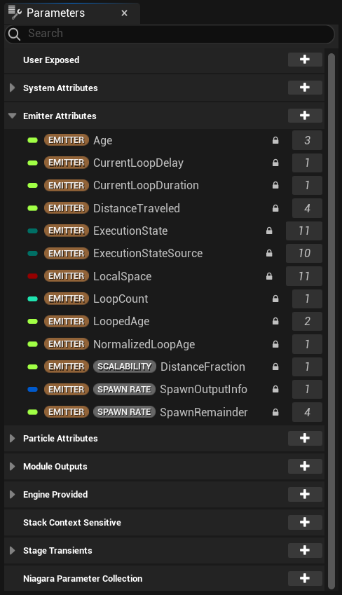]


--

.right-quarter[
* Abstraction of data
* Exposes system, emitter, particle, and engine-provided attributes
* Drag & Drop-able

.footnote[[[Unreal Documentation](https://dev.epicgames.com/documentation/en-us/unreal-engine/overview-of-niagara-effects-for-unreal-engine)]]

]


???
  

* Parameters are an abstraction of data in a Niagara simulation. Parameter types are assigned to a parameter to define the data that parameter represents. There are four types of parameters:

    * Primitive: This type of parameter defines numeric data of varying precision and channel widths.
    * Enum: This type of parameter defines a fixed set of named values, and assumes one of the named values.
    * Struct: This type of parameter defines a combined set of Primitive and Enum types.
    * Data Interfaces: This type of parameter defines functions that provide data from external data sources. This can be data from other parts of UE4, or data from an outside application.
* This panel lists all the user exposed, system, emitter, particle, and engine-provided parameters (also called attributes) that are used by the active emitter or system.
* From the Parameters panel, you can drag and drop parameters to any appropriate node in the System Overview, or to any appropriate module parameter in the Selection panel. The number of times a parameter is referenced is shown on the right, enabling you to spot errors and make decisions on how to change your variables. If you have other emitters open, this panel pulls in data from those open emitters. This enables the user to share data between emitters. The Namespace for a parameter is displayed with a prominent icon, and you can see a tooltip that explains that Namespace when you mouse over the icon. To see more advanced Namespaces, such as parameter collections, click the Eye icon next to the Search bar.


---
template:inverse

# Hands On!

---
template:inverse

## The End

# 👋🏻
