name: inverse
layout: true
class: center, middle, inverse
---


# Procedural Generation and Simulation

### Prof. Dr. Lena Gieseke | l.gieseke@filmuniversitaet.de  

#### Film University Babelsberg KONRAD WOLF

---
layout: false

## Today

--
* Particle Systems
    * Niagara

--
* Complex Systems

--
* ~~Fluids~~

--
* Wrap-Up


---
## Dynamic Solver

.center[].imgref[[[tlemco]](https://tlemco.medium.com/tylers-life-hacks-01-e87f6fb3397a)]


---
## Mathematical Fundamentals

  
**v'** = **v** + **a** · **Δt**  
**p'** = **p** + **v'** · **Δt**  

--

* Acceleration measures the change in velocity over time  
* Velocity measures the change in position over time


???
  

Roughly speaking:

* How do we find the next position?
**We add the velocity!**

* How do we find this velocity?
**We add the acceleration!**
  
--

<br >
  
The integral of the object’s acceleration over time tells us the velocity when that time period ends.
  
<br >
  
The integral of an object’s velocity over time tells us the object’s new position when that time period ends.


???
  

We compute the integral analytically or approximate it.

*  The integral of the object’s velocity over time tells us the position when that time period ends.


---
## Newton’s Second Law of Motion

--

> Force equals mass times acceleration, hence **F** = **M** · **A**.  

With **F** as force, **M** as mass and **A** as acceleration.


???
  

* Why is this exciting? Well, now we have a formula that directly ties a force to acceleration, which we had already tied to a change of position, meaning, moving stuff. 
* The law says that acceleration is directly proportional to force and that acceleration is inversely proportional to mass. This means if you get pushed, the harder you are pushed, the faster you’ll move (or accelerate) and the bigger you are, the slower you’ll move!
    * The *mass* of an object is a measure of the amount of matter in the object (measured in kilograms).
    * *Weight*, though often mistaken for mass, is technically the force of gravity on an object. From Newton’s second law, we can calculate it as mass times the acceleration of gravity (w = m * g). Weight is measured in newtons.
    * *Density* is defined as the amount of mass per unit of volume (grams per cubic centimeter, for example).
    * An object that has a *mass* of one kilogram on earth and would have a *mass* of one kilogram on the moon. However, it would *weight* only one-sixth as much.

--


???
  

* We can also now express acceleration simply as..
* Once again, let's keep in mind that we work with a pretend pixel world. If we want to, objects can have a mass equal to 1.

If we want to, objects can have a mass equal to 1. Then we have **A** = **F**, meaning that the acceleration of an object is equal to the force applied. 


Also, more precisely: *the net force equals mass times acceleration*, meaning that acceleration is equal to the *sum of all forces* divided by mass.


* If we have more than one force such as gravity and wind, we refer to a more precise formulation of the second law as *the net force equals mass times acceleration*, meaning in turn that acceleration is equal to the *sum of all forces* divided by mass.

---
## Newton’s Second Law of Motion

> How can a *force* change the position of an object?


???
  

* Ok, now. Back to the question: how does a force change the position of an object? We know that with a mass of one, the force equals the acceleration of the object. 

--

**v'** = **v** + **F** · **Δt**   
**p'** = **p** + **v'** · **Δt**  
  


--
1. Add up all forces

--
2. Compute the velocity

--
3. Compute the position

--

*Compute:* We integrate analytically or approximate it.


???
  

* So, we start with the force or acceleration and want to compute the velocity and position from that.
* Seems like we somehow need to go the steps we took to get from position to acceleration the other way around.  
  
*What is this other way around?*    
*What is the inverse of a derivation?*

* The inverse of derivation is integration


---
## Dynamic Solver


> In short, in a dynamic system we define forces, these forces create acceleration, from these we compute the velocity and from that the position.

--
  
<br />
  
As dynamic forces might change over time, we need to integrate repeatedly in certain time steps for detecting any changes of the force.

???
  

*  Hence, at each time step we compute the force, add it to the velocity and add the velocity to the position. 


---
template:inverse

# Particle Systems

---
## Particle Systems


???
  

* The process of making the particles move is also called *simulation*.  
* With particles we almost always want to work with a dynamic system to make the particles move as we don't want to animate each particle manually.
* So what are we talking about here exactly?


--

> A particle system is a collection of many many minute particles that together represent a fuzzy object. Over a period of time, particles are generated into a system, move and change from within the system, and die from the system.  
  
— William Reeves, [*Particle Systems—A Technique for Modeling a Class of Fuzzy Objects*](https://dl.acm.org/doi/epdf/10.1145/964967.801167), ACM Transactions on Graphics 2:2 (April 1983), 92.


???
  
A fuzzy object generally refers to something that has unclear or ambiguous boundaries, either in a visual, conceptual, or mathematical sense. 
  
* Reeves created [these particle effects](https://www.youtube.com/watch?v=zXFNypyMJCc) in the 80s as the first one to do so.

---
## Particle Systems

.center[]
  
— William Reeves, [*Particle Systems—A Technique for Modeling a Class of Fuzzy Objects*](https://dl.acm.org/doi/epdf/10.1145/964967.801167), ACM Transactions on Graphics 2:2 (April 1983), 92.

???
  

* From this quote we can gather that we have a large amount of particles ("many many"), that time ("over a period of time") and movement ("move") matter and that there is some sort of lifecycle ("are generated" and "die").
* Reeves is famous for his contributions to particle systems, a method used to model fuzzy objects in computer graphics. In this context, a fuzzy object is typically represented by a collection of particles that together create the appearance of a diffuse, soft-edged form. This approach allows for the realistic simulation of complex, dynamic phenomena that are difficult to model using traditional geometric techniques. In summary, when William Reeves refers to a "fuzzy object," he is likely discussing objects that have soft, undefined boundaries, often simulated using particle systems in computer graphics to achieve realistic visual effects for natural phenomena.

---
## Particle Systems

> A particle system is a collection of **many many** minute particles that together represent a fuzzy object.** Over a period of time**, particles are generated into a system, **move** and **change** from within the system, and **die** from the system.  
  
— William Reeves, *Particle Systems—A Technique for Modeling a Class of Fuzzy Objects*, ACM Transactions on Graphics 2:2 (April 1983), 92.

???
  

* From this quote we can gather that we have a large amount of particles ("many many"), that time ("over a period of time") and movement ("move") matter and that there is some sort of lifecycle ("are generated" and "die").
* Reeves is famous for his contributions to particle systems, a method used to model fuzzy objects in computer graphics. In this context, a fuzzy object is typically represented by a collection of particles that together create the appearance of a diffuse, soft-edged form. This approach allows for the realistic simulation of complex, dynamic phenomena that are difficult to model using traditional geometric techniques. In summary, when William Reeves refers to a "fuzzy object," he is likely discussing objects that have soft, undefined boundaries, often simulated using particle systems in computer graphics to achieve realistic visual effects for natural phenomena.


---
## Particle Systems


E.g., we need *many* things for

--
* Natural systems such as birds flocking, fish schooling, ecosystems evolving, etc.

--
* Irregular types of natural phenomena auch as fire, smoke, waterfalls, fog, grass, bubbles, etc.


---
## Particle Systems

.center[].imgref[[[princeton.edu]](https://www.princeton.edu/news/2013/02/07/birds-feather-track-seven-neighbors-flock-together)]

---
## Particle Systems

.center[] .imgref[[[pinterest]](https://www.pinterest.de/pin/31243791139408749/)]


???
  

* These systems are dynamics systems, often simulating based on insights from physics and based on Newton’s laws of motion about how to apply forces.

---
## Particle Systems

.center[] .imgref[[[wallpapercave]](https://wallpapercave.com/w/wp9767060)]


---
.header[Particle Systems]

## The System

--

A single particle is an independent body that moves. 

--
  
<br />

For building a system of moving particles, you need:

--
1. A constructor initializing the system

--
2. Computation of acceleration, velocity and position for each particle

--
3. Application of the newly computed values


--
Step 2. and 3. are usually executed by your 3D environment. 


???
  

* We will use it in the exercise. If we were in Processing or p5 or such, we would also need to explicitly call a `display()` or render method for the particles in a fourth step.


---
.header[Particle Systems | Setup]

## Emitter

--

The source of the particles.

--
* A single burst of particles, a continuous stream of particles, or both  

--
* Controls the initial settings of the particles
  


???
  

* Such as their position, velocity, etc. 


---
.header[Particle Systems | Setup]

## Life Cycle

During its life, particles can be controlled in various ways.
  
<br />

--

After a certain amount of time, particles die of various possible reasons.
* Collision, running off screen, etc.  

--
  
<br />
Particles should have a well defined lifespan!


???
  

* In regard to life cycles make sure to actually delete the affected particles. For example (up to my current knowledge), when you work with Processing and objects wander off-screen they continue to exists as normal objects and are recomputed.


---
.header[Particle Systems]

## A System of Systems

A particle system is in itself an object.  
  
--
  
As such you can easily build a system of systems of systems of systems of systems...


???
which most effects do

--

.left-even[]

--

This principle relates to self-similar structures, fractals, turbulence noise, etc.


???
  

* We have already seen this principles in self-similar structures such as fractals or turbulence noise. But we can find this principle of *nesting* in all aspects of the world. E.g. an organ is a system of cells, a human body is a system of organs, a neighborhood is a system of human bodies, a city is a system of neighborhoods, and so own.


---
template:inverse

# Niagara


---
## Niagara

Workflow:

--
* System

???
  

* First create a Niagara System in which you can add one or more emitters. You can then set up the properties of each emitter.

--
* Emitters

???
  

* In the Niagara Editor, you can adjust your emitter by changing the properties of the modules already in it, or add new modules for the desired effect. You can also copy emitters and add multiple emitters into a single Niagara system. For an example of this, see the Sparks tutorial.

--
* Modules

???
  

* In your emitter, you can add existing modules from Niagara by clicking on the Plus (+) of the group where you want to add the module. Niagara comes with a lot of pre-existing modules, and for the majority of circumstances you will be able to create your effects without needing to do any custom module design.

However, if you want to create your own modules, it can be helpful to understand how the data flows through a module.

.task[TASK: Show simple setup]


---
.header[Niagara]

## New Niagara System

.center[]

---
.header[Niagara]

## New Niagara System

.center[]

---
.header[Niagara | The System]

.center[]

---
.header[Niagara]

## The System

.left-quarter[]

--

.right-quarter[

* Global system parameters, e.g. CPU vs. GPU rendering


]


.footnote[[[Unreal Documentation](https://dev.epicgames.com/documentation/en-us/unreal-engine/overview-of-niagara-effects-for-unreal-engine)]]


???
  

* A Niagara system is a container for everything you will need to build that effect. Inside that system, you may have different building blocks that stack up to help you produce the overall effect.

You can modify some system-level behaviors that will then apply to everything in that effect.

* Like emitters, systems work in a stack paradigm, and also work with a Sequencer timeline — which you can use to control how the emitters in the system behave. A system is a container for emitters. The system combines these emitters into one effect. When editing a system in the Niagara Editor, you can modify and override any parameter, module or emitter that is in the system.
* The Timeline panel in the System Editor shows which emitters are contained in the system, and can be used to manage those emitters.


---
.header[Niagara]

## Emitter


.center[]


---
.header[Niagara | Emitter]


.center[]


---
.header[Niagara | Emitter]


.center[]


---
.header[Niagara]

## Emitter


.left-quarter[]

--
.right-quarter[
Organized in a stack of behaviors]

???
* What is each category?

---
.header[Niagara]

## Emitter


.left-quarter[]

--

.right-quarter[
* Emitter Spawn: First creation
* Emitter Update: On each frame
* Particle Spawn: Called once per particle, when that particle is first born
* Particle Update: Called once per particle, on each frame 
* Render: Define the display of the particle
]

???
  

The emitter is organized in a stack. Inside that stack is several groups, inside which you can put modules that accomplish individual tasks. The groups are as follows.


* Emitters are where particles are generated in a Niagara system. An emitter controls how particles are born, what happens to that particles as they age, and how the particles look and behave.
* Emitter Spawn
    * This group defines what happns when an emitter is first created on the CPU. Use this group to define initial setups and defaults.
* Emitter Update
    * This group defines emitter-level modules that occur every frame on the CPU. Use this group to define spawning of particles when you want them to continue spawning on every frame.
* Particle Spawn
    * This group is called once per particle, when that particle is first born. This is where you will want to define the initialization details of the particles, such as the location where they are born, what color they are, their size, and more.
* Particle Update (everything that affects particles over time)
    * This group is called per particle on each frame. You will want to define here anything that needs to change frame-by-frame as the particles age. For example, if the color of the particles is changing over time. Or, if the particles are affected by forces like gravity, curl noise, or point attraction. You may even want the particles to change size over time.
* Event Handler
    * In the Event Handler group, you can create Generate events in one or more emitters that define certain data. Then you can create Listening events in other emitters which trigger a behavior in reaction to that generated event.
* Render
    * The last group is the Render group. This is where you define the display of the particle and set up one or more renderers for your particles. You may want to use a Mesh renderer if you want to define a 3D model as the basis of your particles, upon which you could apply a material. Or, you may want to use a sprite renderer and define your particles as 2D sprites. There are many different renderers to choose from and experiment with.


* Within each group, there may be multiple stages, which are called at particular points in a system's life cycle. Emitters, systems, and particles all have Spawn and Update stages by default. Spawn stages are invoked in the first frame where that group exists. For example, systems invoke their Spawn stage when the system is first instantiated in the level and activated. Particles invoke their Spawn stage whenever the emitter emits a particle, and Spawn instructions will be executed for each new particle that is created. Update stages are invoked in every frame where the system, emitter or particle is active.

---
.header[Niagara | Emitter]

## Modules


.left-quarter[]


---
.header[Niagara | Emitter]

## Modules


.left-quarter[]

--

.right-quarter[
* Processed sequentially from top to bottom
* The underlying node system is usually accessible

]


???
  

* Modules are the basic building blocks of effects in Niagara. You add modules to groups to make a stack. Modules are processed sequentially from top to bottom.
* You can think of a module as a container for doing some math. You pass some data into the module, then inside the module you do some math on that data, and then you write that data back out at the end of the module.
* Modules are built using High-Level Shading Language (HLSL), but can be built visually in a Graph using nodes. You can create functions, include inputs, or write to a value or parameter map. You can even write HLSL code inline, using the CustomHLSL node in the Graph.
* You can double-click any module from an emitter in Niagara to take a look at the math that's happening inside. You can even copy and create your own modules. For example, if you double-click on the Add Velocity module to take a look inside, you can inspect the data flow.

* Particle simulation in Niagara conceptually operates as a stack — simulation flows from the top of the stack to the bottom, and executes modules in order. Crucially, every module is assigned to a group that describes when the module is executed. For example, modules that initialize particles or that act when a particle spawns are in the Particle Spawn group.

* Emitters work in a stack paradigm—they serve as containers for modules, and can stack together to create various effects. An emitter is single-purpose, but it is also reusable. Parameters transfer up to the emitter level from modules, but you can modify modules and parameters in the emitter.

* Show add velocity node?


---
.header[Niagara | Emitter]

## Renderer


.left-quarter[]


---
.header[Niagara | Emitter]

## Renderer


.left-quarter[]


.right-quarter[
* Sprites
* Meshes

]


---
.header[Niagara]

## Parameter

.left-quarter[]


--

.right-quarter[
* Named variables
* Exposes system, emitter, particle, and engine-provided attributes
* Control or pass data between different parts of the system
* Drag & Drop

.footnote[[[Unreal Documentation](https://dev.epicgames.com/documentation/en-us/unreal-engine/overview-of-niagara-effects-for-unreal-engine)]]

]


???
  

* Parameters are an abstraction of data in a Niagara simulation. Parameter types are assigned to a parameter to define the data that parameter represents. There are four types of parameters:

    * Primitive: This type of parameter defines numeric data of varying precision and channel widths.
    * Enum: This type of parameter defines a fixed set of named values, and assumes one of the named values.
    * Struct: This type of parameter defines a combined set of Primitive and Enum types.
    * Data Interfaces: This type of parameter defines functions that provide data from external data sources. This can be data from other parts of UE4, or data from an outside application.
* This panel lists all the user exposed, system, emitter, particle, and engine-provided parameters (also called attributes) that are used by the active emitter or system.
* From the Parameters panel, you can drag and drop parameters to any appropriate node in the System Overview, or to any appropriate module parameter in the Selection panel. The number of times a parameter is referenced is shown on the right, enabling you to spot errors and make decisions on how to change your variables. If you have other emitters open, this panel pulls in data from those open emitters. This enables the user to share data between emitters. The Namespace for a parameter is displayed with a prominent icon, and you can see a tooltip that explains that Namespace when you mouse over the icon. To see more advanced Namespaces, such as parameter collections, click the Eye icon next to the Search bar.


---
template:inverse


### Particle Systems

# Complex Behavior

???
  

* New line of thought: so far, when working with forces only, influences e.g. on the particles came only from the outside.

*With which concepts could we extend a simulation for more complex behavior?*

There are two approaches towards more complex behavior.

* Autonomous agents not only react to e.g. forces but they also take certain actions themselves. Furthermore, we might want to create not just a single agent but a group of agents. For these we also might assign behavior to the group as whole. For grouping, agents need to know about the members of their group and adjust their specific behavior in regard to the group, e.g. when flocking and schooling.


---
.header[Particle Systems]

## Agency

--

Autonomous agents not only react to their environment but also take actions and make their own choices.  
  
<br />
  
This is called *agency*.

???
  

* which can be described as a *desire* to move. Such desires can be differentiated for example as fleeing, wandering, arriving, pursuing, evading, etc. depending how the movement is expressed. Often, with agents the goal to create live-like behavior and an impression of liveliness.


* fleeing
* wandering
* arriving
* pursuing
* evading
* ...

--

Often the goal is to create the impression of *liveliness*.


---
.header[Particle Systems | Autonomous Agents]

## Agency

Agency can be understood as the application of *forces from within*.

???
  

Hence, we usually implement it in the same way we were working with forces and understand agency as the application of *forces from within*. 

--

.center[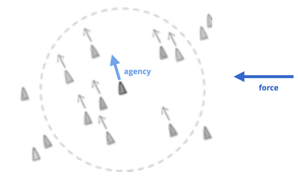]
  


---
.header[Particle Systems | Autonomous Agents]

## Agency

Requires

--
* Knowledge of the environment

???
  

* Agency requires some knowledge of the environment. This can be anything, from having an understanding of the whole scene, to just recognizing the closest neighbor. Which knowledge we need to implement depends on the system and the behavior we want to create.

--
* Interactions between the elements 

???
  

or group behaviors we need to enable local interactions between the elements themselves.

--
* Computability

???
  


Agency, or the desire to move must be a *computable action*.


---
.header[Particle Systems | Autonomous Agents]

## Agents

> How would you express and implement seeking?
  
???
  

* One of the simplest desires to move is the desire to move in a certain direction or towards an aim. This is implemented with a *steering force*.


---
.header[Particle Systems | Autonomous Agents]

## Example: Steering Force

--

.center[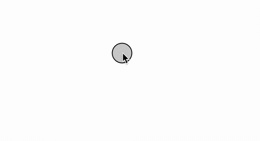.imgref[[[natureofcode]](https://natureofcode.com/book/chapter-6-autonomous-agents/)]]


---
.header[Particle Systems | Autonomous Agents]

## Example: Steering Force


.center[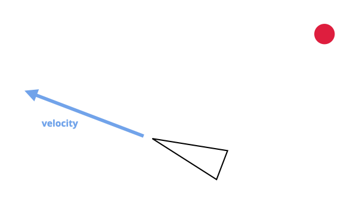]

---
.header[Particle Systems | Autonomous Agents]

## Example: Steering Force

.center[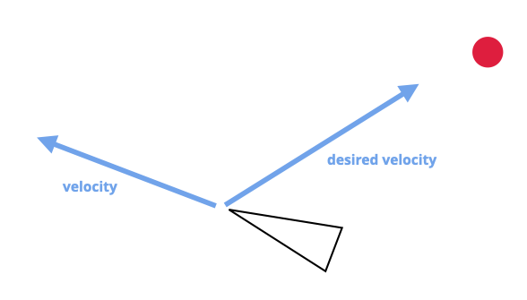]


---
.header[Particle Systems | Autonomous Agents]

## Example: Steering Force

.center[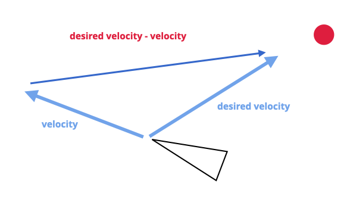]

---
.header[Particle Systems | Autonomous Agents]

## Example: Steering Force

.center[]


The desired velocity usually has a constant *maximum speed*, which is also called the *steering strength*.


???
* You don't want to have more desired speed just because the target is further away.


---
.header[Particle Systems | Autonomous Agents]

## Example: Steering Force

.center[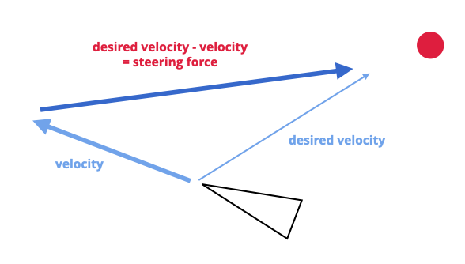]


???
  

* Here, the steering force is the difference between the desired velocity and the current velocity, as defined by Reynolds in *Steering Behaviors for Autonomous Characters*.

---
.header[Particle Systems | Autonomous Agents]

## Example: Steering Force


```js
// Reynolds’s steering formula
steering force = desired velocity - current velocity
```

In Reynold's *Steering Behaviors for Autonomous Characters*.

--

<br />
  
> The steering force corrects the difference between where I want to go and where I am currently going.

???
  

You can understand this as a form of error correction and the difference between where I want to go and where I am currently going.


---
.header[Particle Systems | Autonomous Agents]

## Example: Steering Force

You usually also add a *maximum force* to limited the magnitude of the steering force.


.center[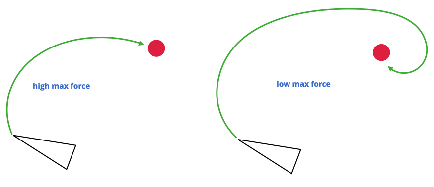]


???
  

* For making it appear that the agent is slowly steering towards the target, you can also add a *maximum force* to limited the magnitude of the steering force.

--
```
steer.limit(maxforce);
```

---
.header[Particle Systems | Autonomous Agents]

## Example: Steering Force

.center[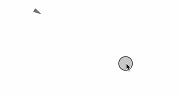]
 


???
  

* Depending on the behavior you want to archive, you might not want the agent to get to the target as fast as possible. If that were the case, we would just say “position equals target” and there the agent would be. Our goal, as Reynolds puts it, is to move the vehicle in a *lifelike and improvisational manner*.


*How would you convert this seeking behavior into a fleeing behavior?*
* Reverse the desired velocity force.


---
.header[Particle Systems | Autonomous Agents]

## Example: Steering Force


```java
void seek(PVector target) {

    PVector desired = PVector.sub(target,position);
    desired.normalize();

    // Calculating the desired velocity
    // to target at max speed
    desired.mult(maxspeed);

    // Reynolds’s formula for steering force
    PVector steer = PVector.sub(desired,velocity);

    // Applying the force
    // to the object’s acceleration
    applyForce(steer);
}
```


---
.header[Particle Systems | Autonomous Agents]

## Example: Steering Force

Reynolds suggests to slow down if we are a certain (small) distance from the target. 

.center[.imgref[[[natureofcode]](https://natureofcode.com/book/chapter-6-autonomous-agents/)]]
  

--
  
This supports the appearance of the agent that it knows and perceives its environment.

???
  

* To create even more live like behavior, often you want to create certain behavior when an agents comes closer to a target or arrives at a target. Reynolds suggests to slow down if we are a certain (small) distance from the target. This supports the appearance of the agent that it knows and perceives its environment.

---
.header[Particle Systems | Autonomous Agents | Example: Steering Force]

## The Slow Down


.left-even[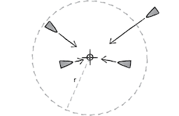.imgref[[[natureofcode]](https://natureofcode.com/book/chapter-6-autonomous-agents/)]]

--

.right-even[

<br />
* Inside of r gradually slow down
* E.g., map range from maximum speed at r to zero at the target

]


???
  
* If the distance from the target is less than r, the agent gradually slows down—from the maximum speed at the very edge of the circle to zero speed at the target (Figure 5.9).
* If you are further interested in steering behaviors and how to make them appear life-like, check out Craig Reynold's original, in-depth [website about steering](https://www.red3d.com/cwr/steer/).
* TASK: Go through attractor example 

---
.header[Particle Systems]

## Agency   
  
--

> How would you express wandering?

  
---
.header[Particle Systems]

## Agency   
  

> How would you express being fearful?

---
.header[Particle Systems]

## Agency   
  

> How would you express being friendly?


---
.header[Particle Systems]

## Agency  


.left-even[[](https://www.youtube.com/watch?v=VTNmLt7QX8E)  
.imgref[[[Heider and Simmel]](https://doi.org/10.2307%2F1416950)]]

???
  

* https://www.youtube.com/watch?v=VTNmLt7QX8E


---
.header[Particle Systems]

## Complex Systems

--

* Ant colonies
* Termites
* Migration patterns
* Earthquakes
* Snowflakes
* etc.

---
.header[Particle Systems]

## Complex Systems

--

* Non-Linearity

???
  

* Complex systems also often include non-linear effects. Such a non-linear effect is also often casually referred to as *the butterfly effect* coined by mathematician and meteorologist Edward Norton Lorenz, a pioneer in the study of chaos theory. In 1961, Lorenz was running a computer weather simulation for the second time and, perhaps to save a little time, typed in a starting value of 0.506 instead of 0.506127. The end result was completely different from the first result of the simulation. In other words, the theory is that a single butterfly flapping its wings on the other side of the world could cause a massive weather shift and ruin our weekend at the beach. We call it *non-linear* because there isn’t a linear relationship between a change in initial conditions and a change in outcome. A small change in initial conditions can have a massive effect on the outcome. Non-linear systems are a superset of chaotic systems. 

--
* Competition and cooperation

???
  

* One of the things that often makes a complex system tick is the presence of both competition and cooperation between the elements. In a flocking system, for example, elements have to cooperate, that is work together to stay together and move together. However, they also need to compete for space. We will come back to this. Competition and cooperation are a big factor for making a complex system appear to be alive.

--
* Feedback loop

???
  

* Complex systems often include a feedback loop where the output of the system is fed back into the system to influence its behavior in a positive or negative direction. Let’s say you drive to work each day because the price of gas is low. In fact, everyone drives to work. The price of gas goes up as demand begins to exceed supply. You, and everyone else, decide to take the train to work because driving is too expensive. And the price of gas declines as the demand declines. The price of gas is both the input of the system (determining whether you choose to drive or ride the train) and the output (the demand that results from your choice). I should note that economic models (like supply/demand, the stock market) are one example of a human complex system. Others include trends, elections, crowds, and traffic flow.

[[11]](https://natureofcode.com/book/chapter-6-autonomous-agents/)  

--
> Combine rules for emergent behavior.

???
  

* If we want to create more complex and more live-like systems than e.g. agents seeking a target, we can make use of the fact that often simple individual elements and rules combined, create a much more complex effect than just the sum of its parts. Such individual elements might be agents that have only a limited perception of their environment but they operate in parallel and create a complex whole with emergent behaviors.
* Example: Raynold's *[boids](https://www.youtube.com/watch?v=86iQiV3-3IA)*.
* The classic example for a complex system that appears to be more than the sum its parts is *[boids](https://www.youtube.com/watch?v=86iQiV3-3IA)*.


---
.header[Particle Systems]


## Complex Systems

.left-even[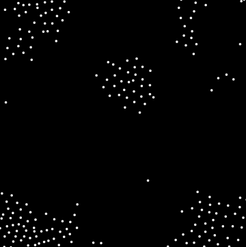  
.imgref[[[codingtrain]](https://editor.p5js.org/codingtrain/sketches/ry4XZ8OkN)]]

--
.right-even[
Boids are again, the doing of Craig Reynolds:

Reynolds, Craig (1987). *[Flocks, herds and schools: A distributed behavioral model](https://dl.acm.org/doi/10.1145/37402.37406)*. SIGGRAPH '87
]


???
  

* Boids is, what Reynolds calls an artificial life program, which simulates the flocking behavior of birds - with very simple rules. The name *boid* corresponds to a shortened version of *bird-oid object*, which refers to a bird-like object [2, as cited in 12]. Incidentally, *boid* is also a New York Metropolitan dialect pronunciation for *bird*.


---
.header[Particle Systems]

## Boids

The complexity of Boids arises from the interaction of individual agents adhering to a set of simple rules:

???
  

* As with most artificial life simulations, Boids is an example of emergent behavior; that is, the complexity of Boids arises from the interaction of individual agents (the boids, in this case) adhering to a set of simple rules. The rules applied in the simplest Boids world are as follows:

--
.left-even[
* *Separation*  
]

.right-even[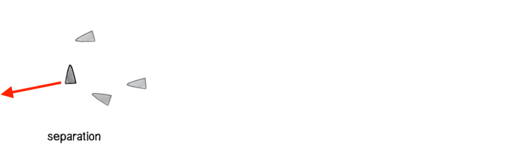]

???
  

* (also known as *avoidance*): Steer to avoid colliding with your neighbors.

---
.header[Particle Systems]

## Boids

The complexity of Boids arises from the interaction of individual agents adhering to a set of simple rules:

.left-even[
* *Separation*  
* *Alignment* 
]

.right-even[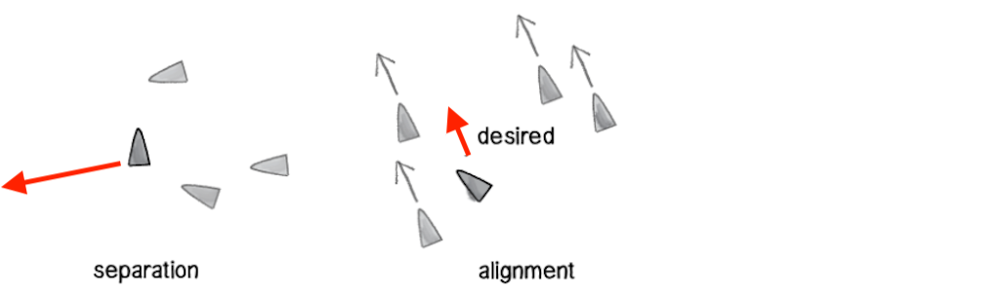]


???
  

* (also known as *copy*): Steer in the same direction as your neighbors.

---
.header[Particle Systems]

## Boids

The complexity of Boids arises from the interaction of individual agents adhering to a set of simple rules:
  
.left-quarter[
* *Separation*  
* *Alignment* 
* *Cohesion* 
]

.right-quarter[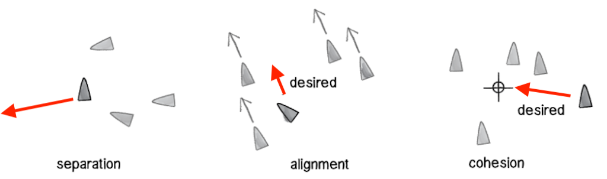]


???
  

* (also known as *center*): Steer towards the center of your neighbors (stay with the group).

---
.header[Particle Systems]

## Boids

.center[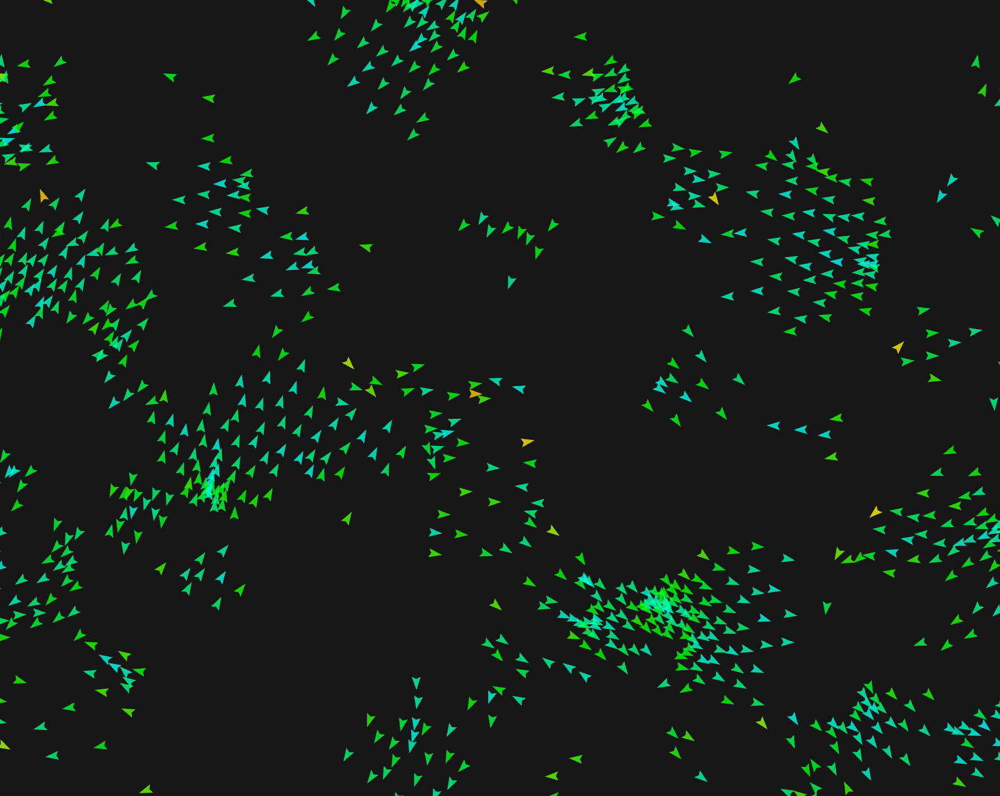.imgref[[[cubedhuang]](https://boids.cubedhuang.com/)]]

???
  

* The left slider adjusts the influence of alignment, the middle one cohesion and the right one separation*
* https://boids.cubedhuang.com/

---
.header[Particle Systems | Boids]

## Example: Separation

If a given agent is too close to you, steer away from that agent. 

--

.center[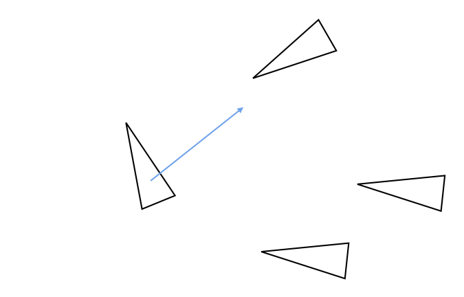]

???
  

* This is the same as the above discussed seeking behavior of an agent. We only need to inverse the direction of the force to point away from the crowd. For this we take the average of all the vectors pointing away from any agent within a certain range.

---
.header[Particle Systems | Boids]

## Example: Separation

If a given agent is too close to you, steer away from that agent. 

.center[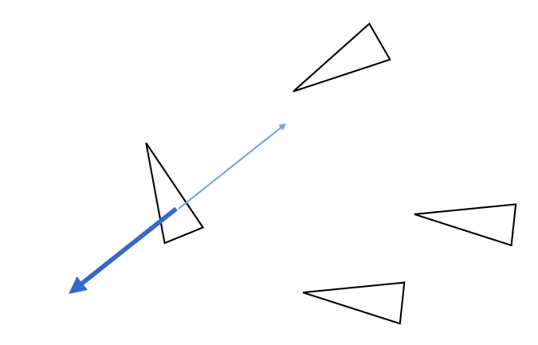]

???
  

* This is the same as the above discussed seeking behavior of an agent. We only need to inverse the direction of the force to point away from the crowd. For this we take the average of all the vectors pointing away from any agent within a certain range.


---
.header[Particle Systems | Boids]

## Example: Separation

If a given agent is too close to you, steer away from that agent. 

.center[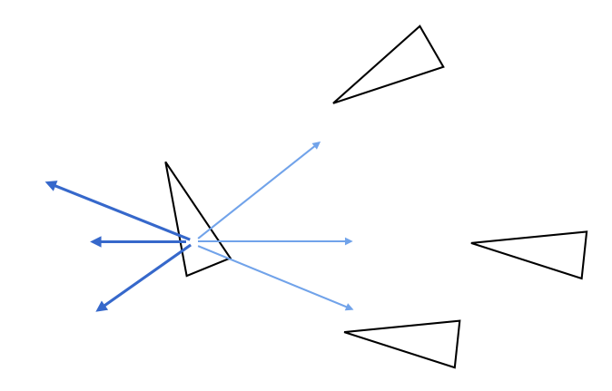]

???
  

* This is the same as the above discussed seeking behavior of an agent. We only need to inverse the direction of the force to point away from the crowd. For this we take the average of all the vectors pointing away from any agent within a certain range.

---
.header[Particle Systems | Boids]

## Example: Separation

If a given agent is too close to you, steer away from that agent. 

.center[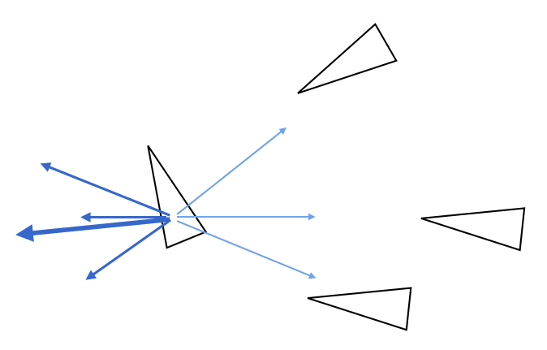]

???
  

* This is the same as the above discussed seeking behavior of an agent. We only need to inverse the direction of the force to point away from the crowd. For this we take the average of all the vectors pointing away from any agent within a certain range.


---
.header[Particle Systems | Boids | Example: Separation]


???
  

In summary, the steps to compute the separation force for a single agent

--
* Get all agents within a certain radius

--
* Get the difference between the main agent and those neighboring agents within the radius

--
* Compute the average of all differences (of the main agent and a neighbor) and weight each contribution by its distance

--
* Set the steering strength

--
* Apply Reynolds’s steering formula (steering force = desired velocity - current velocity)

--
* Clamp at the maximum force for the resulting separation steering force

--
* Update the acceleration and velocity for the main agent

--
* Reset the main agent's acceleration

--
* Start all over again in the next frame


???
  

Similarly, for alignment we take the average of the velocity of all agents within a certain radius in order to move in a similar direction as them.  

For cohesion we want to stay close to our group. Hence for cohesion we take the average of the positions of all agents within a certain radius.

---
.header[Particle Systems]

## Boids

.center[<iframe width="818" height="460" src="https://www.youtube.com/embed/r3ZnyLDuGcE?start=230" title="Demo of my new BOIDS particle system in UE5!" frameborder="0" allow="accelerometer; autoplay; clipboard-write; encrypted-media; gyroscope; picture-in-picture; web-share" referrerpolicy="strict-origin-when-cross-origin" allowfullscreen></iframe>]

---
.header[Particle Systems]

## Boids

.center[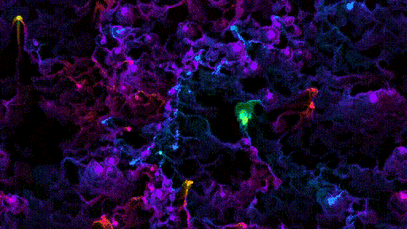] .imgref[[[davidar]](https://www.shadertoy.com/view/7dlcW7)]


---
.header[Particle Systems]

## Complex Behavior   


### Autonomous Agents And Group Behaviors

--

* Agents not only react to e.g. forces but they also take certain actions themselves
* Often as a group behavior


???
  

* Autonomous agents not only react to e.g. forces but they also take certain actions themselves. Furthermore, we might want to create not just a single agent but a group of agents. For these we also might assign behavior to the group as whole. For grouping, agents need to know about the members of their group and adjust their specific behavior in regard to the group, e.g. when flocking and schooling.

--

.center[ .imgref[[[science-junkies]](https://science-junkies.com/meet-the-swirlon-a-new-state-of-active-matter-discovered-by-physicists/17)]]

---
.header[Particle Systems]

## Complex Behavior   

### Autonomous Agents And Group Behaviors

* Agents not only react to e.g. forces but they also take certain actions themselves
* Often as a group behavior

.center[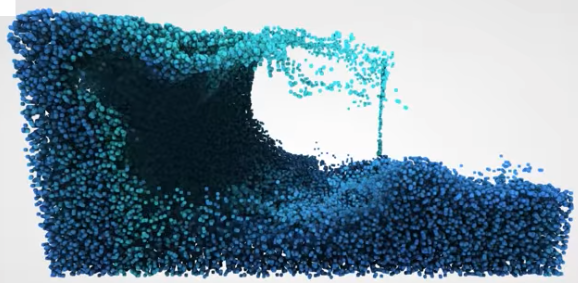 .imgref[[[david.li]](http://david.li/fluid/)]]


???
  

* http://david.li/fluid/


---
.header[Particle Systems]

## Complex Behavior   

### Autonomous Agents And Group Behaviors

> Combine rules for emergent behavior.

???
  

* If we want to create more complex and more live-like systems than e.g. agents seeking a target, we can make use of the fact that often simple individual elements and rules combined, create a much more complex effect than just the sum of its parts. Such individual elements might be agents that have only a limited perception of their environment but they operate in parallel and create a complex whole with emergent behaviors.
* Example: Raynold's *[boids](https://www.youtube.com/watch?v=86iQiV3-3IA)*.
* The classic example for a complex system that appears to be more than the sum its parts is *[boids](https://www.youtube.com/watch?v=86iQiV3-3IA)*.


---
.header[Particle Systems]

## Complex Behavior   

--

### Soft Body Deformations


* System of connected particles

.center[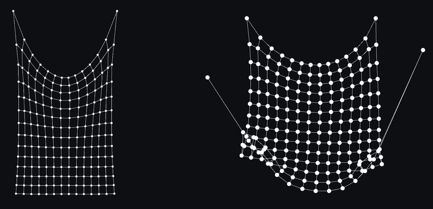].imgref[[[jklintan]](https://jklintan.github.io/html/cloth-simulation.html)]


???
  

* https://jklintan.github.io/Cloth-Simulation/
* Certain appearances and deformations, such as fluids and cloths, are actually often modeled as a system of connected particles. These are topics that a quite complex and we will not dive deeper into them on a theoretical level.

---
.header[Particle Systems]

## Complex Behavior   

### Soft Body Deformations

* System of connected particles

.center[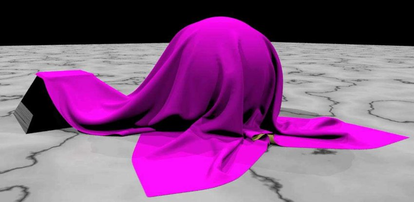] .imgref[[[Gabriel-Zachmann]](https://www.researchgate.net/profile/Gabriel-Zachmann)]


---
template: inverse

# Wrapping Up


---

## Learning Objectives


--
* Overview about techniques and their capabilities

--
* Understanding of formal theories and algorithms

--
* Practical implementation experiences

--
* Implementation of specific design goals

---
template:inverse

# Introduction

---
.header[Introduction]

## Patterns

--
* The recognition of suitable design goals

--
* An understanding of what a procedural technique is and what it is capable of

--
* An broad overview of approaches

---
.header[Introduction]

## Patterns

.center[].imgref[[[boredpanda]](https://www.boredpanda.com/geometry-symmetry-plants-nature/?utm_source=google&utm_medium=organic&utm_campaign=organic)]

---
.header[Introduction]
## Patterns

.center[] .imgref[[[stackexchange]](https://tex.stackexchange.com/questions/404925/animated-koch-snowflake)]


---
.header[Introduction]
## Abstraction

--
  
  
.footnote[[[Hilma af Klint, Group V, The Seven-Pointed Star, 1908]](https://medium.com/as-mag/modern-mystic-hilma-af-klint-c4ef6c27467c)]  

---
.header[Introduction]
## Abstraction

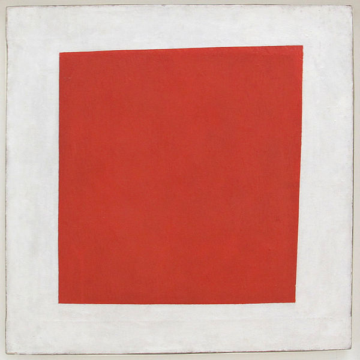  

.footnote[[[Francis Picabia, Quadrato rosso, Kazimir Malevich, 1915]](https://en.wikipedia.org/wiki/File:Francis_Picabia,_1912,_La_Source,_The_Spring,_oil_on_canvas,_249.6_x_249.3_cm,_Museum_of_Modern_Art,_New_York._Exhibited,_1912_Salon_d%27Automne,_Paris.jpg)]

---
.header[Introduction]
## Abstraction

  

.footnote[[[Albert Omoss]](https://omoss.io/)]  


---
.header[Introduction]
## Abstraction

  
  
.footnote[[[Lee Griggs]](https://leegriggs.com)]

---
.header[Introduction]
## Procedural Generation

--

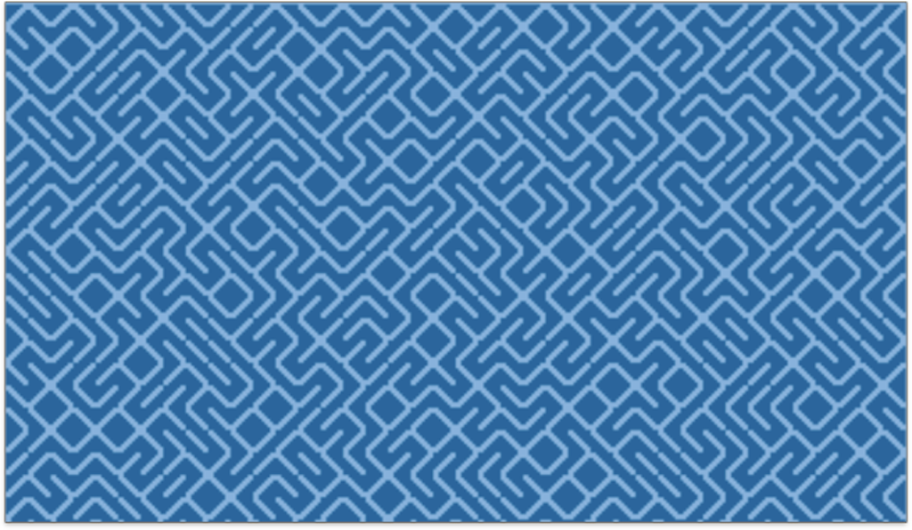

---
.header[Introduction]
## Procedural Generation


  

.footnote[[Forms by Memo Akten and Quayola](https://vimeo.com/38017188)]


???
  

* Forms is a series of studies on human motion, and its reverberations through space and time. [...] Rather than focusing on observable trajectories, it explores techniques of extrapolation to sculpt abstract forms, visualizing unseen relationships – power, balance, grace and conflict – between the body and its surroundings.
  
* The project investigates athletes; pushing their bodies to their extreme capabilities, their movements shaped by an evolutionary process targeting a winning performance. Traditionally a form of entertainment in todays society with an overpowering competitive edge, the disciplines are deconstructed and interrogated from an exclusively mechanical and aesthetic point of view; concentrating on the invisible forces generated by and influencing the movement.
  
* The source for the study is footage from the Commonwealth Games. The process of transformation from live footage to abstract forms is exposed as part of the interactive multi-screen artwork, to provide insight into the evolution of the specially crafted world in which the athletes were placed.


---
## Unreal

  
.imgref[[[pcgamesn]](https://www.pcgamesn.com/unreal-engine-5-demo)]

--

> Always think about your work as creating a process, rather than a thing.  
  


---
template:inverse

# Beauty in Maths

???
  

---
## Beauty in Maths

--
* Learn about visual properties of some numbers and curves

--
* Get an intuition on how to use formulas in regard to their design space and their implementation

--
* Learn how to grow leaves like a plant

---
## Beauty in Maths

.center[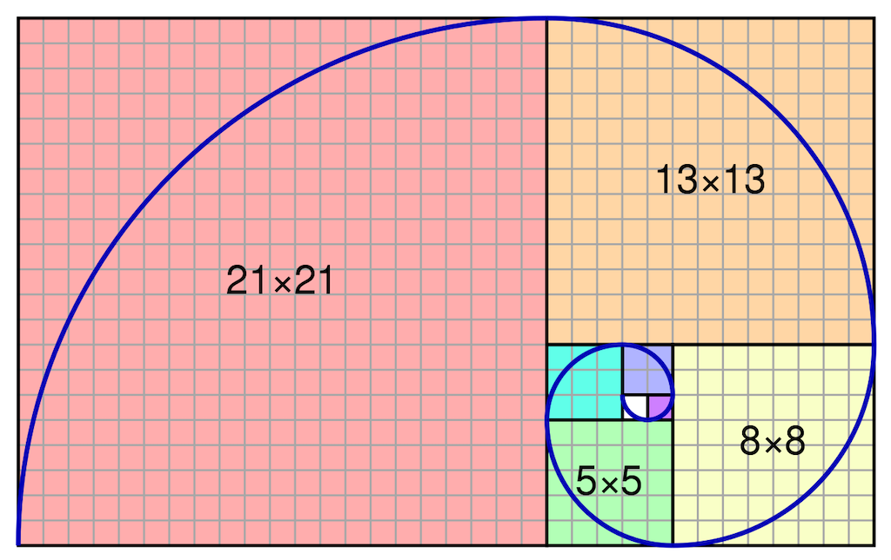.imgref[[[wiki]](https://commons.wikimedia.org/wiki/File:FibonacciSpiral.svg)]]  


???
  

* The above segmentation of an rectangle approximates the *golden spiral*. 
* We have a *golden* ratio if the ratio of two quantities is the same as the ratio of their sum to the larger of the two quantities.

$\frac{a+b}{a} = \frac{a}{b}$

---
## Beauty in Maths


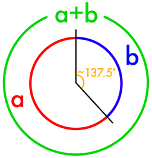  
.imgref[[[gofiguremath]](http://gofiguremath.org/natures-favorite-math/the-golden-ratio/the-golden-angle/)]

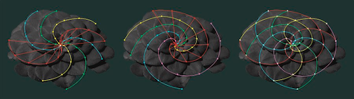  
.imgref[[[fineartamerica]](https://fineartamerica.com/featured/1-golden-angle-thomas-festerscience-photo-library.html)]


???
  

* 
The best solution to *how far to turn from the last leaf* in degree is therefore $~137.5°$, and that is what all kinds of plants do.

---
## Beauty in Maths


  


???
  

* Vogel, H (1979). **A better way to construct the sunflower head**. Mathematical Biosciences 44 (44): 179–189.

---
## Beauty in Maths

  


???
  

* But the fascination doesn't stop here. If we change the angle from the golden angle to an arbitrary angle between 0..360 we get vastly different designs for only very small changes. The following code maps the angle to turn to the mouse position in x. Try the code for yourself!
* Fractions for the `ratio` value lead to spikes, while getting closer to an irrational number produces dense distributions:

---
## Beauty in Maths

  
[[fineartamerica]](https://fineartamerica.com/featured/flow-of-life-flow-of-pi-cristian-ilies-vasile.html)

---
## Beauty in Maths

### The Rose Curve

.center[.imgref[[[wiki]](https://en.wikipedia.org/wiki/Rose_(mathematics)]]  
  
---
## Beauty in Maths

.center[]

---
template:inverse

# Function Design


???
  

With this chapter, you will

* gain an intuitive understanding of the visual qualities of different operators and function components.
* gain some understanding of how to put the different function components together to create a specific design goal.

---
## Function Design

Gain an understanding of

--

* the visual qualities of different operators and function components

--
* how to put the different function components together to create a specific design goal


---
## Function Design

.center[  .imgref[[[geogebra]](https://www.geogebra.org/m/Wkjz2X92)]]


---
## Function Design

.center[]  

???
  

* The simplest of transitions is the step function, which switches between values based on a threshold, meaning with a fixed value that *t* is smaller or larger to.


---
## Function Design

.center[

]


???
  

* Often times we want to repeat certain visual features, which can be done in its simplest form e.g. with a `sin` function. However, there are several other design options. The following functions are also often called *wave functions*.
* Wave functions have as common properties
    * frequency (“*how often*”), and
    * amplitude (“*how much*”).


---
## Function Design


.center[]

---
## Function Design

.center[]  

---
## Function Design


  
.footnote[[Happy Jumping by Iq](https://www.shadertoy.com/view/3lsSzf)]


---
template:inverse

# Tilings

---
## Tilings


--
* Know about the formal world of tilings and be aware of their mathematical complex constructions

--
* Know which terms to investigate if you are further interested in the formal aspects of tilings

--
* Understand the design principles of Islamic art

--
* Learn about contexts and interpretations of geometry


---
## Tilings

So far, we have used simple grids to create repetitive patterns. However, grid with hexagons are also very commonly used!

.center[]


???
  

* In previous years I have explained how to create a hex tiling in glsl.
* Unreal would be the way to go: https://www.youtube.com/watch?v=hc6msdFcnA4

* https://www.youtube.com/watch?v=VmrIDyYiJBA


---
.header[Tilings]

## Hexagonal Grids


.center[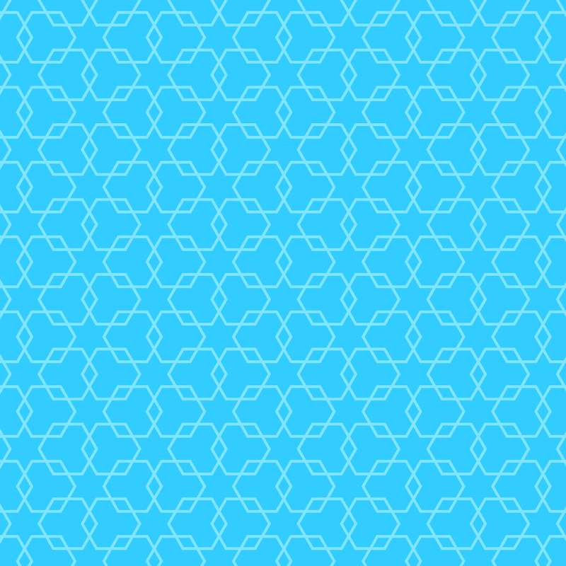]

---
.header[Tilings]

## Hexagonal Grids


.center[ 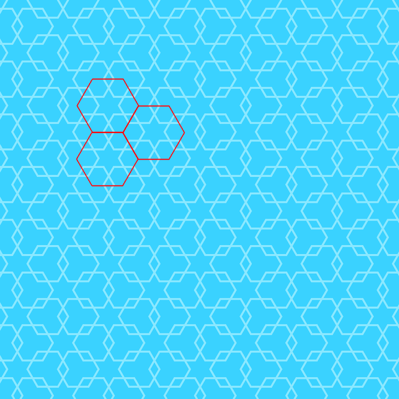]

---
.header[Tilings]

## Hexagonal Grids


.center[ 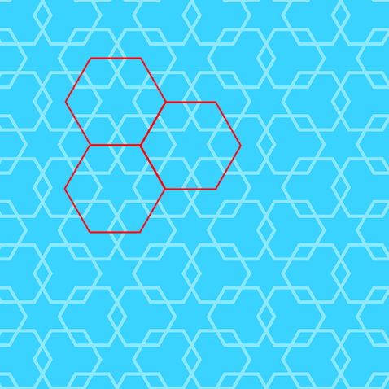]


---
.header[Tilings]

## Hexagonal Grids


.center[]

---
.header[Tilings]

## Hexagonal Grids


.center[ 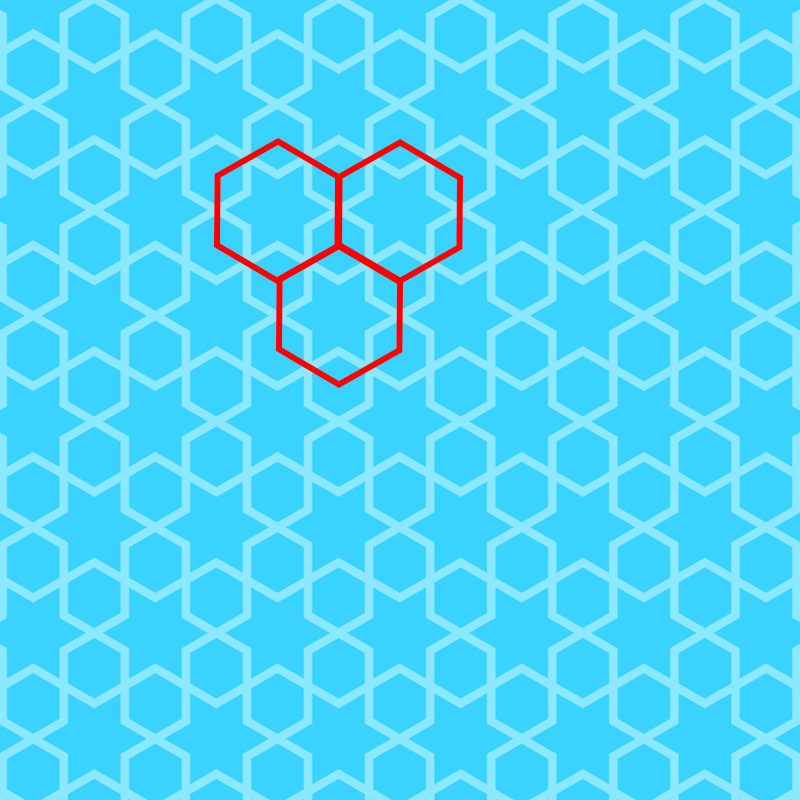]

---
.header[Tilings]

## Hexagonal Grids


.center[]

---
.header[Tilings]

## Hexagonal Grids


.center[ ]

---
.header[Tilings]

## Hexagonal Grids


.center[]

---
.header[Tilings]

## Hexagonal Grids


.center[ ]


???
  

* pattern_islamic_hex.frag


---
## Tilings

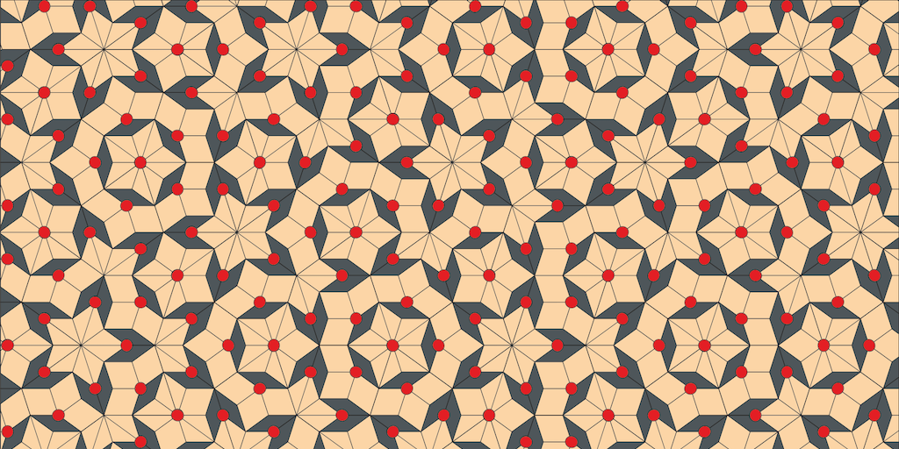  
*Penrose rhomb tile* .imgref[[[aperiodictiling]](https://www.aperiodictiling.org/wpaperiodictiling/)] 


???
  

* What kind of tiling is this?
* A non-repeating pattern, is call an *aperiodic* tiling. Hence, a set of polygons that tile the plane but never form a periodic tiling.
  
* This means the pattern is not constructable by simple translations of potentially arbitrarily large periodic patches. Shifting an aperiodic tiling cannot produce the same tiling. 
* It is not possible to create the tiling by taking some (potentially very large) section and repeating it over and over again. 
* Around 1973/74 Roger Penrose found a set of two tiles that only tile non periodically. 


---
## Tilings

There is a new tile in town - the Einstein tile. 


???
  

After 50 years of almost no developments in finding new aperiodic tiles, a commoner fund a solution for a aperiodic tile with just one time (hence Ein-Stein tile)!

If you are interested, I highly recommend this great overview of the new developments:

[How a Hobbyist Solved a 50-Year-Old Math Problem (Einstein Tile)](https://www.youtube.com/watch?v=A1BhOVW8qZU&t=564s):

--

<iframe width="640" height="360" src="https://www.youtube.com/embed/A1BhOVW8qZU" title="How a Hobbyist Solved a 50-Year-Old Math Problem (Einstein Tile)" frameborder="0" allow="accelerometer; autoplay; clipboard-write; encrypted-media; gyroscope; picture-in-picture; web-share" referrerpolicy="strict-origin-when-cross-origin" allowfullscreen></iframe>


???
  

.center[]
  
[[Craig S. Kaplan]](http://www.cgl.uwaterloo.ca/csk/projects/starpatterns/)


* Computer generated star patterns, inspired by islamic art, applied to the Euclidean plane, the surface of the sphere, and the hyperbolic plane.

---
## Tilings

.center[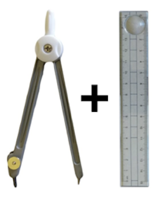]

.imgref[[[ricoflow]](https://www.youtube.com/watch?v=FqBWjJQKICk)]


---
## Tilings

.center[]  
  
.imgref[[[travelingalchemists]](https://travelingalchemists.wordpress.com/)] 


???
  

* The above image, depicts the *seed of life*, which is believed to be an ancient geometric universal symbol for all creation.
* Speaking of religion, there is a discipline called *sacred geometry*. Sacred geometry ascribes symbolic and sacred meanings to certain geometric shapes and certain geometric proportions. It is associated with the belief that god is a mathematician, specializing in geometry, applying this mastery when building the world. Here, the synchronicity of the universe is determined by certain mathematical constants, which express themselves in the form of patterns and cycles in nature. The geometry used in the design and construction of religious structures such as churches, temples, mosques, religious monuments, altars, and tabernacles has then sometimes been considered sacred. 

---
## Tilings

.center[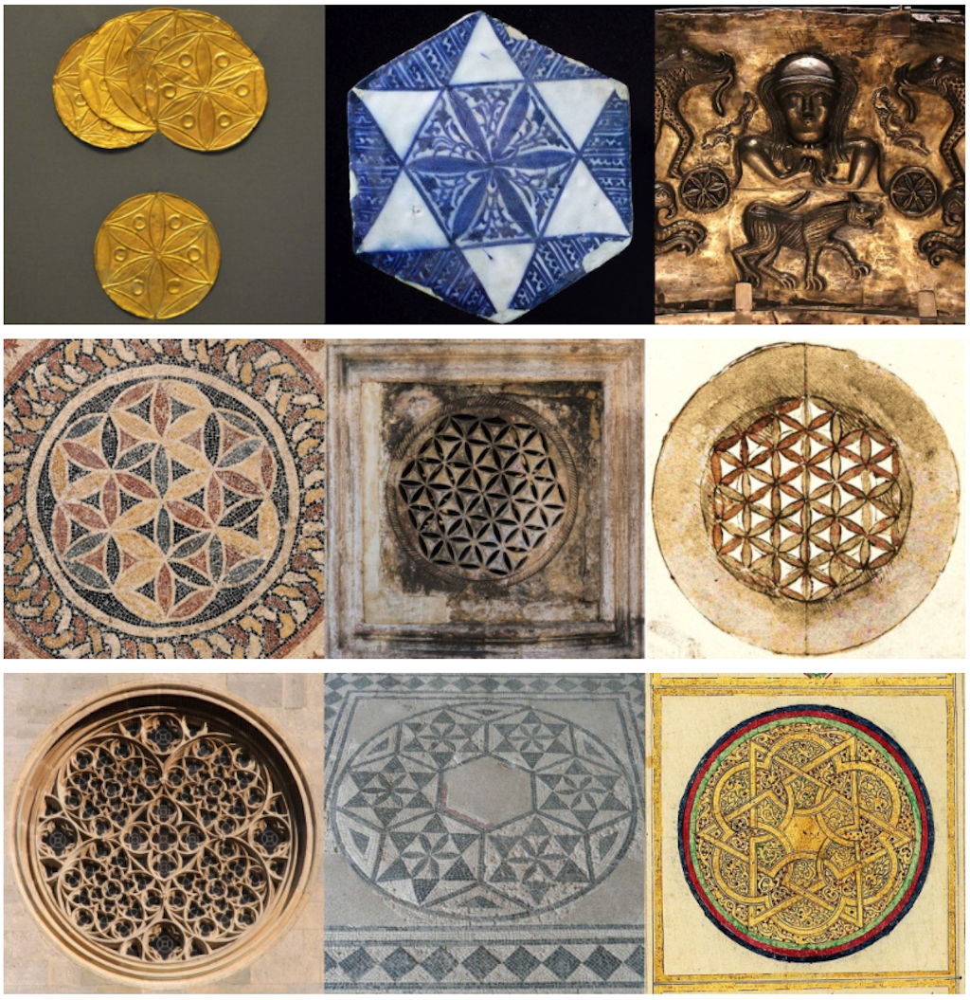]  

.imgref[[[etemetaphysical]](https://blog.etemetaphysical.com/seedoflife/)] 

???
  

* The above image, depicts the *seed of life*, which is believed to be an ancient geometric universal symbol for all creation.
* Speaking of religion, there is a discipline called *sacred geometry*. Sacred geometry ascribes symbolic and sacred meanings to certain geometric shapes and certain geometric proportions. It is associated with the belief that god is a mathematician, specializing in geometry, applying this mastery when building the world. Here, the synchronicity of the universe is determined by certain mathematical constants, which express themselves in the form of patterns and cycles in nature. The geometry used in the design and construction of religious structures such as churches, temples, mosques, religious monuments, altars, and tabernacles has then sometimes been considered sacred. 

???
  

.center[]

[[forgingmind]](https://www.forgingmind.com/collections/frontpage/products/bioluminescence)


---
template:inverse

# Noise Functions


---
## Noise Functions

Gain an understanding of 

--
* what a procedural noise function is and the requirements for it

--
* the different types of noise

--
* how to use noise

---
## Noise Functions

.center[]

```js

smooth_pseudo_noise(x) = smooth_saw(x) * step_random(x) 
                         + smooth_saw(x - 1) * (step_random(x - 1) * -1 + 1)
```

--

There is good noise and bad noise.


???
  

* Spatial correlation
* No periodicity
* A defined distribution
* Reproducibility


---
## Noise Functions

  
.footnote[[[Jackson Pollock - Number 14 gray (1948)]](https://thebookofshaders.com/11/)]


---
## Noise Functions

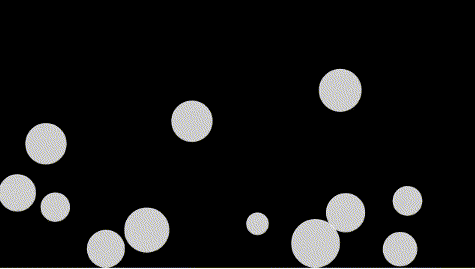  

.footnote[[[processing]](https://www.processing.org/examples/bouncybubbles.html)]


???
  

  
[[iquilezles]](http://www.iquilezles.org/)

---
## Noise Functions

.center[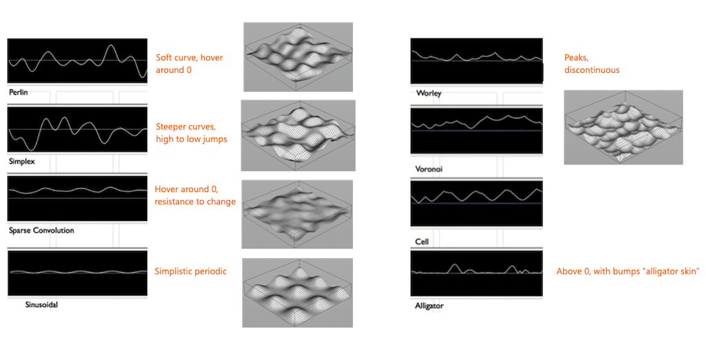]
[[sidefx]](https://vimeo.com/75313908)

---
## Noise Functions

### Turbulence Noise

  
  
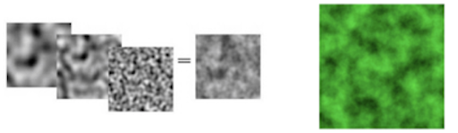

---
## Noise Functions

  

.footnote[[[Warping by Iq]](https://www.shadertoy.com/view/4s23zz)]


---
## Noise Functions

### Cellular Noise

 .imgref[[[thebookofshaders]](https://thebookofshaders.com/12/)]

--
  
 .imgref[[[wiki]](https://en.wikipedia.org/wiki/Voronoi_diagram#/media/File:Euclidean_Voronoi_diagram.svg)]

---
template:inverse

# Dynamics


---
## Dynamics

--
* An understanding of the different approaches to moving stuff,

--
* An understanding of the theoretical backgrounds of dynamics
    * Calculus
    * Velocity, acceleration, forces, ...
    * Newton’s Laws of Motion
--
* The ability to transfer the theory to examples of dynamic systems in Unreal


---
## Dynamics


???
  

In short, velocity is a *rate of change*.

Computations in regard to moving objects and changing locations are part of *[Calculus](https://en.wikipedia.org/wiki/Calculus)*, *the study of change*.  

---
## Dynamics

If we want to compute a new location for a point **p** over time t, we apply its velocity **v** and acceleration **a**:

**v'** = **v** + **a** · **Δt**  
**p'** = **p** + **v'** · **Δt**  

* Velocity measures the change in location over a certain time.
* Acceleration measures the change in velocity over time

---
## Dynamics

#### Newton’s Second Law of Motion

> Force equals mass times acceleration, hence **F** = **M** · **A**.  

With **F** as force, **M** as mass and **A** as acceleration.

--


---
## Dynamics

### Example Air and Fluid Resistance

  
.footnote[[[codingtrain]](https://editor.p5js.org/codingtrain/sketches/5V8nSBOS)]  

???
  

* Friction occurs when a body passes through a liquid or gas. This force is called a *drag force*, or a *viscous force*, or *fluid resistance*. With that we want to model e.g. a drag force for a liquid (the gray area).


---
template:inverse

# Particles

---
## Particles

Gain an understanding of

--
* the components of particles systems

--
* the characteristics for more natural movements with agents

--
* how to transfer the theory to examples of dynamic particle systems Unreal

---
## Particles

.center[]

---
## Particles

.center[]

.footnote[[[princeton.edu]](https://www.princeton.edu/news/2013/02/07/birds-feather-track-seven-neighbors-flock-together) *Flocks of birds.*, [[pinterest]](https://www.pinterest.de/pin/31243791139408749/) *A school of fish.*]

---
.header[Particles]

## Agency

.center[]

Agency as the desire to move in a certain way.

---
.header[Particles]

## Boids

.left-even[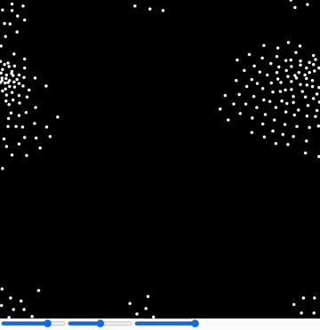  
.imgref[[[codingtrain]](https://editor.p5js.org/codingtrain/sketches/ry4XZ8OkN)]]

.right-even[
* Separation  
* Alignment 
* Cohesion 
]

???
  

* The left slider adjusts the influence of alignment, the middle one cohesion and the right one separation
* http://www.basis64.nl/flocking3D/


## Fluids

Gain an understanding of

* what a fluid is an its properties
* the formal representation of a fluid
* a real-time solution for a fluid visualization in the context of VFX


## Fluids


.center[]  
[[Created with Wind Tunnel/Quanta Magazine]](https://www.quantamagazine.org/what-makes-the-hardest-equations-in-physics-so-difficult-20180116/)


## Fluids


---
template: inverse

# *That's it!*

---
template:inverse

# *What Next?*


---
.header[*What Next?*]

## Unreal

--
* C++ in Unreal

--
* Procedural Content Generation

---
.header[*What Next?* | Unreal]

## Procedural Content Generation 

.center[] .imgref[[[epicgames]](https://dev.epicgames.com/documentation/en-us/unreal-engine/procedural-content-generation-overview?application_version=5.3)]


---
.header[*What Next?*]

## Unreal

* C++ in Unreal
* Procedural Content Generation
* Player mode / VR

---
.header[*What Next?*]


## CTech Workshops

--
* Shader Programming

--
* Materials & Shading

--
* Fluids & Volumes (?)

--
* More Particles (?)

--
* Houdini (VFX)

---
.header[*What Next?*]

## Projects

Does it makes sense for you

--
* ...to have procedural generation in your set of skills? If yes, 
    * with which tool do you want to work with?
    * which outputs / designs / setups are you aiming for?
--
* ...to have Unreal in your set of skills? If yes, 
    * which Unreal topic so you want to look into next?
    * which outputs / designs / setups are you aiming for?


---
template:inverse

# Feedback

---
.header[Feedback]

### Anything Worthwhile to Mention?

* How would you rate the difficulty?
* How would you rate the amount of work?
* What do you think about Unreal as tool to learn for a CTecht student? Is it valuable?
* What do you think about Unreal as a tool for this class?
* Do you have any other ideas reading which tools to use for this class?
* Do you have any useful hints to pass on to future students?
* What is your opinion regarding practical exercises in class?
* Which one was your favorite chapter, which one your least favorite?
* Was there a topic missing and if so which one?


???
  

* Unreal exercises do not yet fully connect to the theoretical topics and a procedural paradigm, as of now.
  
  
---
template:inverse

# The End

# 👋🏻

