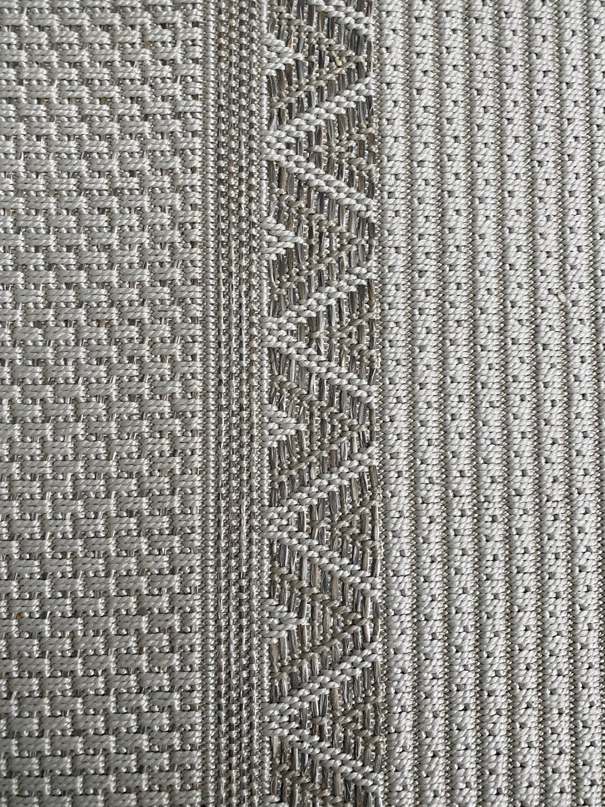
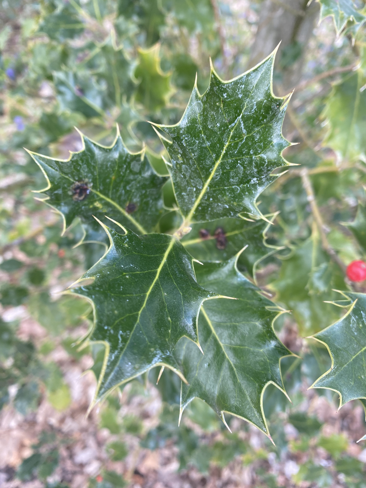
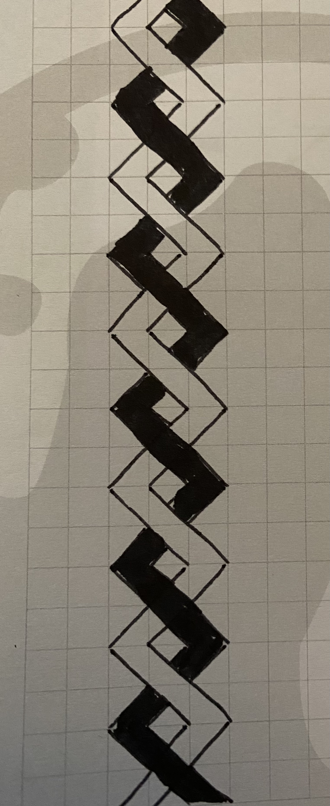
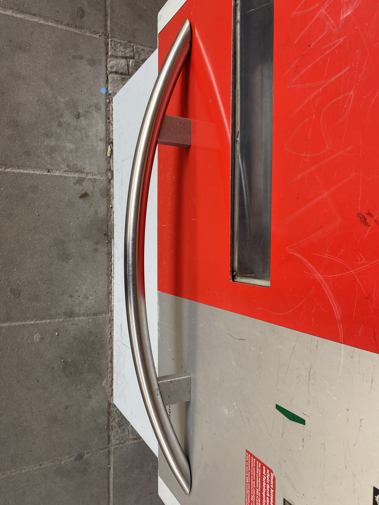
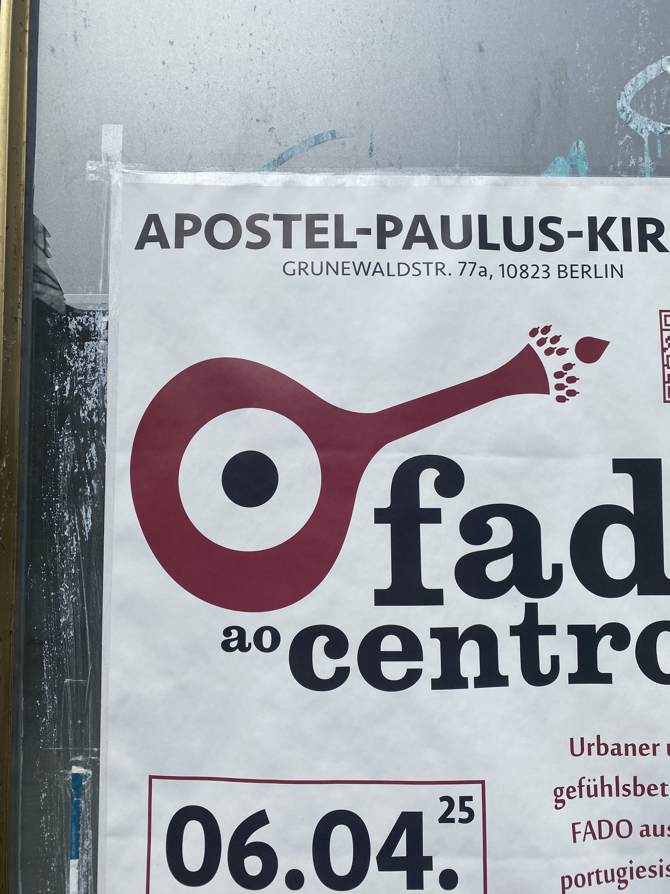
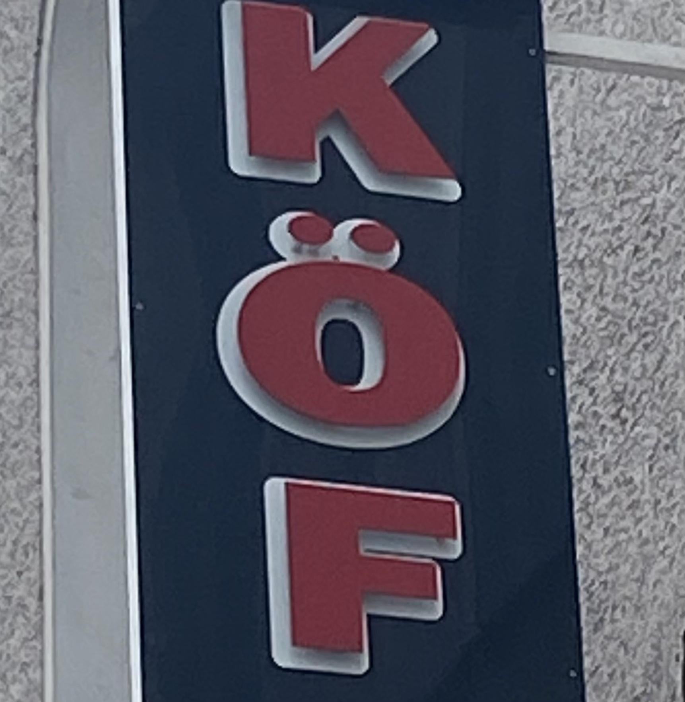
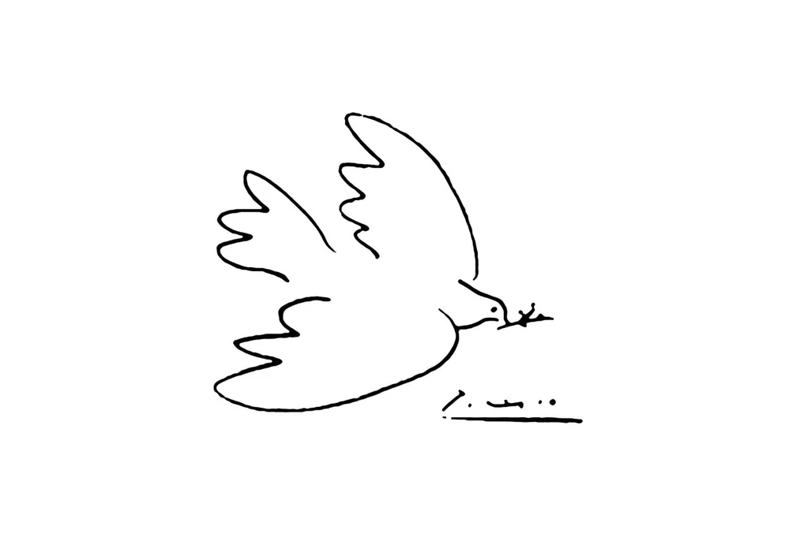
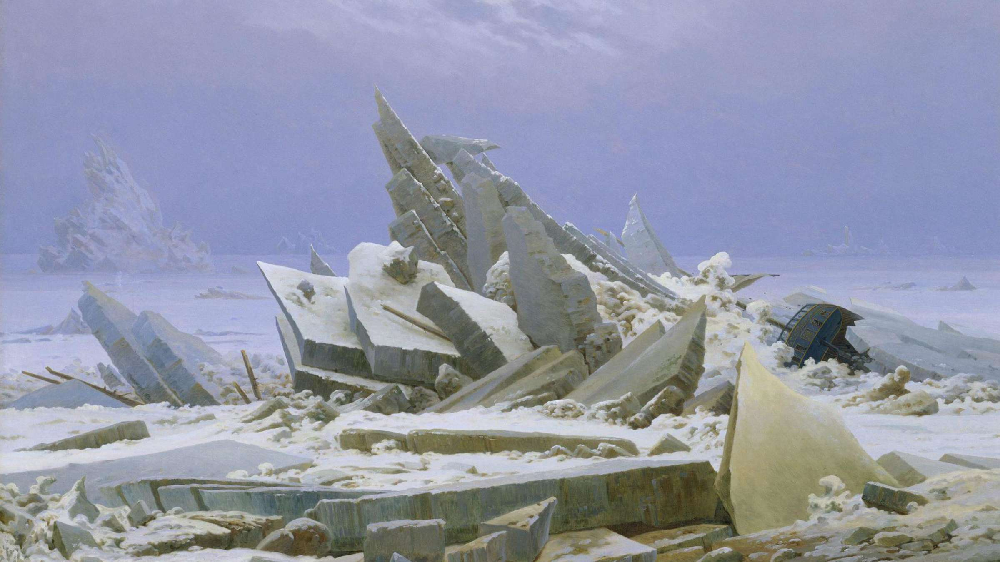
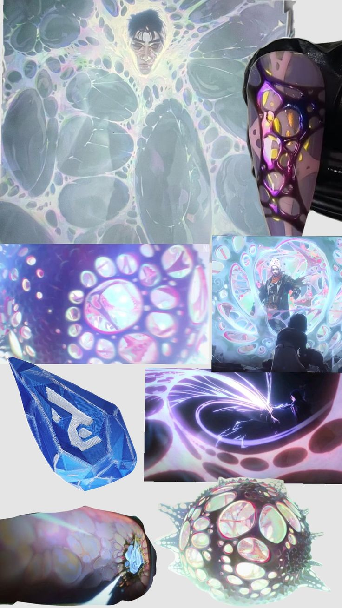

## Task 01: Numbers

### Task 01.01

- **Which of the chapter topics given in the syllabus are of most interest to you? Why?**<br>
  Abstracted design in 3D space, just out curiosity how its done.

- **Are there any further topics regarding procedural generation and simulation that would interest you?**<br>
  The idea of generating single trees or forest for game design and co. sounds very interesting. It would be nice to implement that as well on other things/objects like just generating legs of tables, plates on a table, windows on a house.

- **Is there a different tool than Unreal that you would prefer to do the exercises with (e.g. Unreal, Houdini, Unity, Maya, Blender, JavaScript, p5, GLSL, ...)? If so which one, and why?**<br>
  Probably Blender or GLSL. Blender: Because I have used it before and would like to deepen my knowledge in that program especifically. GLSL: It sounds interesting, wanted to do a workshop in this anyway.

_Submission_: Answer in your markdown submission file.

### Task 01.02 - Seeing Patterns




### Task 01.03 - Designing Patterns



```
set position to (0, 0, 0)

define line_black as black
define line_white as white

// Loop through steps
repeat 8 times:
    if step is even:
        draw line_black from (-1, -1, 1) to (1, 1, 1)
        draw line_white from (-1, -1, 0) to (1, 1, 0)
    else:
        draw line_black from (-1, -1, 0) to (1, 1, 0)
        draw line_white from (-1, -1, 1) to (1, 1, 1),

    translate all positions by (0, -2, 0)

```

### Task 01.04 - Seeing Faces





### Task 01.05 - Abstraction in Art

I chose two painting I really love as both have different meaning on abstraction.

**Dove of Peace. Picasso:**



What is the minimal amount needed to represent something? I enjoy the play and thinking of the idea to reduce down to their simplest form. Just enough to express the message.

**Das Eismeer. Caspar David Friedrich:**



I can’t explain how much I love this painting. To me, it shows emotions in a different way, through shapes and colors. When I look at it, I feel both fear and hope. It’s hard to describe with words.

### Task 01.06 - Abstracted Artistic Expression in CGI

**Arcane 2. Anomaly**



This way of representing the anomaly in the series Arcane 2 is, first of all, incredibly beautiful in my opinion. Every shot that includes it becomes instantly more captivating—rich in color and full of visual depth. It weaves through the entire series, linking each chapter together. The repetitive pattern it follows creates a sense of rhythm and unity, making it a powerful way to portray 'the universe' in this context. It’s both simple and profound, and it adds a strong visual identity to the whole work.

## Unreal Engine

### Task 01.06 - First Steps


### Task 01.07 - Multiplication On A Circle With Modulo In Unreal

## Learnings

### Task 01.08

It is still for me difficult to grasp the whole PGS concept and what it really means. It was difficult to find topics I am interested in as I don't really know if it's still part of the topic or not. However, I really enjoyed the part of reflecting on art and especially learning to have more fun while searching and creating stugg!
