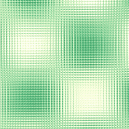

# Task 02: Functions

## Function Designs

### Task 02.01 - Inspiration

Example:
["Warping - procedural 2" created by iq](https://www.shadertoy.com/view/lsl3RH)  
This example strongly reminded me of the CGI images by Quayola we saw in class. It captures the essence of a feeling or moment, an attempt to grasp meaning or form, to find something tangible to hold onto. Yet it remains abstract, intentionally distancing itself from realism. I really appreciated this approach. Unlike other examples in shadertoy where there’s often something to decipher or a clear purpose to uncover, this piece simply exists. Calmly. Without striving to be something specific. It feels more like a quiet detachment from meaning than a search for it.

However, it also reminded me of a cat desintegrating in space. I will keep this example in mind and am exited to hopefully be able to play around whit this aesthetic and recreate it by myself.

### Task 02.02 - Brick Pattern

`brick_bunge.frag` submitted in this same folder.

### Task 02.03 - Pattern Experiments

`pattern_experiment_bunge.glsl` submitted in this same folder.
I started using the given code 'pattern_circles.glsl' and wanted to do something using the noise example I found as inspiration from shadertoy. I quickly noticed that shadetoy's code has it's own environment and rules. So first, I asked ChatGPT to change the logic so it could be used in VSCode environment using the pluging gsls canva renderer. It gave me the parameter for the noise so it created this movement. Furthermore, this noise is then animated.

This experiment gives this kind of "Glasbaustein"-look which is a happy accident and for me very welcomed :)

## Learnings

### Task 02.04

This session and homework was very challenging for me. I think I have now understanded the concept and implementation of normalizing. Furthermore, it was a great task to comment the "brick" code, which helped me to go over all the concepts over again.
