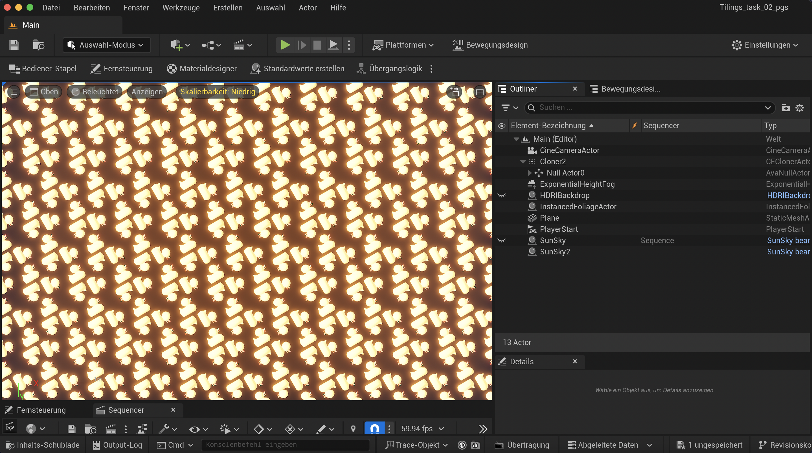
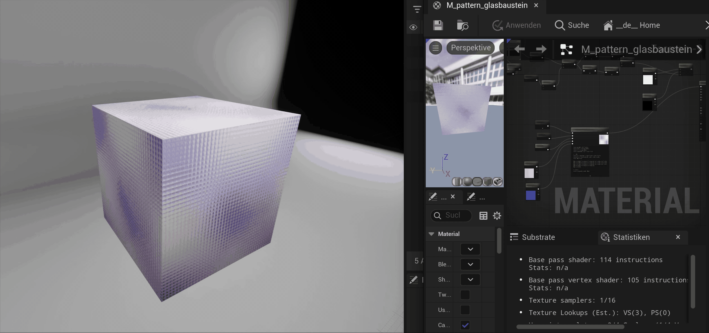

<<<<<<< HEAD
# Task 02: Tilings
=======
# Task 03: Tilings
>>>>>>> 1a1e4e9f06da55bb434dd0d2d68524986a7b9354

First try using the Motion Design Plugin. However, it was painfully slow and I couldn't work with the effectors without unreal crashing :( The idea was to create a tile design using three ducks and then multiplying them.

So I created a second one. This test is using the code for the exercise of last week (funtions) and implementing it using node in UE5.

## Learnings

### Task 03.03

- I had a hard time normalizing and creating the cells using nodes in ue5. I will need to come back to it and try to find the mistake. However, coding in ue5 feels like a shortcut, as we have already learned to implement these as code anyway.
- I learned how to use the note funtion in ue5, which was a first time experience for me.
