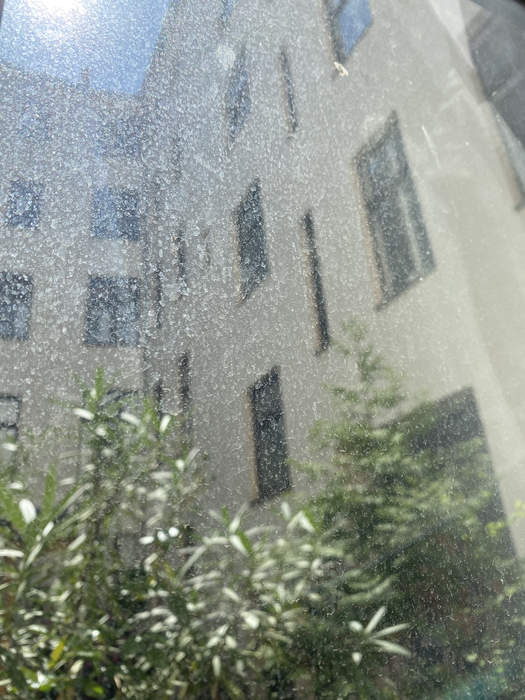
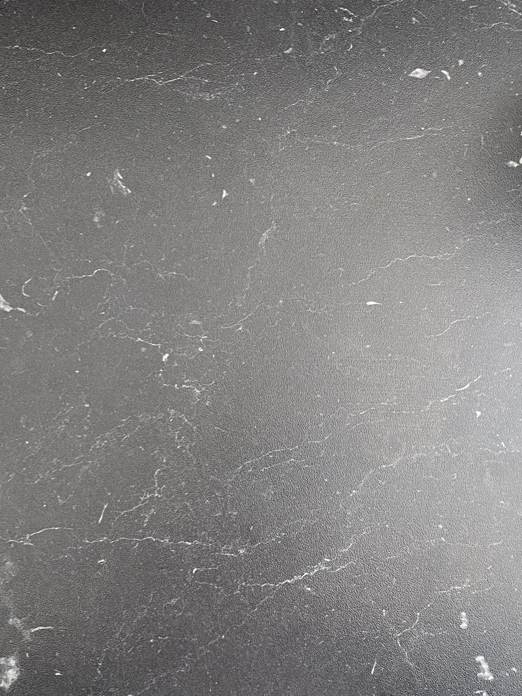
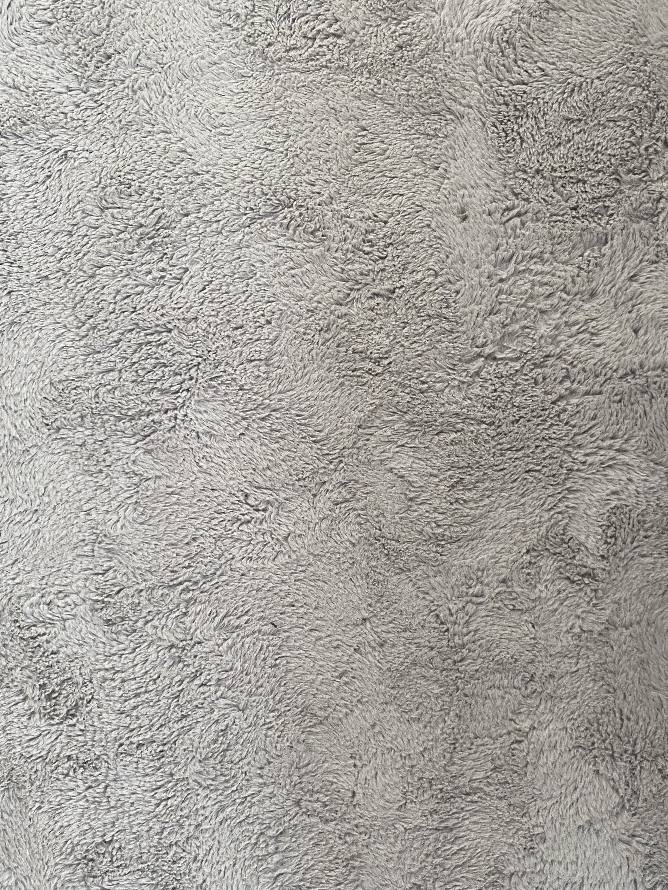
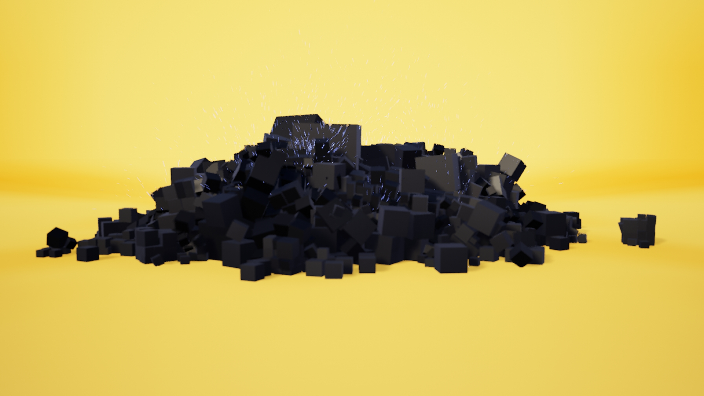

# Task 04: Noise Dynamics

e

### Task 04.01 - Collecting Inspiration

Natural Noise Patterns:

Artistic Image:

- Submit one stylized / artistic image that uses noise as generating principle or design element. You can find it on the internet.

## Dynamics

### Task 04.02 Tutorial Fancy Cubes

You can view the video [here](https://owncloud.gwdg.de/index.php/s/tYWUFPeBw803Lns).

Preview

## Learnings

### Task 04.04

I enjoyed doing and following a well documented tutorial. It was a good way to get an overview of various topics. I had to invest a bit more time in the rendering part as I am a beginner there. I tried to implement some post-hocs, but I will need to dig deeper in the topic to really understand it better.
