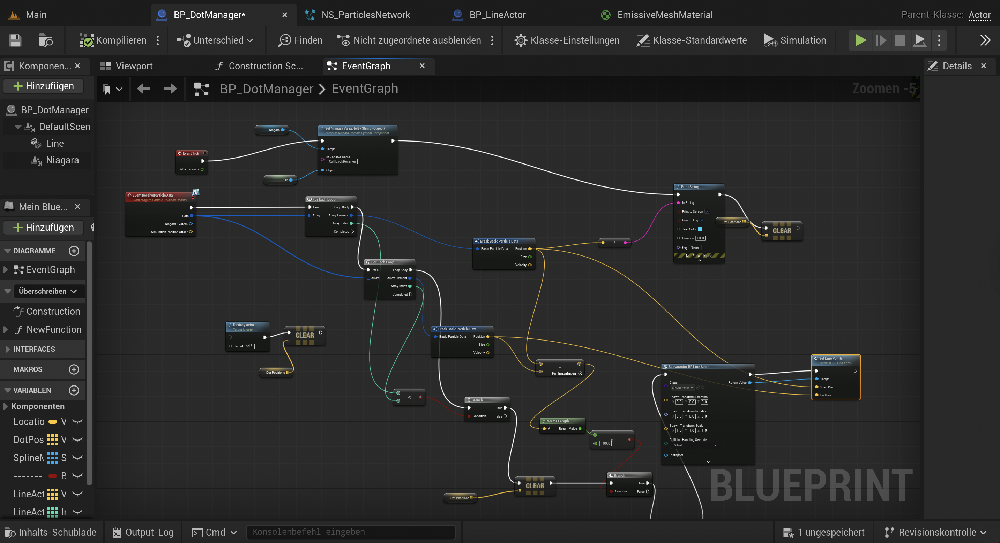
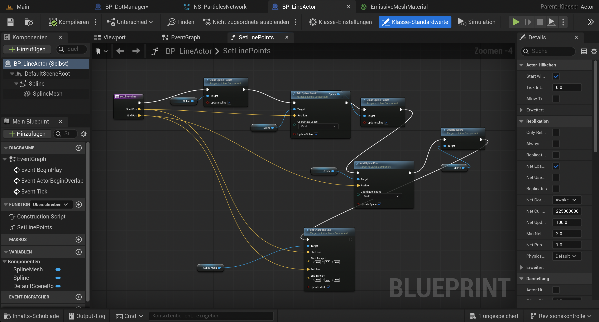
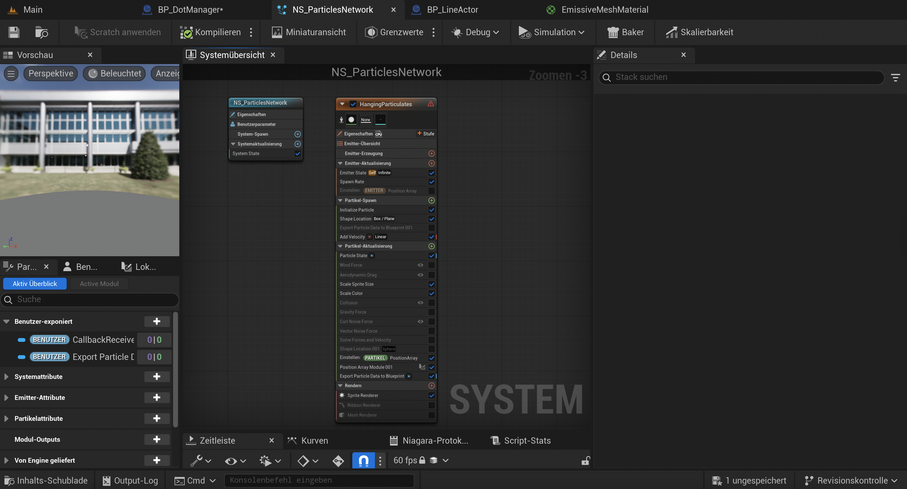

# Final Project: Hanging Particles with Connecting Lines (Network System)


## Goal / Idea

The idea of this project was to create a cool-looking particle simulation. I wanted to have many particles floating in space, and each particle should connect to nearby ones with lines. This should create a kind of net or web structure. It was inspired by some generative art and abstract visuals. As I discovered that there are no similar tutorials or projects to be found on the net (at least I did not found any). The most similar one would be connecting particles usually usign a Ribbon Renderer, however this one just connects the particles with on continuos line, and not like I did various lines connecting nearby particles.

---

## Approach

To make this happen, I used:

- **Niagara System** to create the moving particles
- **Blueprints** to read particle data and draw lines between them
- **Spline Meshes** to create real 3D lines
- A custom pooling system to make the project run faster

---

## Blueprint Overview

### BP_DotManager



This is the main controller Blueprint.  
It handles the logic for:

- Receiving the particle data
- Looping (ForLoop) through all the particles
- Checking which ones are close enough
- Spawning or updating line actors between nearby particles
- Also manages a pool of `BP_LineActor` objects to avoid spawning too many actors every frame

#### Pseudo Code: For Loop Logic

```
// Loop over all particles (outer loop)
For Each particle A in received particle array:

    // Loop over all particles again (inner loop)
    For Each particle B in received particle array:

    // Check if A and B are not the same particle
        If A != B:

    // Measure the distance between A and B
        distance = VectorLength(A.Position - B.Position)

    // Only draw a line if they are close enough
        If distance < MaxDistance:

    // Get a line actor from the pool or create a new one
        line = GetOrSpawnLineActor()

    // Send positions to the line actor to draw the line
        line.SetLinePoints(A.Position, B.Position)
```

### BP_LineActor



This Blueprint creates a simple spline with a mesh stretched between two points.  
It is used to draw the line between two particles.

Each line is reused from a pool instead of being created every frame. This helps reduce lag and crashes.

The main function in here is `SetLinePoints`, which:

- Clears the spline
- Adds two points (start and end)
- Updates the spline
- Sets the mesh to stretch between the two points

### NS_HangingParticulates



This is the Niagara System that spawns and manages the particles adapted from the template "Niagara Particulates"

- It uses a particle emitter, spawns a defined amout of particles and kills them after some time.
- It sends the position of the particles to the Blueprint using a **Export Particle Data to Blueprint** module.

This way, the Blueprint always knows where the particles are.

---

## Summary

In short:

- Particles are spawned in Niagara
- Their positions are sent to Blueprints
- The Blueprint checks which ones are close
- Lines are drawn using spline mesh components
- A pooling system is used to avoid performance issues

---

## Challenges

- A lot a lot... I spent a bit longer than a week only figuring the Blueprints. As there were no tutorials, I had to learn it by heart how blueprint communicate and work and what their logic is. However, I wanted to learn it anyways.
- Learning how to read Niagara particle data in Blueprint took some time
- Drawing the lines correctly between all nearby particles without creating a mess
- Implementing "code" logic into a node system.

---

## Learnings

- How to use variables to send and store data in Blueprints and Niagara Systems.
- How to create spline meshes between two points. (Draw a line between A and B).
- Why performance is important when working with many particles
- How to debug and organize large Blueprint logic. (Using debug nodes in BP like printing the coordinates of the particles on the screen)

---

## Final Result

The video shows the final result:

- Hanging particles floating in space
- Lines drawn between nearby particles

You can view the final result [here](https://owncloud.gwdg.de/index.php/s/nF14mLLqQ9moUVH).

Also, watch the preview showed below [here](https://owncloud.gwdg.de/index.php/s/Bd5G5FqZ3jWB7k6H).

Preview low-res:


---

Thanks for reading! 😊

Sophie
