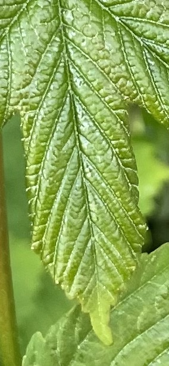
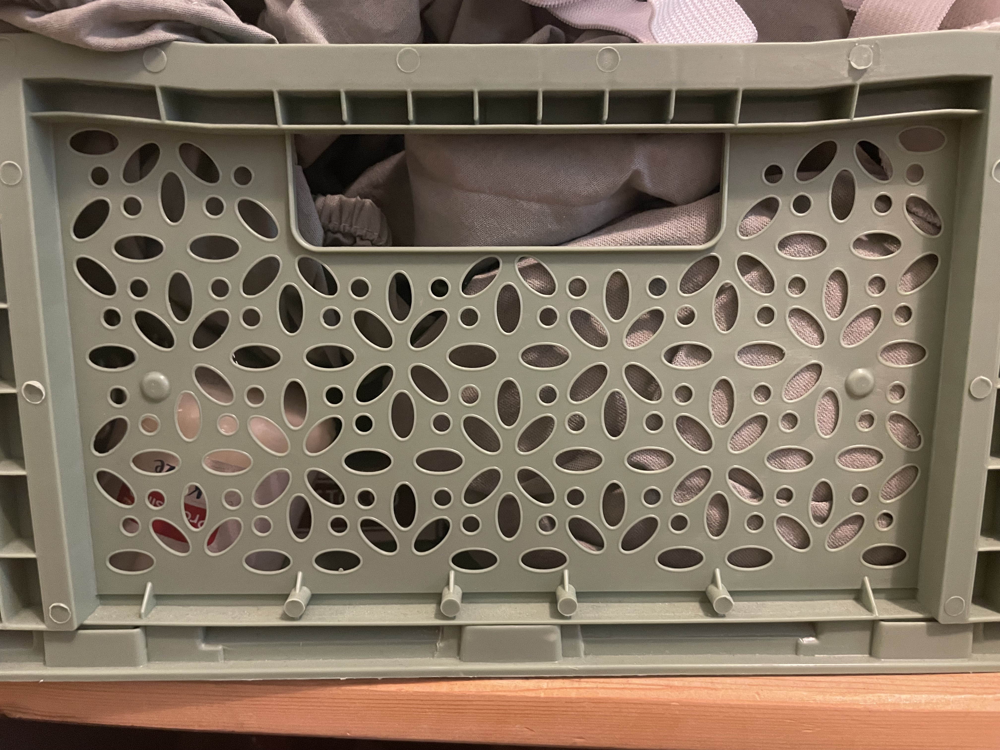
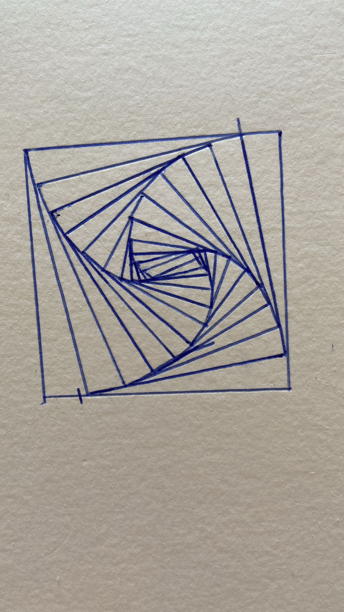
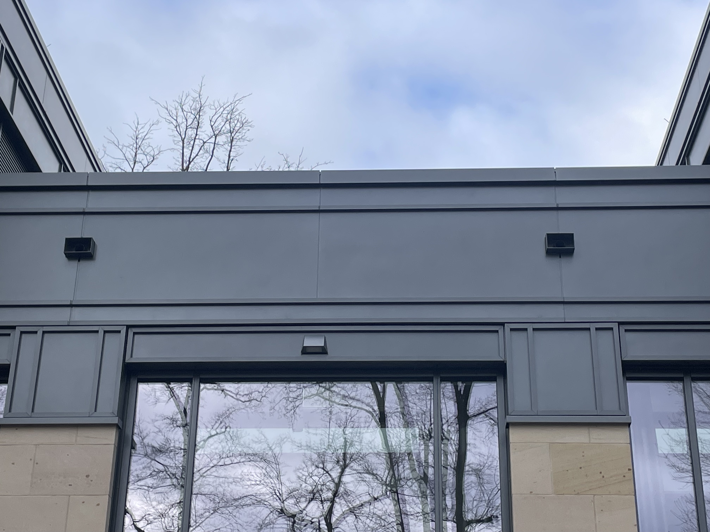
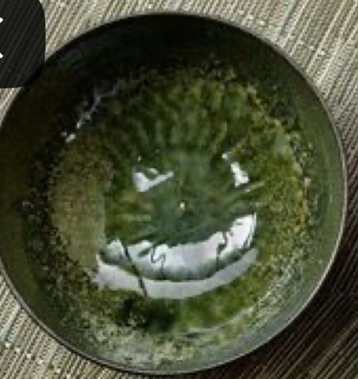
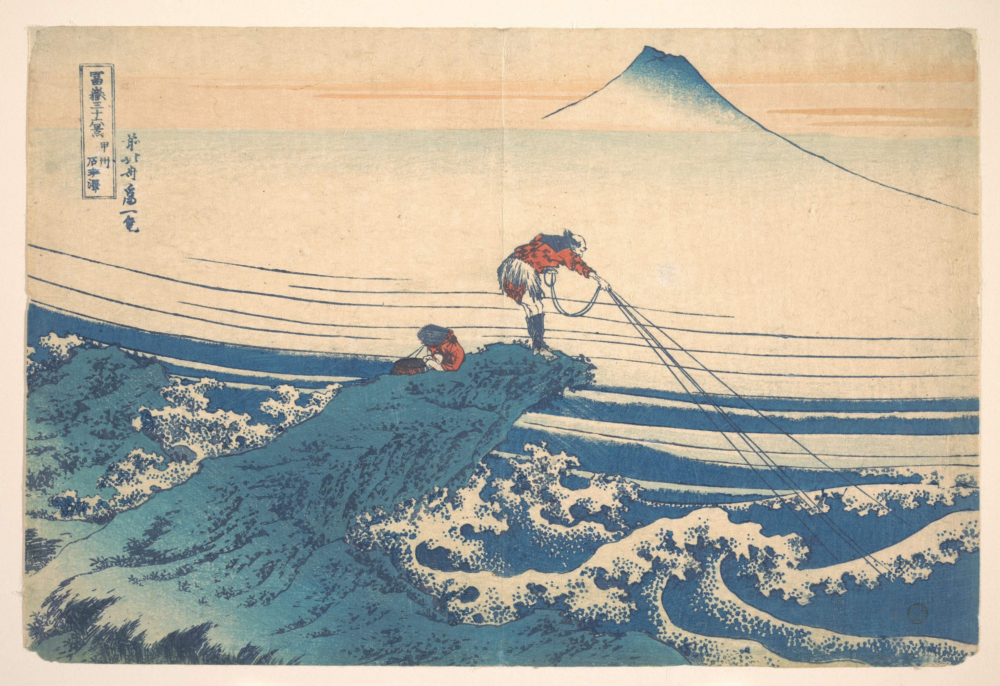
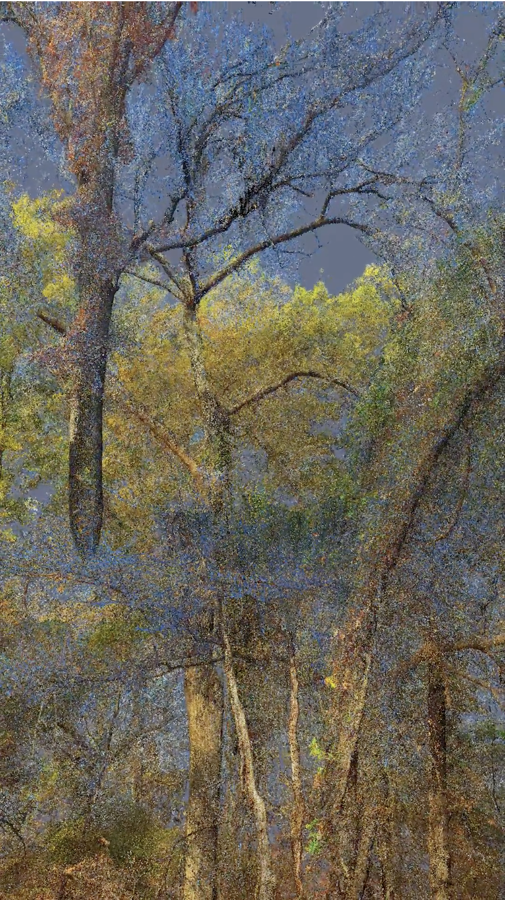
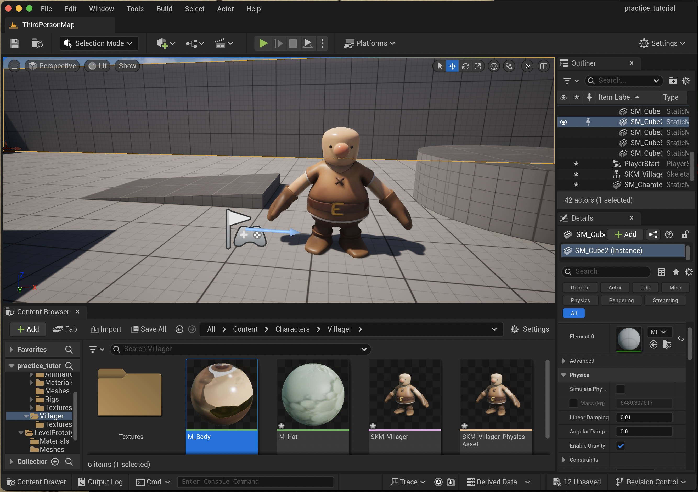

  
## Task 01.01

1. Which of the chapter topics given in the syllabus are of most interest to you? Why?

I am most interested in procedural generation in the world of data visualization. The piece Forms by visual artists Memo Akten and Quayola was the most interesting example to me out of everything shown, as I feel they are able to truly capture the essence of a dataset visually. I would like to explore this and perhaps create something in this realm, since I am interested in data visualization and feel that this technique goes beyond the common types of visualizations I have seen.

2. Are there any further topics regarding procedural generation and simulation that would interest you?

Besides data visualization, I would be interested in looking at procedural generation combined with visceral, more tactile materials. I would be interested in looking at this topic in relation to creating algorithms that allow the creation of some tactile thing—be it something woven, ceramics, or 3D modeling.

3. Is there a different tool than Unreal that you would prefer to do the exercises with (e.g. Unreal, Houdini, Unity, Maya, Blender, JavaScript, p5, GLSL, ...)? If so which one, and why?

No, I am new to this field and have only ever worked with Unity and Maya so I am interested to try Unreal out and see if I prefer it or not.

## Task 01.02 - Seeing Patterns
Natural Pattern: 

Human Pattern:

## Task 01.03 - Designing Patterns

# 

1. Draw a square that is 5cm x 5cm
2. Define the square bounds (top-left corner at (0, 0), width = 5cm, height = 5cm)
3. Set starting point to (0, 0)
4. Set the angle to 10 degrees
5. Set the direction to clockwise
6. While the current point is within the square bounds:
a. Start at the set starting point (0,0). Draw a line using the current angle (10 degrees) and end the line when you reach the next line.
b.  Repeat the above process of drawing a line from the end point with an angle of 10 degrees going in the set direction (clockwise).
c. Continue doing this until you run out of space!

## Task 01.04 - Seeing Faces

## Task 01.05 - Abstraction in Art

I have always been drawn to the prints by the artist Katsushika Hokusai. This piece, called 冨嶽三十六景　甲州石班沢 | Kajikazawa in Kai Province (Kōshū Kajikazawa), from the series Thirty-six Views of Mount Fuji (Fugaku sanjūrokkei), is particularly interesting to me due to the way he is able to capture so much movement and intensity in a rather mundane scene of a man fishing. In particular, I love his approach to treating water in such a stylised way, reimagining the shape of waves in general while still capturing their chaotic nature. This, in combination with the dramatic movements of the fisherman and the non-realistic depiction of the rocks he is on, amplifies the emotions in the picture, making it feel almost dreamlike. I am inspired by his unique take on everyday objects and the way that stylising them can actually increase the reality of a scene.
## Task 01.06 

### Abstracted Artistic Expression in CGI

I really like this piece by the artist Quayola from his series Landscape Painting. The image above is a screenshot from a short video he made of a tree forming and growing flowers, which you can see here: https://quayola.com/selected-landscape-paintings/.

I really like how he chose to depict the tree in an impressionistic style rather than the realism that CG artists often go for. I feel it captures the feeling of spring even better than if he had made it look realistic.
This is inspiring to me because the artistic style he chose enhances the emotional impact of the piece, demonstrating how abstraction can often capture the true essence of something more effectively than realism. 

### First Steps
I chose to complete this tutorial: https://www.youtube.com/watch?v=e_SPuvO_l1w

I was not able to complete the whole thing but I was able to get used to the environment and import a mesh the creator of the turorial had made. In the tutorial they explained how to use the Third Person Games template and add a character to the character there by importing their files and changing the characters texture and add some animations to it. Below is a screen shot of the little village person he made: 

## Task 01.08
I found it most challenging understanding each of the algorithms in the section 'Beauty in Maths'. I think I challenged myself by trying to follow all the steps taken in each of the different steps explored and went over some of the basic maths principles that I had forgotten from high school. I think it was also suprisingly hard to find smiley faces, it took a while to remember that I needed to be more aware of my surroundings and find those faces. 