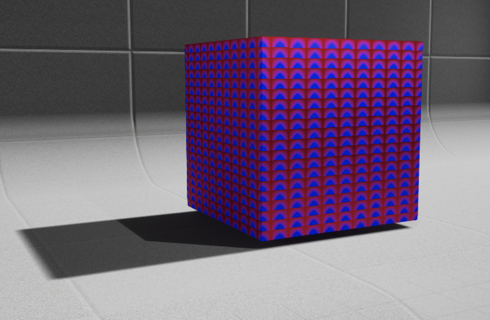
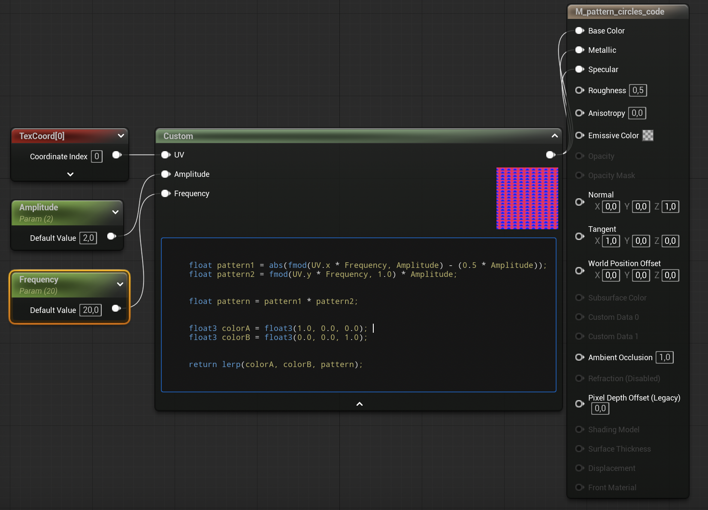

**Function Designs**

**Task 02.01 - Inspiration**

https://www.shadertoy.com/view/4sK3RD

**Task 02.02 - Brick Pattern**

You can see my commented code in brick_drews.frag 

**Task 02.03 - Pattern Experiments**

I decided to look into both the GLSL example and the Unreal one. What I decided to do is adapt the code from perodicity.frag which only displayed vertical lines along the x axis. The pattern shown was also only the wave_square one, even though there were functions for wave_sawtooth and wave_triangle included in the code as well. I decided to not only have the pattern display vertical lines along the x axis but to include horizontal lines along the y axis as well to create a grid. I then decided to use the wave_triangle function for the x axis and the wave_sawtooth for the y axis as it created an interesting look of a triangle facing downward and then fading out. I then also use the interpolation code which included both red and blue. You can see the code for this in the file imogen_periodicity.frag. Below you can then see my attempt to place this code in on an Unreal material:

And here is a screenshot of the code:

As you can see the colours are much brighter but I think overall it is pretty similar.

**Learnings**

**Task 02.04**

- I mainly tried to really understand the GLSL code and went through each line so that I could familiarise myself with the syntax
- I then added the y values myself since I wanted to try and get that to work without looking into it which I was able to do
- Lastly, with the help of ChatGPT I translated the GLSL code for the Unreal box but found that it was pretty bad at doing this. After looking through the internet for a bit I realised that the Unreal code does not accept functions so I just removed the functions for the my wave_triangle and wave_sawtooth and placed them directly in the code.