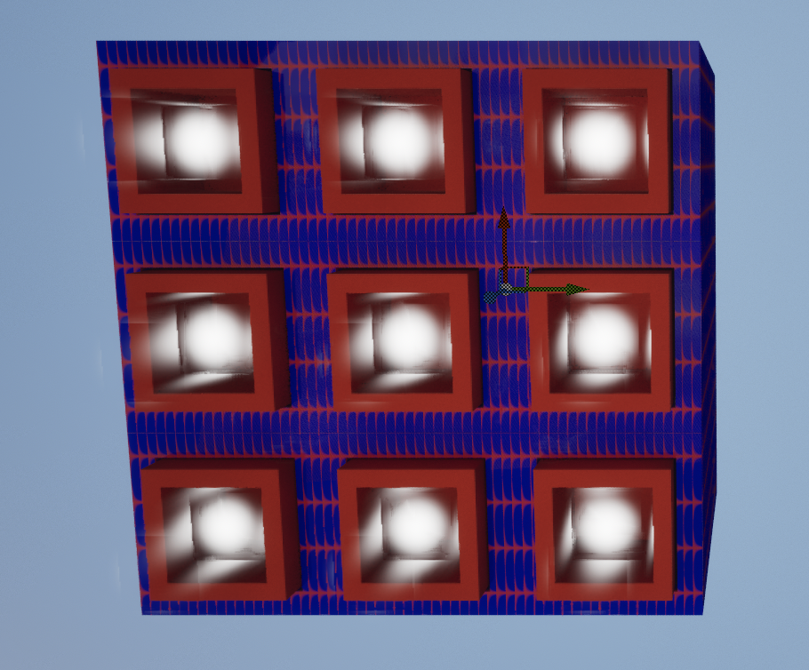

## **Tilings**

### **Task 03.02 - Tilings Implementation**

You can view the animations for this piece [here](https://owncloud.gwdg.de/index.php/s/rbyoMMiVDzqvXgy).

So I followed the [second tutorial](https://www.youtube.com/watch?v=wfbEAfzhTDQ) to help explain cloning and then the [first tutorial](https://www.youtube.com/watch?v=KdR1Fjsc8Bo) to help me understand animation using the Motion Design Plugin. In the second turorial, the tutorial maker uses a cyclinder to create his pattern but I used a square since that is one of the shapes best suited to tiles. I then did I similar thing to him where I first created one square and then added two more squares which are placed inside of the main one. I then used the same material that I made for task 2 for the outer square, a red material that I made by adapting the material M_Basic_Floor for the second square and then the for the inner square I added the material m_flare_01 which transforms the square into a little glowing globe. I then added a time animator to the small box’s cloner and transformed the z’s location to increase in a loop creating the look of light coming in and out of each square. I wanted this light to loop repetitively in light of the tiling theme of this weeks homework. 

## **Learnings**

### **Task 03.03**

Summarise your learnings (text or bullet points - whatever you prefer). What was challenging for you in this session? How did you challenge yourself?

Using the Motion Design Plugin was definitely the most challenging part of this exercise since it was quite slow on my laptop. However, once everything had loaded, it proved to be a very interesting plugin which I would like to work more with. I think the most beneficial thing I learned was the way that you can create a shape in the Modeling Mode and then, once you are finished, you can just drag and drop it into a cloner and it will clone it for you as many times as you like. I couldn’t get it to make too many clones for this project since my laptop did not allow for that but now that I know the process I would like to try this out on one of the desktops at the university. I challenged myself the most with using the animator to make the little ball go up and down. It looks quite easy but it took me a while to understand how to use the Time animator. Now that I know how to use it I would really like to look into it further.