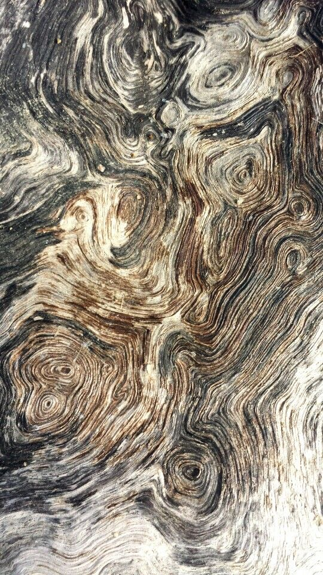
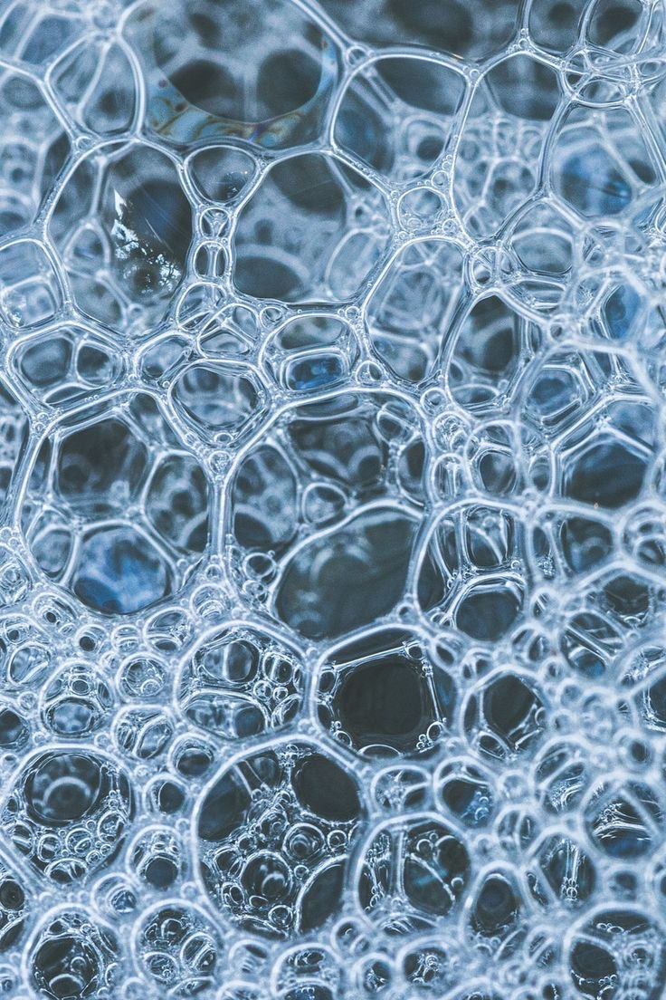
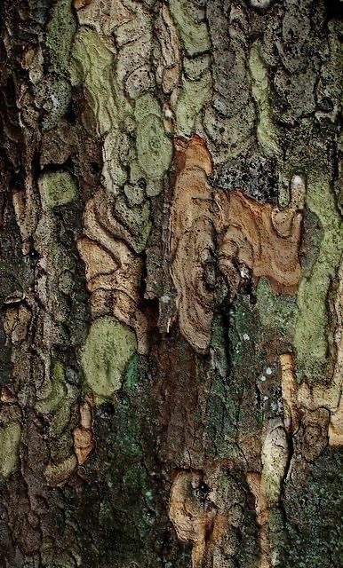
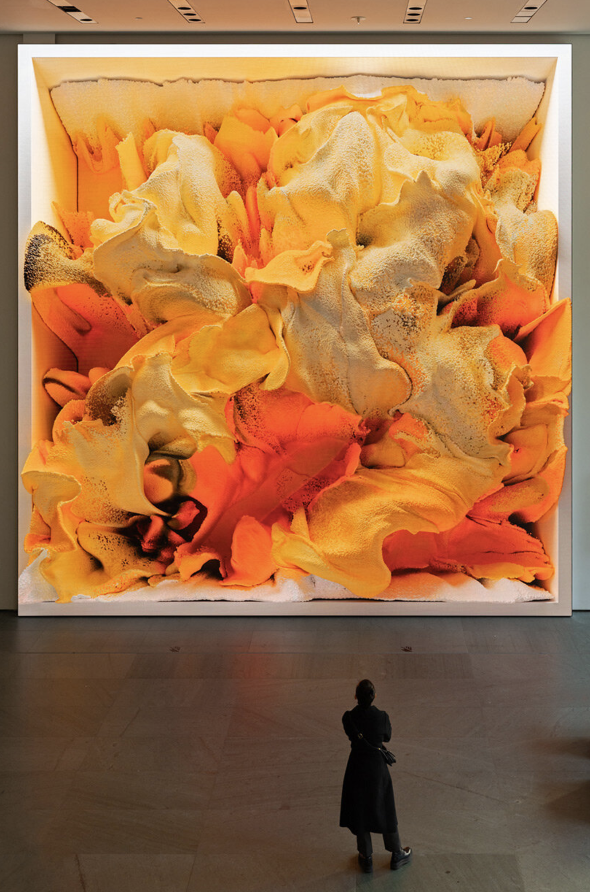
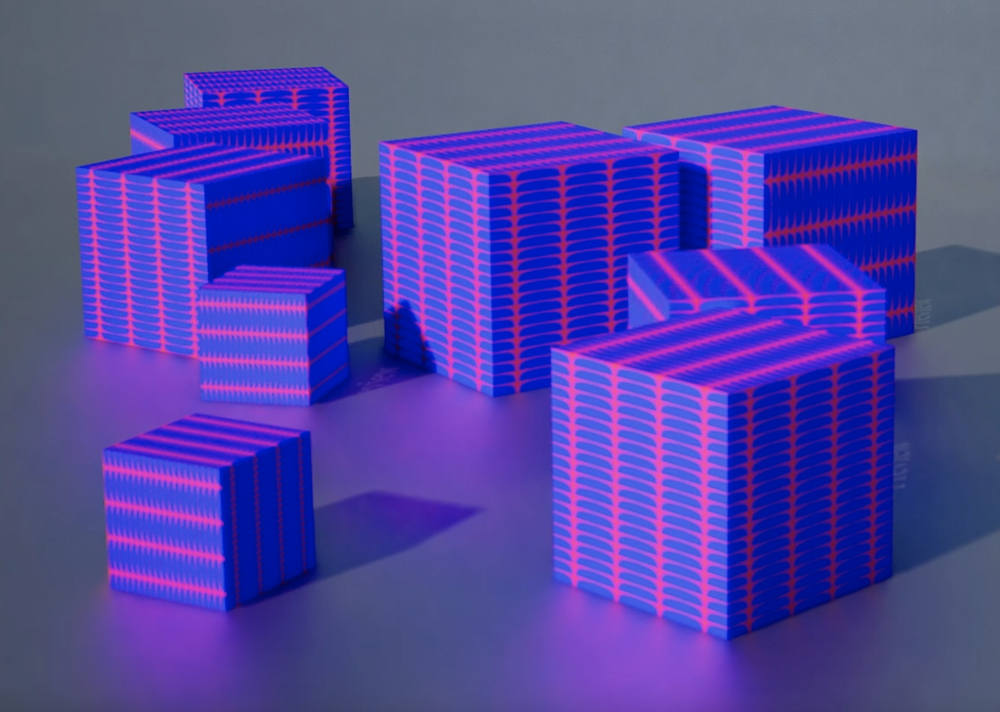
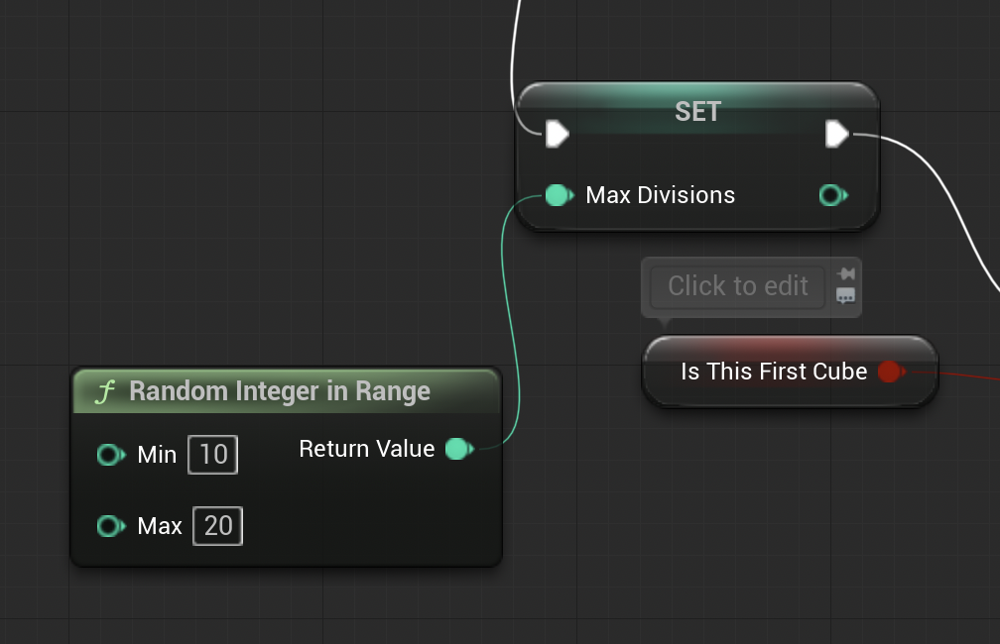

# Task 4

**Seeing Noise**

**Task 04.01 - Collecting Inspiration**

### Natural noise patterns

### Stylized/artistic image

Unsupervised by Refik Anadol

**Dynamics**

**Task 04.02 Tutorial Fancy Cube**

**Learnings**

**Task 04.04**

Learning about blueprint’s was new for me in this session so I learned a whole lot. I think the most challenging thing was actually rendering the project. The tutorial was very straight forward but I found the rendering process a bit harder to understand. I also had a few issues sequencing the rendered images in DaVinci. I then challenged myself the most when I personalised the tutorial a bit. These are the changes I made: 

- I opted to make the cubes more varied right from the start and randomised the amount of times the cubes break down:
    

    
- I also changed the material of the cube to my own material that I have been using in the past tutorials
- I then used the material BasicAsset02 for the floor which created a slight reflection on the ground which gave it an almost glowy effect which I liked