### Task 01.01

- most interesting topics in syllabus

  - noise
    - In any visual application, randomness or noise forms the basic building block for most procedural algorithms. Understanding the math behind that and learning how to write custom noise functions seams like a worth-wile knowledge acquisition to me.
  - dynamics
    - In prior projects I worked on, I already came across force fields but I never got around to learn how they actually work. Especially understanding how to build modular utilities that allow me to apply a matrix of vectors to a moving (animated) object is of interest to me.

- further topic

  - As already mentioned in cc-one I would really like to revisit morphogenesis, in particular physarum simulations. That could probably tie in well with `complex systems` in May.

- tools
  - I never used Unreal so I will try to use Unreal however I already noticed that my laptop will probably not offer a comfortable DX. For that reason I am considering the following alternatives if need be:
    - Blender Geometry Nodes (I have basic experience with Blenders node systems and would benefit from broadening my skills here as well)
    - WebGL Shaders (I have no experience here but am eager to learn and also consider to take part in the Shader Workshop this semester)

## Introduction

### Task 01.02 - Seeing Patterns

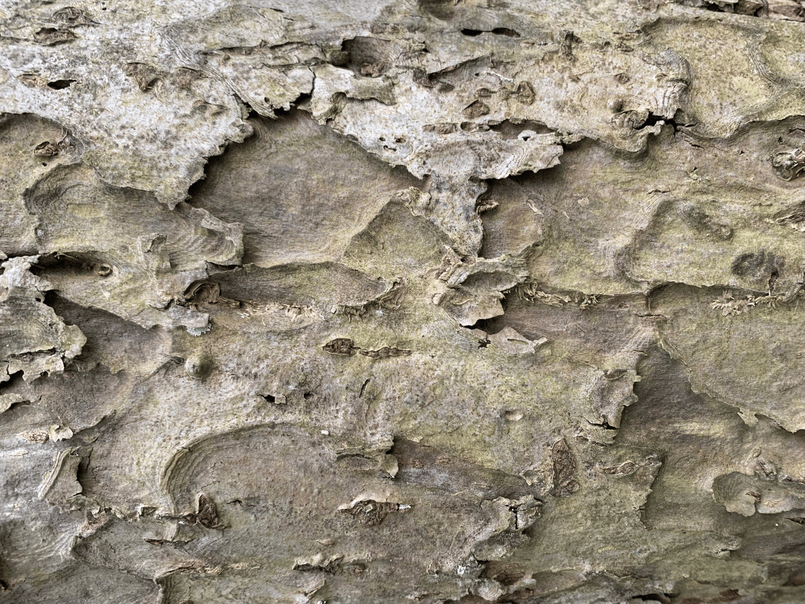
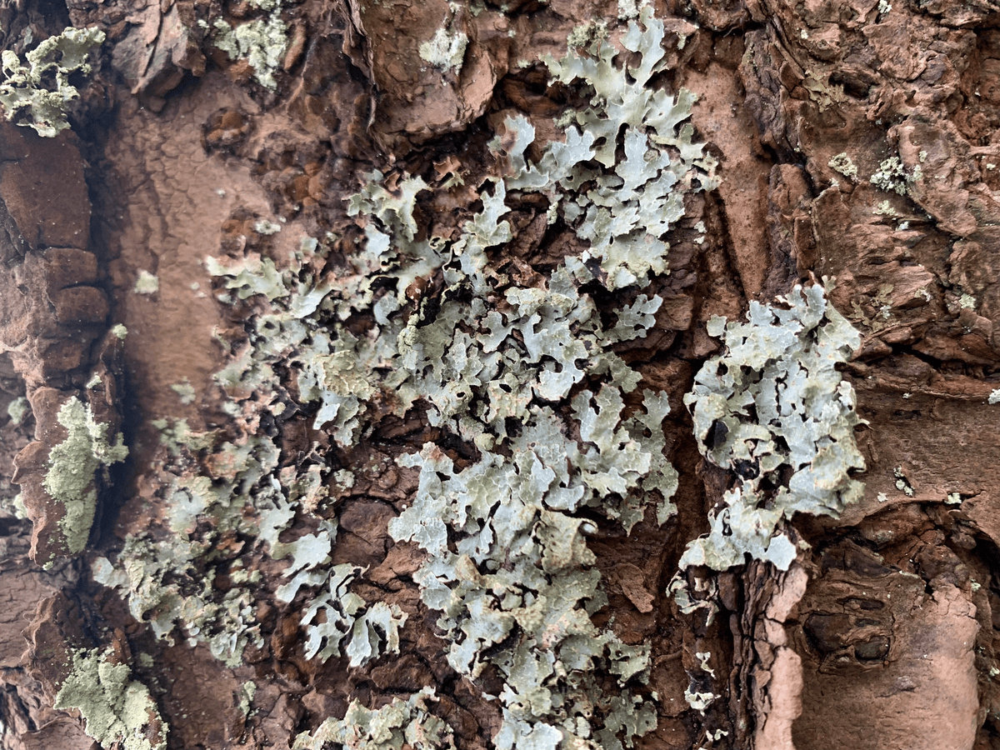
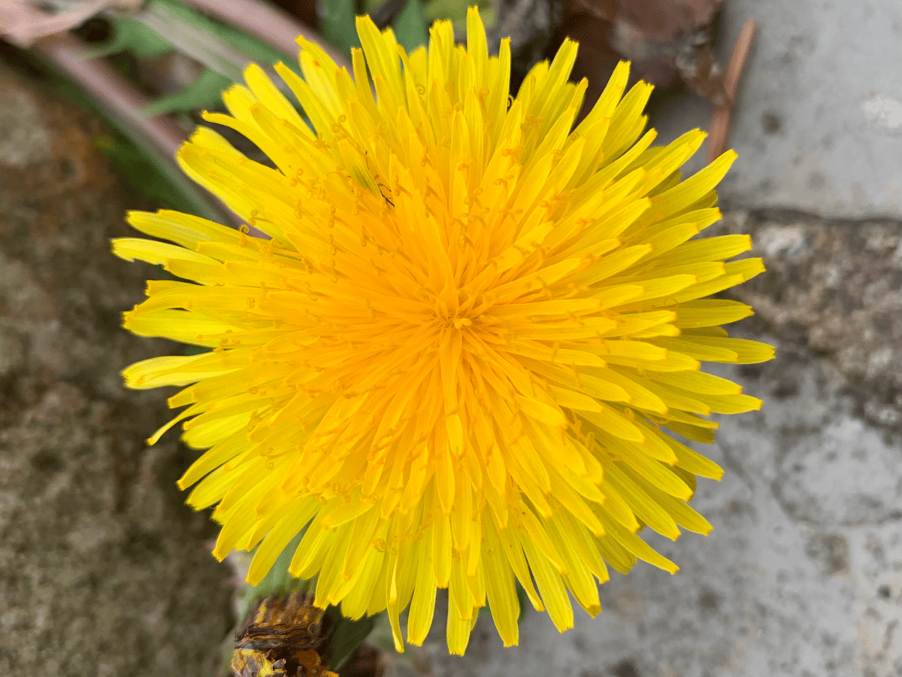

> natural pattern

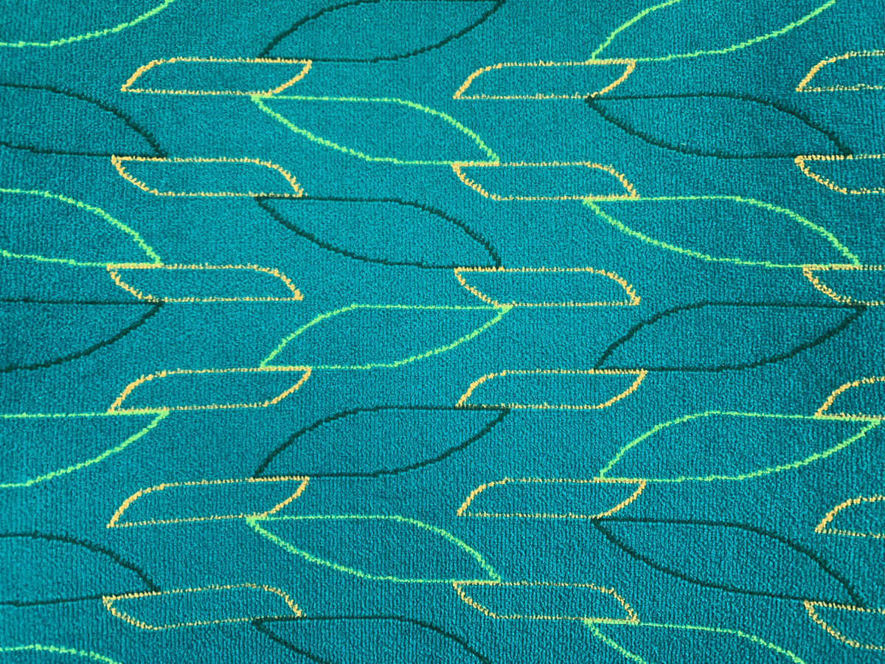
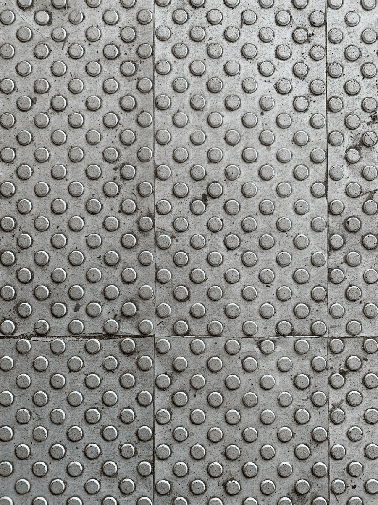
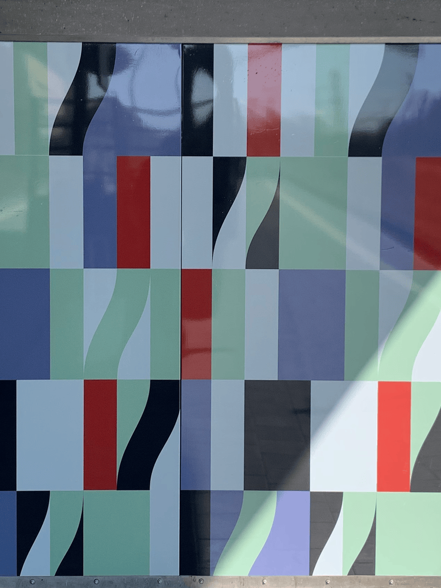

> man-made patterns

### Task 01.03 - Designing Patterns

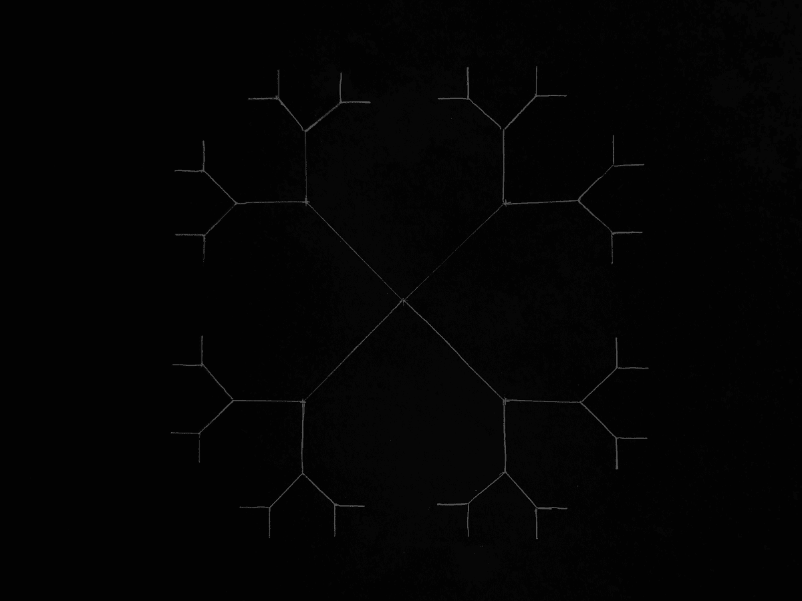

> manual pattern

pseudo-code

> angles expressed as radians (45°, 135°, 225°, 315°)
```
max_level = 4
initial_length = 4

for angle in [1/4π, 3/4π, 5/4π, 7/4π]:
    branch(0, 0, angle, initial_length, 1)

function branch(start_x, start_y, angle, length, level):
  end_x = start_x + cos(angle) * length
  end_y = start_y + sin(angle) * length

  draw_line(start_x, start_y, end_x, end_y)
  
  if level < max_level:
    next_length = initial_length / (level + 1)
    for split in [-1/4π, 1/4π]:
      branch(end_x, end_y, angle + split, next_length, level + 1)
```
> in a way a fractal (as we saw with mandelbrot) where the result of the previous calculation is recursively input into the next

### Task 01.04 - Seeing Faces


> face one

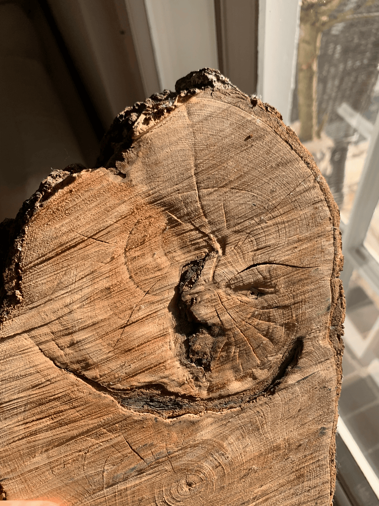

> face two

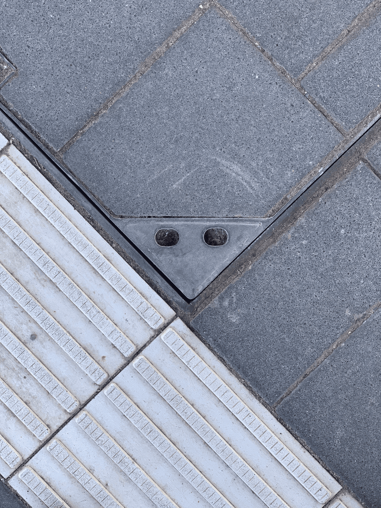

> face three

### Task 01.05 - Abstraction in Art

From the lecture, I was particularly fascinated by the idea in **futurism** where the temporal axis of a subject is captured on the canvas (or as a sculpture). Especially when using digital image processing, these abstractions are worth revisiting as a source of inspiration. The concept reminded me of this [video](https://www.youtube.com/watch?v=NSS6yAMZF78) stumbled across a few months ago.

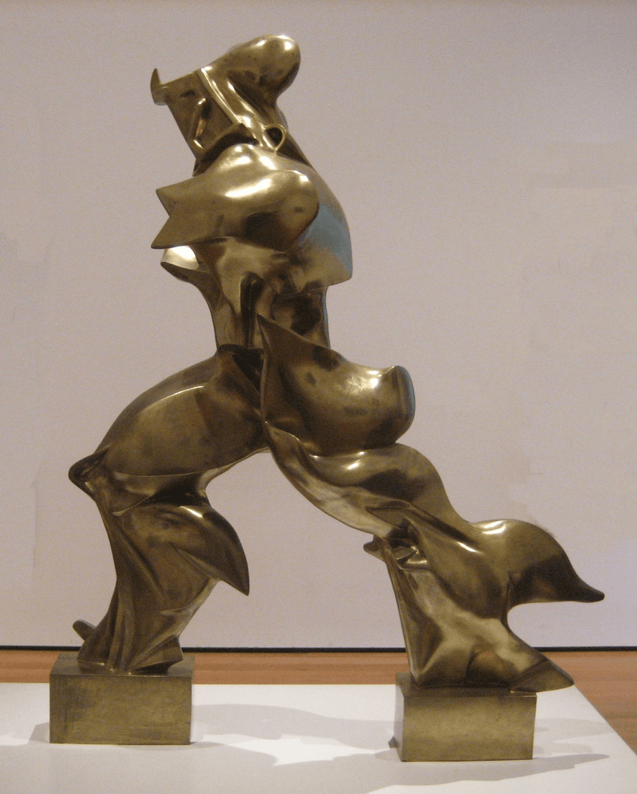

> Umberto Boccioni, Unique Forms of Continuity in Space (1913)

> Disclaimer: When taking a look into the [historic context](https://en.wikipedia.org/wiki/Futurism#Female_Futurists) an early manifest reveals glorification of violence, misogynistic ideas and militarism as fundamental ideologic building blocks within that movement. All of these are diametrically opposed to my own values and perspectives.

### Task 01.06 - Abstracted Artistic Expression in CGI

Even though I consider most of the shader projects by [Arsiliath](https://www.instagram.com/arsiliath/) to be artistic through the beautifully complex interactions of different aspects within those visualizations, none of those technically employ traditional 3D graphics and I already mentioned the artist in creative coding one during the last semester. Very close to that come the works by Sage Jenson with some being particularly interesting on a technical level (like [36 points](https://www.sagejenson.com/36points/#07_enmeshed_singularities) which runs in-browser).

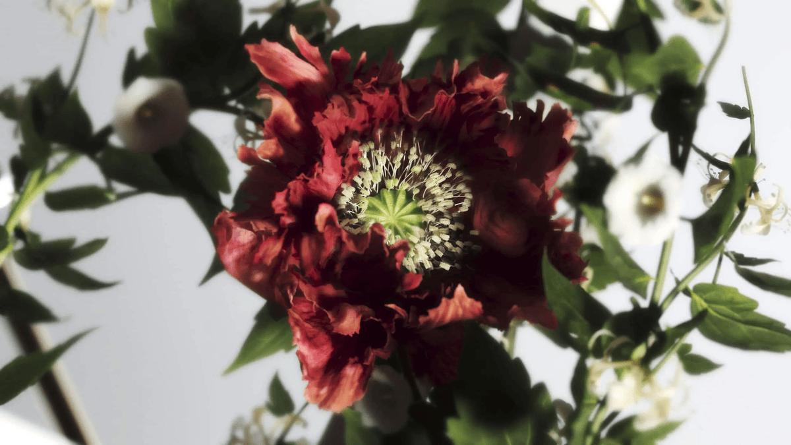

> What makes [Morris](https://opticalarts.studio/work/projects/morris) (also co-created by Lukas Vojir among others) artistic to me is that its visual fidelity manages to move past the typical uncanniness seen in most other CG renderings. Even though this is achieved by using photogrammetry and is still not a pixel-perfect copy of real growing flowers in time-lapse, the art direction and presentation creates something that to me stands out among other works.

## Unreal Engine

### Task 01.06 - First Steps

Since `01.08` requires a thorough understanding of the _Multiplication On A Circle With Modulo_ scene and I have no prior experience with Unreal, I decided to complete the accompanying [tutorial](../../../01_sessions/01_numbers/pgs_tutorial_multicircle/pgs_tutorial_multicircle.md).

While I was able to complete the tutorial, I must say that the controls on Mac (with trackpad only) are close to impossible to use. Despite my hardware being adequate (8GB GPU, Intel i9 CPU, 64GB RAM) this application was clearly not built with laptop (older MacBook in particular) users in mind: Movement is slow and laggy, the ui constantly loses focus when switching windows and even in an almost empty scene things are getting hot and the fans start spinning. For future tasks I will either use university machines or switch to an alternative like Blender or Godot.

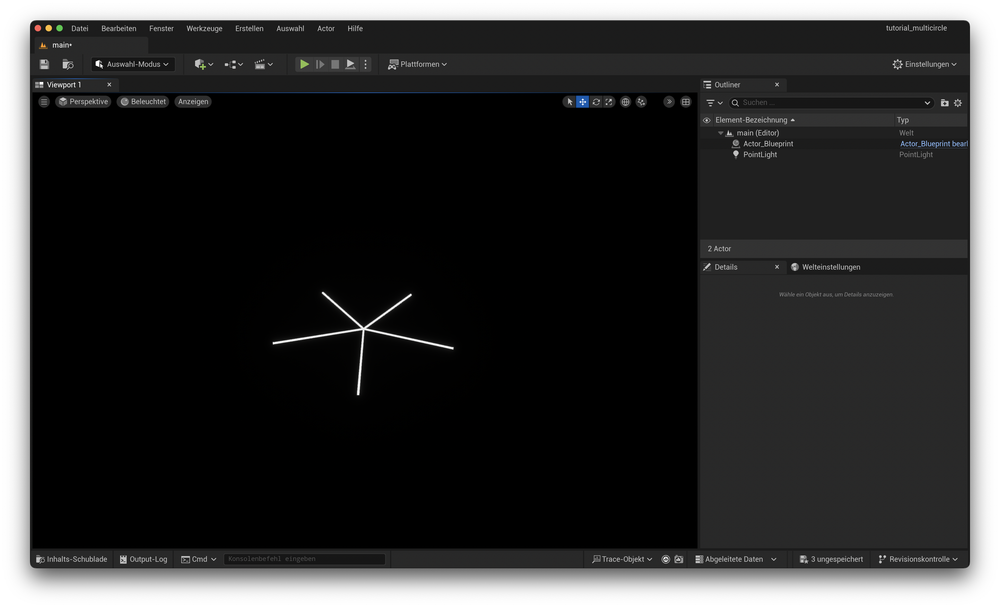

## Beauty in Maths

### Task 01.07 - Multiplication On A Circle With Modulo In Unreal

- [ ] deadline for this task: July 31st.

## Learnings

### Task 01.08

- Conceptually very simple patterns that can be written in a few lines of code can still unveil a lot of math that can prove to be time-consuming when trying to wrap your head around it.
- I still cannot fully grasp how complex numbers work in the Mandelbrot example (even though I really tried).
- Unreal and my laptop don't really get along great. I might have to consider alternatives.