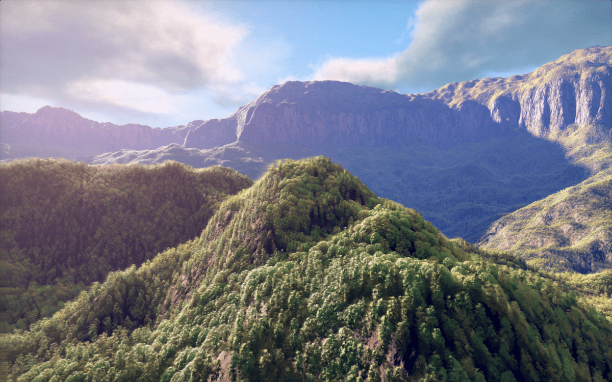
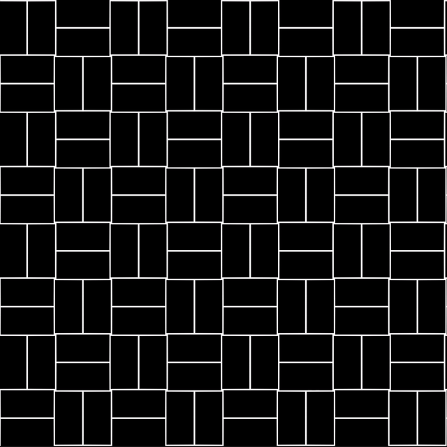
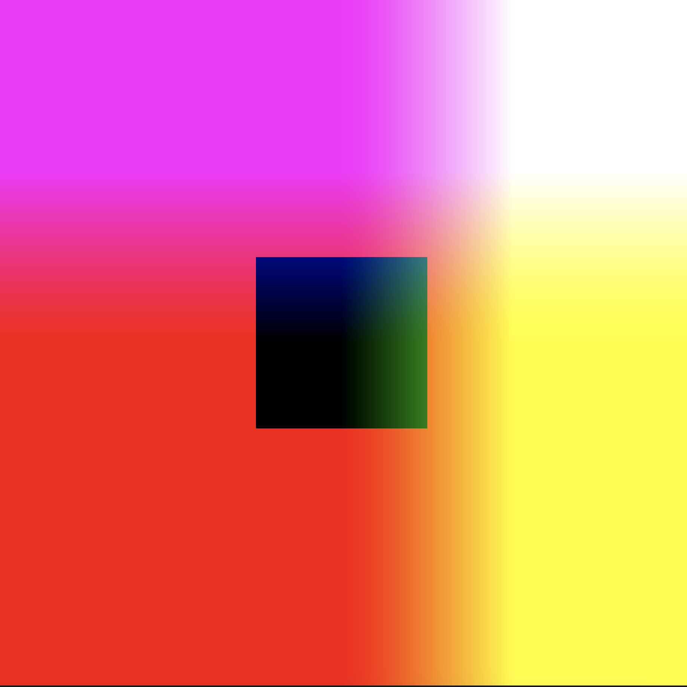
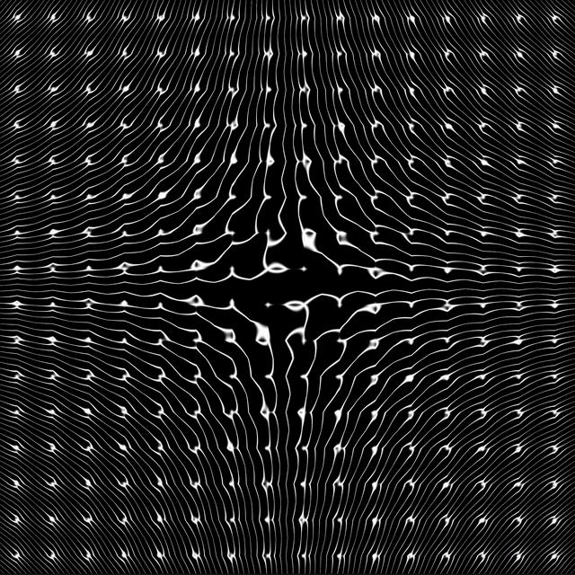
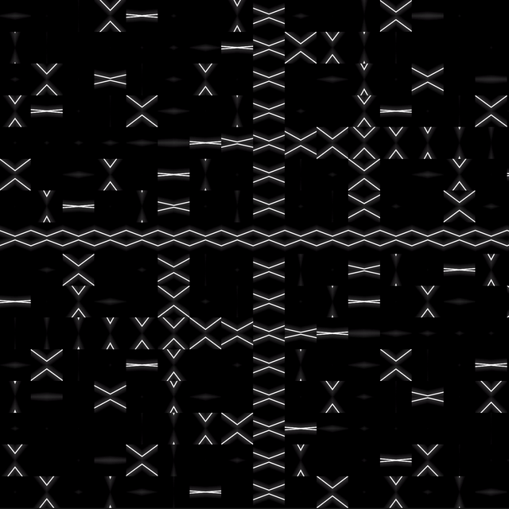

## Function Designs

### Task 02.01 - Inspiration

A while back (and also before reading the [script](../../../02_scripts/pgs_04_functions_script.md#design-goals) and learning that he is actually running shadertoy), I came across [this video](https://www.youtube.com/watch?v=BFld4EBO2RE) describing in great detail how a landscape scene is created step by step entirely inside of a shader.

> Landscape Shader by Inigo Quilez (click image to open on shadertoy)

What I find fascinating about this implementation is how far beyond of common uses for shaders this work goes. Not only is the whole scene entirely constructed using math but also the lighting and clouds are computed entirely from scratch. While it runs painfully slow on my machine I still think this a great example to show how far you can (maybe not always should) go with shaders. Inigo Quilez is in general a great source of inspiration as the artist shares some creations with detailed explanations on a [youtube channel](https://www.youtube.com/@InigoQuilez) and [website](https://iquilezles.org/).

### Task 02.02 - Brick Pattern

Please find the commented [`brick_gerdes.frag`](./src/brick_gerdes.frag) file in the `src` subdirectory.

### Task 02.03 - Pattern Experiments

I started by recreating this [tutorial](https://www.youtube.com/watch?v=51LwM2R_e_o) in [`02-03-01-tutorial.frag`](./src/02-03-01-tutorial.frag). With this I started to experiment with simple animations, basing the angle my lines are drawn in on the `u_time` variable.

> simple oscillating cairo tiles (click image to open file)

Afterwards, I wanted to grasp deeper how the individual components used in the tutorial could be used to create something different or expand upon them. When I tried to recapture how the coordinate system worked I wanted to come up with a way to debug ie. visualize the transformations I used. For this I developed this small test pattern to see clearly what was happening.

> coordinate visualization (click image to open file)

Finally, I started to work on my own pattern utilizing what I learned from the tutorial but focusing on adding animations and a bit more visual interest.

> happy accident: stumbled across this interesting distorted pattern when I attempted to offset my animation based on flattened cell ids (click image to open file)

> my final result (click image to open file)

## Learnings

### Task 02.04

- how to draw a line (see [`02-03-01-tutorial.frag, l.37ff l.44`](./src/02-03-01-tutorial.frag))
- how to alternate patterns (similar to brick example [`02-03-01-tutorial.frag, l.22f, l.31`](./src/02-03-01-tutorial.frag))
- an approach to quadrant symmetry in shaders (see [`02-03-01-tutorial.frag, l.30`](./src/02-03-01-tutorial.frag) and [`02-03-02-debugging.frag`](./src/02-03-02-debugging.frag))
- how to repeat patterns in shaders (see [`02-03-01-tutorial.frag, l.28`](./src/02-03-01-tutorial.frag))
- "debugging" is most easily done using gradients (see [`02-03-02-debugging.frag`](./src/02-03-02-debugging.frag))
