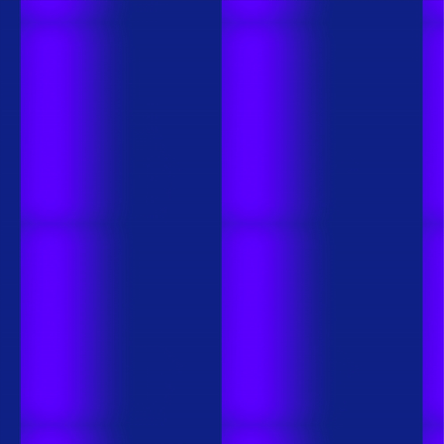

## Tilings

### Task 03.02 - Tilings Implementation

> As previously discussed, instead of the motion design plugin within `Unreal`, I wrote another GLSL shader.

First, I switched my coordinate system out from `-0.5..0.5` to `-1.0..1.0` since that feels more intuitive to me. Additionally, I introduced a `COORD_BOUNDS` constant that allows to set the upper bounds (negative and positive) freely and precisely.

> the altered debugging setup (with coordinate calculations loosely based on [`kishimisu_commented_01.glsl`](../../../01_sessions/02_functions/glsl/examples/kishimisu_commented_01.glsl) (click image to open shader file))

As a second intermediary step, I wanted to get into SDFs. Specifically, I tried to understand how line segments are expressed in shaders. This [tutorial](https://www.youtube.com/watch?v=PMltMdi1Wzg) provides an elegant way that generalizes to any number of dimensions (even though I will stay within two for this particular shader).

> Dancing triangles built using sdf line segments. Even though this is not a tiled pattern, I really like the blur effect created by oscillating the smoothstep distance that is used to draw the sdf shape.

A tiling is a kind of pattern that when repeated:

- has `no gaps`
- has `no overlaps`

## Learnings

### Task 03.03

Summarize your learnings (text or bullet points - whatever you prefer). What was challenging for you in this session? How did you challenge yourself?

_Submission_: Answer in your markdown submission file.

---

Answer all questions directly in a copy of this file and **also link and display all of your images in that file**. Submit your copy as `pgs_XX_lastname.md` in your submissions folder (replace the XX with the number of the session).

---
