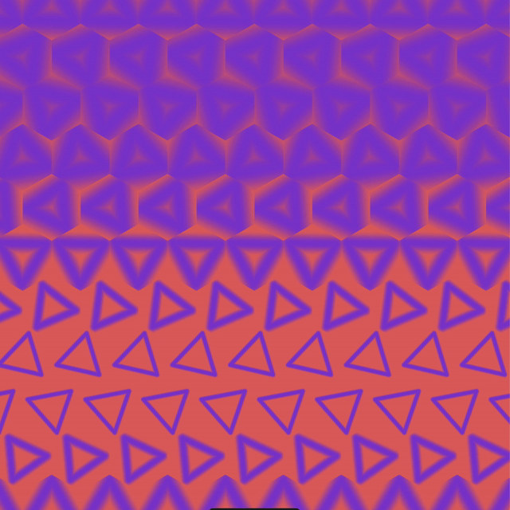

## Tilings

### Task 03.02 - Tilings Implementation

> As previously discussed, instead of the motion design plugin within `Unreal`, I wrote another GLSL shader.

First, I switched my coordinate system out from `-0.5..0.5` to `-1.0..1.0` since that feels more intuitive to me. Additionally, I introduced a `COORD_BOUNDS` constant that allows to set the upper bounds (negative and positive) freely and precisely.

> the altered debugging setup (with coordinate calculations loosely based on [`kishimisu_commented_01.glsl`](../../../01_sessions/02_functions/glsl/examples/kishimisu_commented_01.glsl) (click image to open shader file))

As a second intermediary step, I wanted to get into SDFs. Specifically, I tried to understand how line segments are expressed in shaders. This [tutorial](https://www.youtube.com/watch?v=PMltMdi1Wzg) provides an elegant way that generalizes to any number of dimensions (even though I will stay within two for this particular shader).

> Dancing triangles built using sdf line segments. Even though this is not a tiled pattern, I really like the blur effect created by oscillating the smoothstep distance that is used to draw the sdf shape (click image to open shader file)

Next, I completed another [tutorial](https://www.youtube.com/watch?v=VmrIDyYiJBA) by Art of Code, explaining how to calculate hexagonal coordinates for tiling. My first idea was to try to use this in combination with tesselation (calculating the bounds around any freeform sdf shape and then offsetting that with the aspect corrected modulo) but I failed to understand how I could, instead of rendering every shape within its tile, generate one connected sdf that would not reveal the seams in between. Maybe I will revisited this idea in a future assignment.

> final tiled pattern making use of all learned techniques (click image to open shader file)

## Learnings

### Task 03.03

- how to draw sdf line segments in a fragment shader
- how to calculate hexagonal coordinates to be used for tiling
