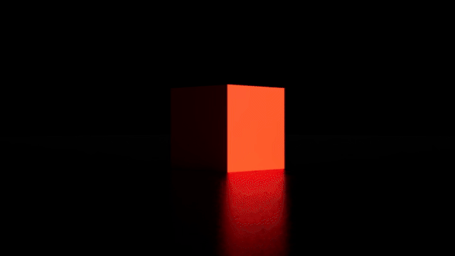

## Noise

## Seeing Noise

### Task 04.01 - Collecting Inspiration

#### natural noise

> reminded me of one of the first shaders I ever built in Blenders shader editor following a [tutorial like this](https://www.youtube.com/watch?v=973Ucv37dfU) ([source](https://unsplash.com/photos/black-and-white-abstract-painting-dIUmyD3D4qI))

> this bork shares a bit of similarity with voronoi noise when looking at the "islands" ([source](https://unsplash.com/photos/a-teddy-bear-sitting-on-the-trunk-of-a-tree-QrDpwcw4hX8))

> two noise layers: the dune lines shaped by the wind (maybe also water) and the individual grains providing overall texture ([source](https://unsplash.com/photos/brown-sand-with-shadow-of-person-IfHAeNOOGQ0))

#### artificial noise

> I think one very beautiful but simple visualization of noise is in form of flow fields. Daniel Shiffman (The Coding Train) created an in-depth [p5 tutorial](https://www.youtube.com/watch?v=BjoM9oKOAKY) about that.

## Dynamics

### Task 04.02 Tutorial Fancy Cubes

> I really liked the glow effect coming from the emission boost on every spit. To emphasize I chose a dark lighting setup.

> click on gif above to download mp4 file

**Notes**

- Collision Preset of ground plane has to be changes to `BlockAll` for custom collision settings in blueprint to work

## Final Project

### Task 04.03 - Project Ideas

- would like to revisit shaders
  - implementation of compute shader using WebGPU

**Idea 01: Arsiliath Tutorial**

> translating one of the simulation shaders from Unity to WebGL (if possible) -
> iterate with personal modifications to create something unique

eg. from [this tutorial](https://arsiliath.gumroad.com/l/compute-shaders?layout=profile)

**Idea 02: Slime Mold**

> Recreate a slime mold implementation based on [this reposity](https://github.com/SuboptimalEng/slime-sim-webgpu)

There is a basic [devlog](https://www.youtube.com/watch?v=nBqZOz7AF34) and some [resources](https://github.com/SuboptimalEng/slime-sim-webgpu?tab=readme-ov-file#webgpu) are linked to get started with webGPU. [This](https://webgpufundamentals.org/) could be a good point to get started.

_Learning Goal_

Trying out `WebGPU` to get a feel for what is possible. In line with the requirements for this course the result should resemble a somewhat polished graphical output.

## Learnings

### Task 04.04

- actors physics settings
- material instancing
- first steps with niagara
- level sequences
  - camera animation
  - rendering
