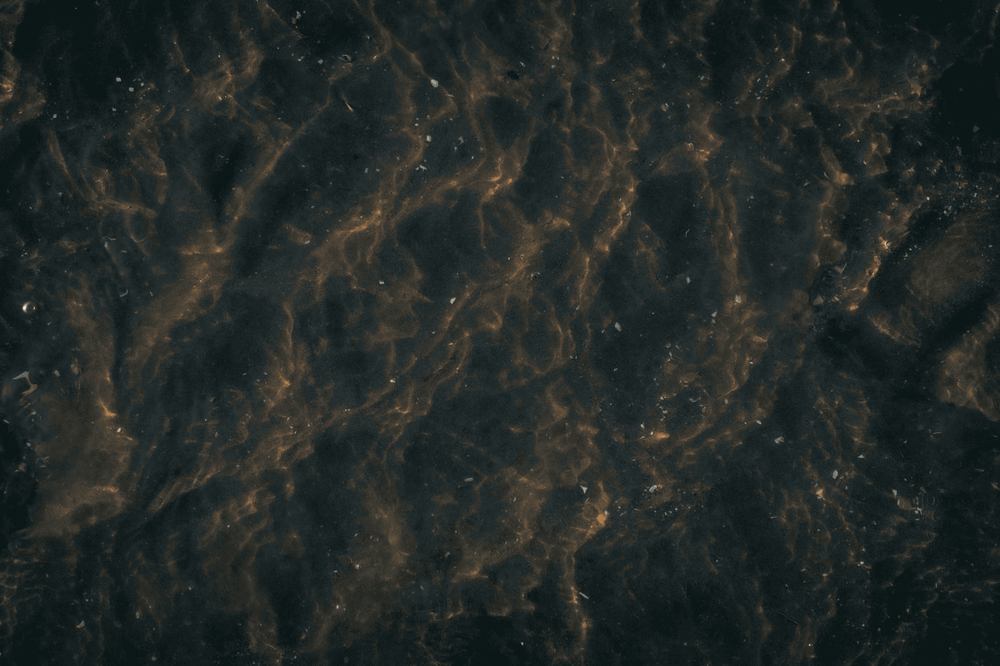
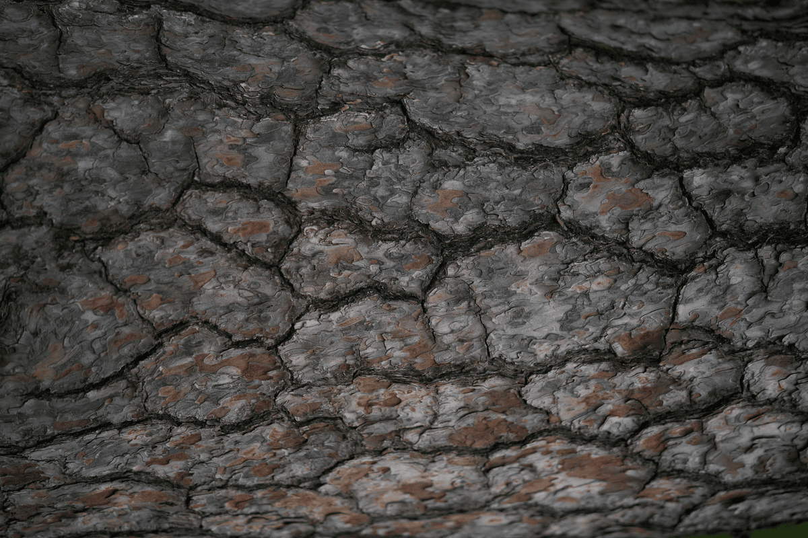
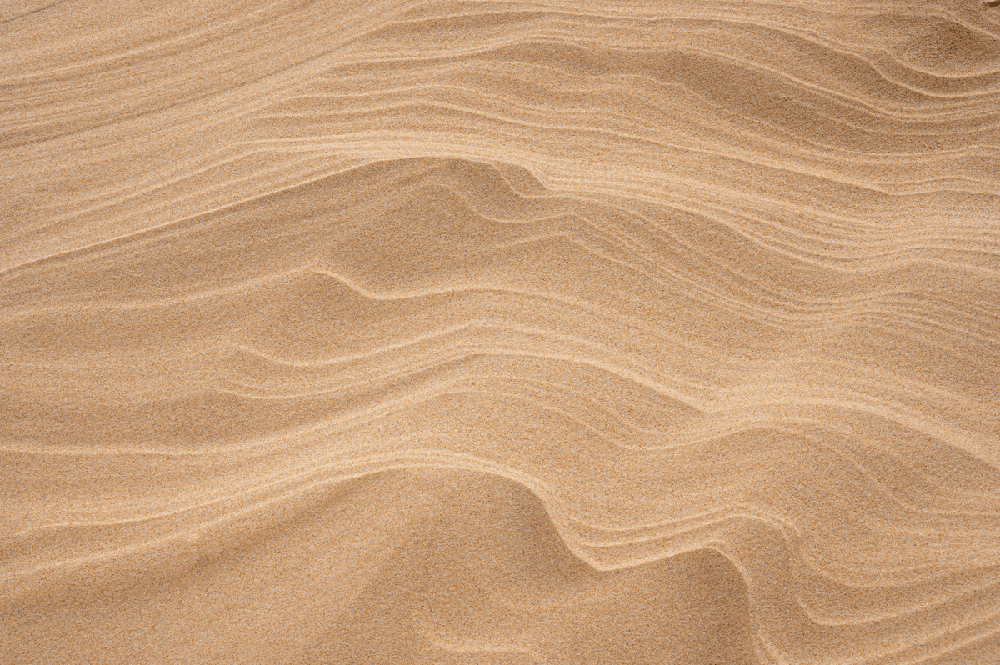
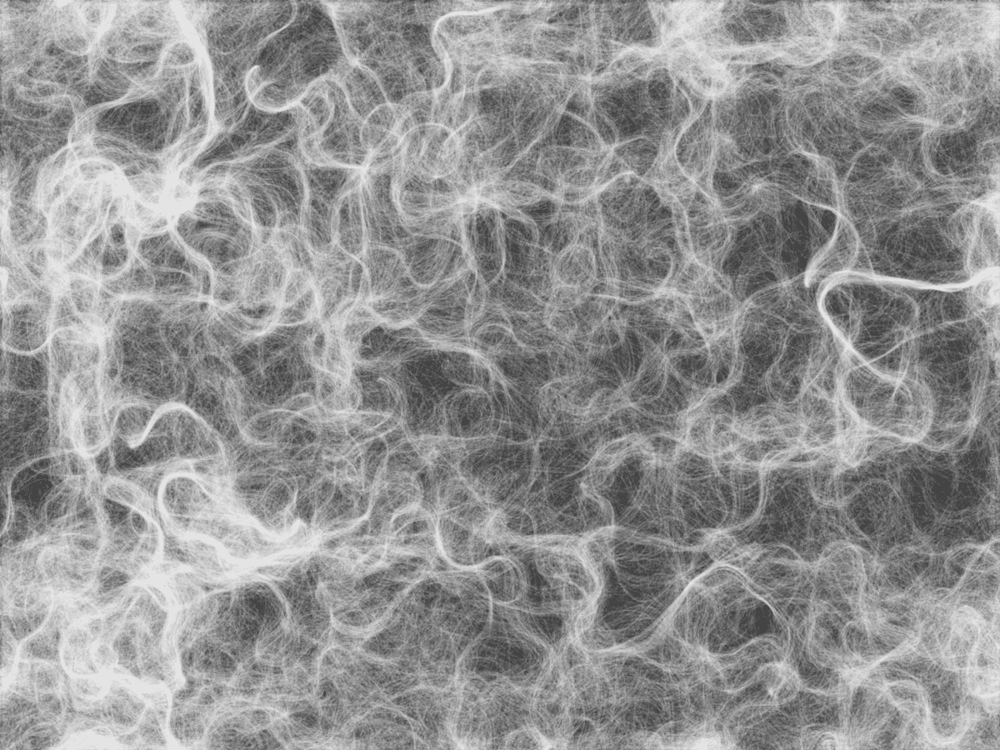

## Noise

## Seeing Noise

### Task 04.01 - Collecting Inspiration

#### natural noise

>

>

>

#### artificial noise

> I think one very beautiful but simple visualization of noise is in form of flow fields. Daniel Shiffman (The Coding Train) created a an in-depth [p5 tutorial](https://www.youtube.com/watch?v=BjoM9oKOAKY) about that.

## Dynamics

### Task 04.02 Tutorial Fancy Cubes

Complete [Tutorial _Fancy Cubes_](pgs_t5_dantutorial_dacing_cubescing_cubes/pgs_t5_dancing_cubes.md). Try to make some changes to the result to make it your own. In the end, you must have a good looking result!

This time, you also have to create a rendering from the scene. For that you can use the [Tutorial Rendering](./tutorial_rendering/tutorial_rendering_rendering.md) (the section about Postprocessing Effects is optional for additional stylization).

_Submission:_ At least one preview image and one animation, e.g. as gif, of your scene, linked in your markdown submission file.

## Final Project

### Task 04.03 - Project Ideas

Think about what you want to do as a final project. Next week would be a good time to ask questions about it.

- would like to revisit shaders
  - implementation of compute shader using WebGPU

**Idea 01: Arsiliath Tutorial**

> translating one of the simulation shaders from Unity to WebGL (if possible) -
> iterate with personal modifications to create something unique

eg. from [this tutorial](https://arsiliath.gumroad.com/l/compute-shaders?layout=profile)

**Idea 02: Slime Mold**

> Recreate a slime mold implementation based on [this reposity](https://github.com/SuboptimalEng/slime-sim-webgpu)

there is always a basic [devlog](https://www.youtube.com/watch?v=nBqZOz7AF34) and some [resources](https://github.com/SuboptimalEng/slime-sim-webgpu?tab=readme-ov-file#webgpu) are linked to get started with webGPU. [This](https://webgpufundamentals.org/) could be a good point to get started.

_Learning Goal_

Trying out `WebGPU` to get a feel for what is possible. In line with the requirements for this course the result should resemble a somewhat polished graphical output.

## Learnings

### Task 04.04

Summarize your learnings (text or bullet points - whatever you prefer). What was challenging for you in this session? How did you challenge yourself?

_Submission_: Answer in your markdown submission file.
