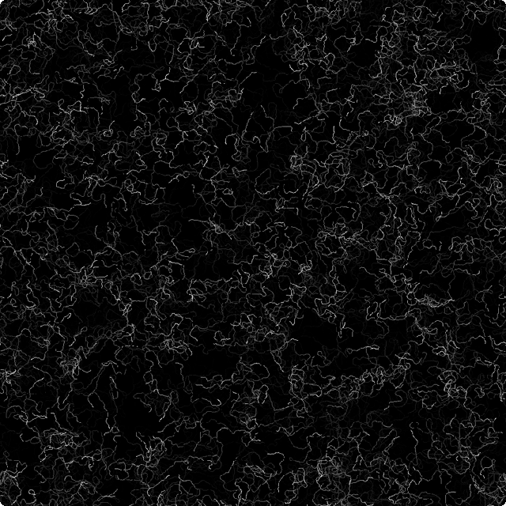
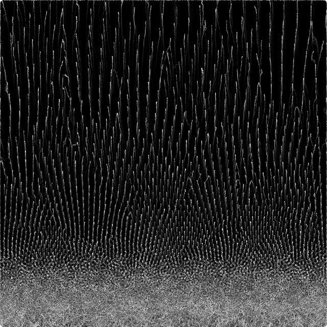
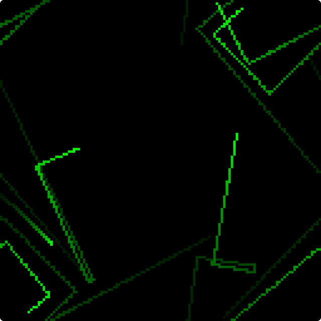
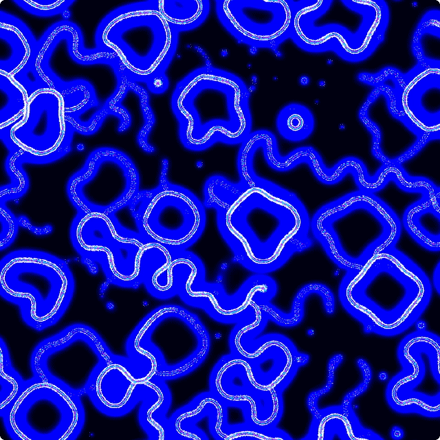
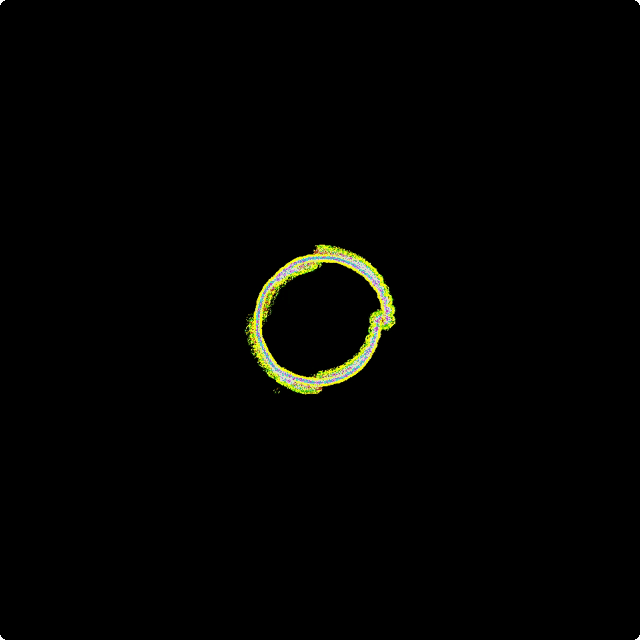
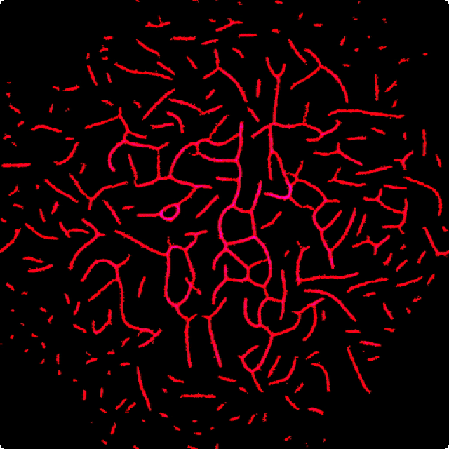

## Final Project

### Task 05.01 - Free

#### Summary

Based on Arsiliath's [webgpu agents tutorial](https://arsiliath.gumroad.com/l/webgpu-agents), I familiarized myself with the proposed setup for the `webGPU API`. Then I worked through all examples and generated a multitude of intermediate results. Finally, I tried to build my own setup to run statically hosted simulations in a GitHub Pages environment. Since the tutorial is copyrighted, the full documentation is uploaded to a private repository (to which you are invited as a collaborator). The deployment is accessible publicly:

[open public deployment](https://whatphilipcodes.github.io/pgs/)

> physarum simulation

[open private repository (requires invitation acceptance)](https://github.com/whatphilipcodes/pgs)

---

#### Concept

As the successor to `webGL`, `webGPU` enables even more granular and performant access to client GPU hardware. These improvements come at the cost of a cumbersome API. With the final project for PGS, I wanted to get my hands dirty in terms of setup and usage. To guide me through that, I referred to the [webgpu agents tutorial](https://arsiliath.gumroad.com/l/webgpu-agents) by Arsiliath.

#### Implementation

Since the most important parts of the tutorial are copyrighted with the explicit request to not reupload anything into a publicly accessible GitHub repository, I created a [private submission repository](https://github.com/whatphilipcodes/pgs) containing all the code and more examples.

#### Results

Here is a collection of results I recorded during the completion of the tutorial:

#### Project Reflection & Discussion

The tutorial offers a nice overview of common agentic particle systems that can be categorized as digital morphogenesis. The three main models discussed (PPA, DLA and Physarum) are explained in great detail. In terms of optimization, although mentioned separately, this crucial step is not that fleshed out: For comparison, I prompted ChatGPT (see [`physarum-gpt`](https://github.com/whatphilipcodes/pgs/tree/main/tutorial/src/2-2-4-gpt)) to optimize the course result (which was not working with 1M agents on my machine) and after some hours of debugging ended up with a visually different but scalable version, performing a lot better (easily running with >1M agents). This criticism, however, comes from a unique perspective from someone who has worked with similar (but admittedly simpler) algorithms, explaining my particular interest in making these run as fast as possible. Lastly, I think the platform for the course is a bit lacking in terms of usability (questionable allocation of screen real estate, without experience not easy to reproduce locally, frequent freezes and crashes).

#### Lessons Learned

The first thing I learned in order to be able to document my process was to record the canvas using the MediaRecorder API. After I used a basic setup for 2-3 sessions, I got annoyed at always manually running the gif conversion on my machine and ended up over-engineering the recording setup to perform in-browser transcoding and rounded corners based on the canvas CSS styling.

Secondly, building compute shaders using the webGPU API is very challenging: In a traditional vertex or fragment shader there is this prebuilt structure where most of the data is handled through the shader itself, but here you have to spend a lot more time figuring out the whole pipeline, i.e., when and how to move data from the CPU to the GPU and back. This added control surely opens up more possibilities but also complexity that I had a hard time working around.

## Wrap-Up

### Task 05.02 - Feedback

Please answer the following questions briefly so that I can further improve the lecture for future students.

- How would you rate the difficulty of this lecture from 1 (far too easy) to 5 (far too difficult)?
  - 3
- How would you rate the amount of work you had to put into this lecture so far from 1 (no work at all) to 5 (far too much work)?
  - 4
- How well did the given time estimates for each session match the time you needed to complete the session?
  - They worked out most of the time, but in the final project I drastically miscalculated (see working hours in pgs repository)
- What do you think about Unreal as a tool to learn for a CTech student? Is it valuable?
  - If the goal is VFX / Virtual Production then definitely, otherwise it depends on the interests one has
- What do you think about Unreal as a tool for this class? I am fully aware that the Unreal exercises do not yet fully connect to the theoretical topics. Try to answer this question also regarding whether you could imagine that Unreal exercises could potentially fit well to the theory.
  - If the required hardware is provided it can be a good tool. The visual editors make simulation computations more easily accessible; however, I prefer code-based tools in general.
- Do you have any other ideas regarding which tools and software packages to use for this class?
  - How about webGPU? Just kidding. For me personally, focusing this whole class on shaders would have been nice, but I also appreciate having been introduced to Unreal and WebGL.
- Do you have any useful hints to pass on to future students, e.g. utility tools, or further resources?
  - I actually think that webGPU could be worthwhile to explore since it offers a lot in terms of simulations but also general GPU-powered calculations for any task, even ML.
- What is your opinion regarding practical exercises in class? Do you think it would be helpful to substitute some of the theory parts with doing e.g. an Unreal exercise in class (there can be no additional time for the class though, it is "either...or")?
  - Class exercises tend to take a lot longer than individual work sessions. Maybe if there is a step that is discussed, then everyone completes the step individually and afterwards there is another brief discussion followed by the next step.
- Which one was your favorite chapter, and which one was your least favorite?
  - Favorite: Noise is amazing and probably also the most important in CG in general. Least favorite: Modulo on a Circle (Mostly because Unreal did not work well for me)

## Learnings

### Task 05.03

To make the best possible use of the lecture, please reflect on the following questions.

Does it make sense for you

- ...to have procedural generation in your set of skills? If yes,
  - with which tool do you want to work with?
    - I think code (shaders in particular when considering generation and simulation) is still the most versatile tool and the one I prefer over all others. When relying on UI-based applications, the Blender Shader Nodes and Geometry Nodes are also getting more usable with every update.
  - which outputs / designs / setups are you aiming for?
    - Most of my outputs are web-based and real-time, so interactivity is also an interesting aspect to experiment with. When integrating with existing pipelines (e.g. working in a movie production), having access to universal exchange formats (e.g. USD as you might have in Blender) might make more sense.
- ...to have Unreal in your set of skills? If yes,
  - I won't be using Unreal as much until I might switch to newer hardware at some point.