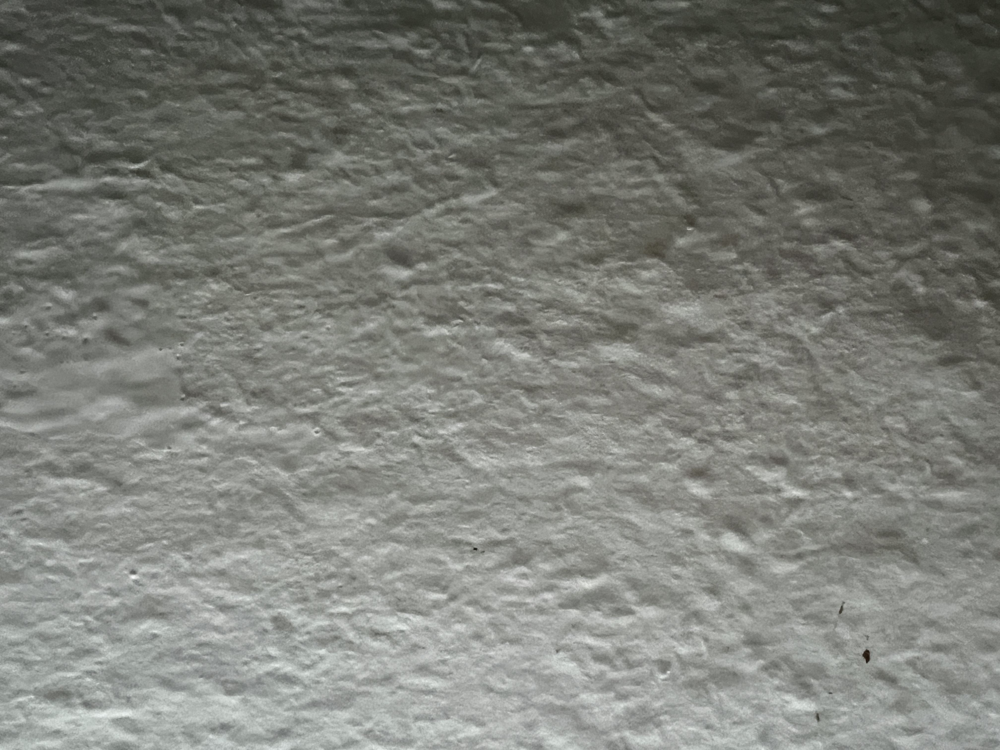
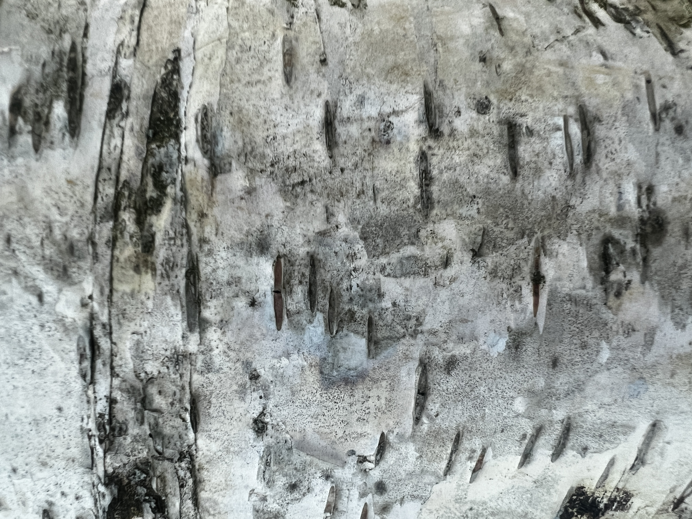
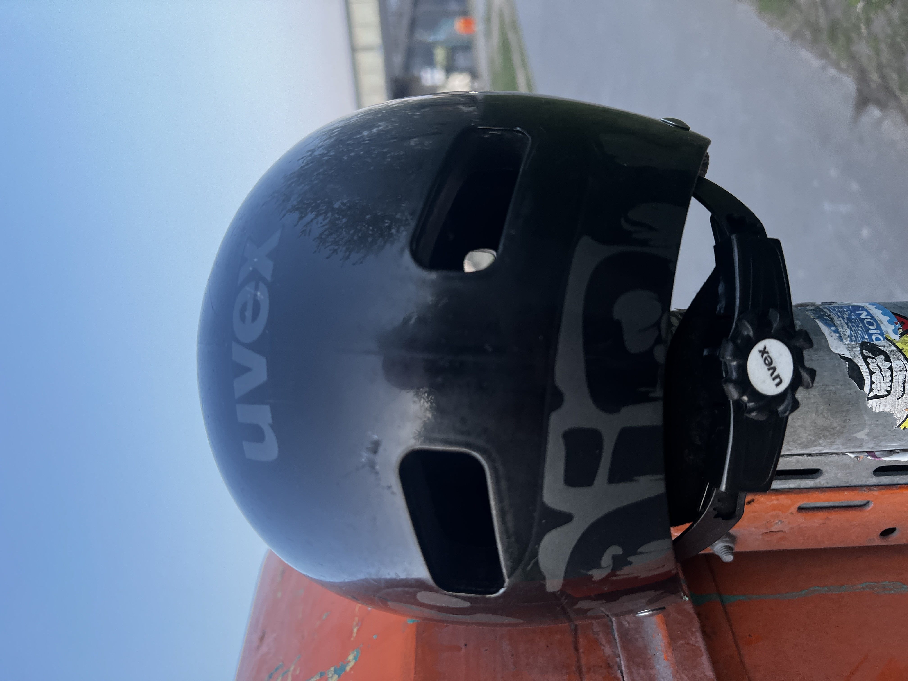
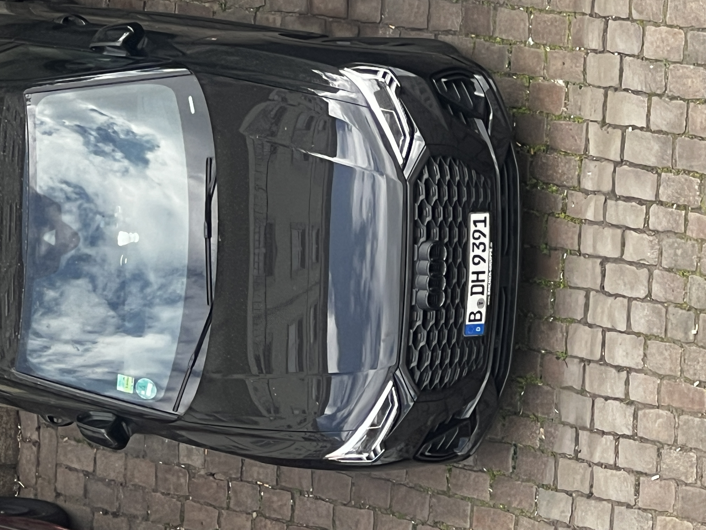
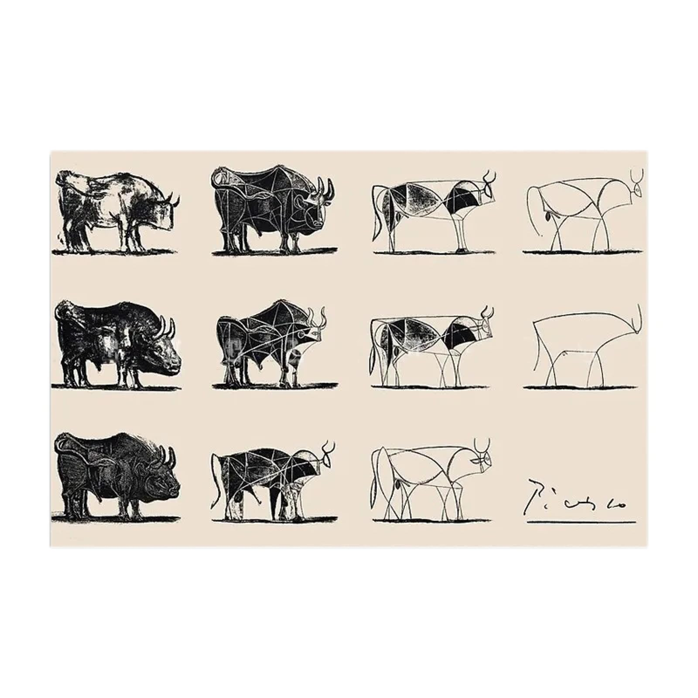
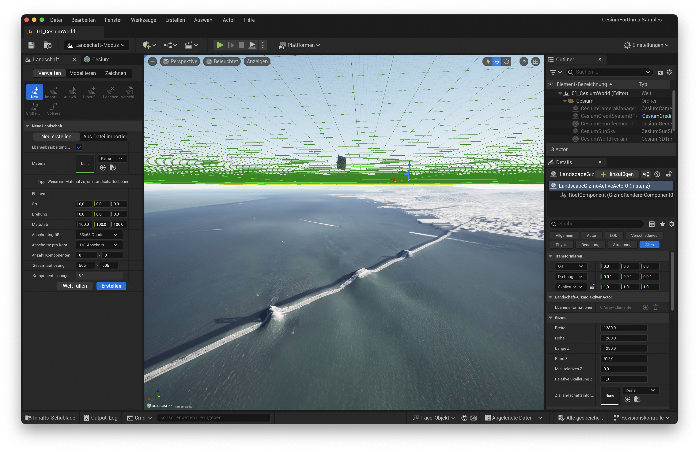
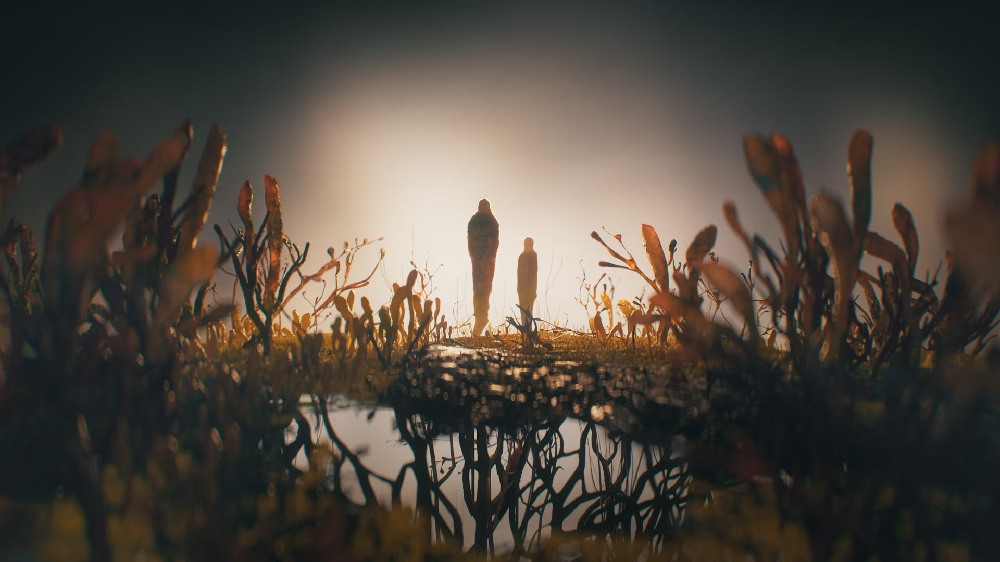
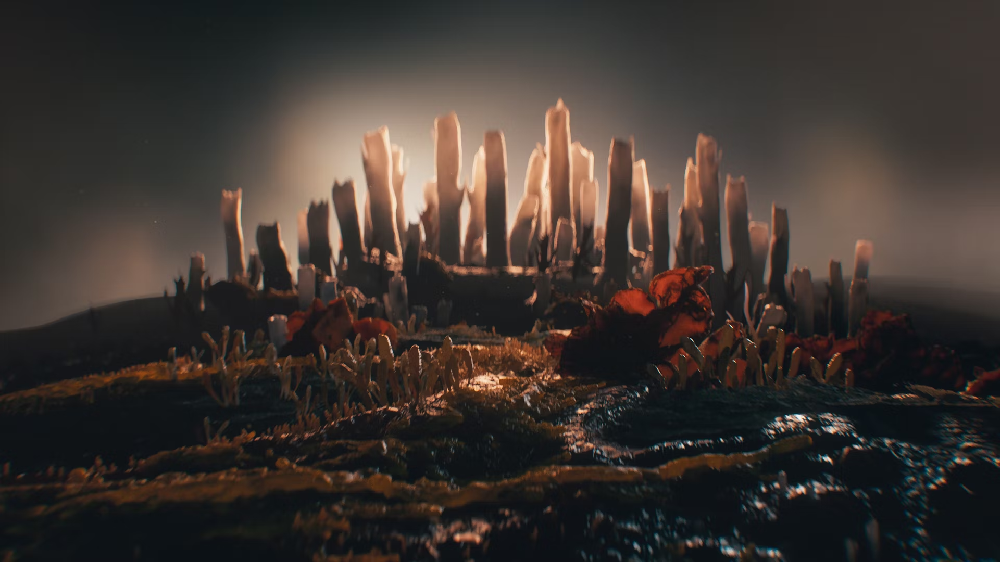
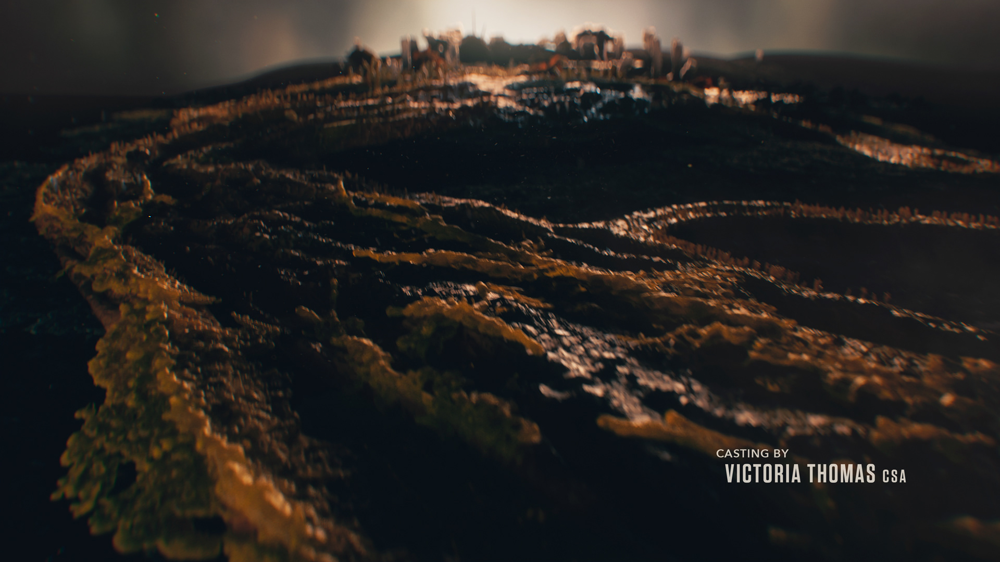

# Task 01.01

**Which of the chapter topics given in the syllabus are of most interest to you? Why?**
**Answer:**
The Generative Models, as this is new to me and I find it interesting which standards and methods have become established. Furthermore, there will probably be many subgroups in Generative AI that are currently still being developed, and this is a relatively new field.

**Are there any further topics regarding procedural generation and simulation that would interest you?**
**Answer:**
Personally, I'm interested in geodata and how it can be used to create sceneries or simulations. Additionally, new techniques in Generative AI and how they interlock, for example in Comfy UI.

**Is there a different tool than Unreal that you would prefer to do the exercises with (e.g. Unreal, Houdini, Unity, Maya, Blender, JavaScript, p5, GLSL, ...)? If so which one, and why?**
**Answer:**
I would generally like to explore Houdini. I'm also interested in how one can achieve the same result using different models. For example, creating a complex pattern with Function-based models / Generative AI.

# Task 01.02 - Seeing Patterns




# Task 01.03 - Designing Patterns


```
for row, row-index in col:
    for col, col-index in row:
        if col-index % 2 == 0:
            draw_vertical(row, col)
        else:
            if Math.floor(row-index / 2) % 2 === 0:
                # foreground top-left to bottom-right (1, 5, 9, 13, …)

                if random() > 0.5:
                    draw_background_top_left_bottom_right(row, col)

                if random() > 0.5:
                    draw_foreground_bottom_left_top_right(row, col)

            else:
                # foreground bottom-left to top-right

                if random() > 0.5:
                    draw_background_bottom_left_top_right(row, col)

                if random() > 0.5:
                    draw_foreground_top_left_bottom_right(row, col)
```

# Task 01.04 - Seeing Faces




# Task 01.05 - Abstraction in Art



This lithograph by Picasso shows levels of abstraction of the bull and the process.

# Task 01.06 - First Steps



I used the Cesium plugin in Unreal to incorporate geodata.

# Task 01.06 - Abstracted Artistic Expression in CGI

[The Last Of Us - Title Sequence](https://www.youtube.com/watch?v=8SWhBsbxmpk)





Here, the formal aesthetics of _fungi_ are used to create a world and tell a story. One can clearly see how through shapes, colors, light, and shadow not only an atmosphere is created, but also how motifs from the series like the two main characters, cities, or landscapes can be represented in abstracted, alienated forms.

# Task 01.07


# Task 01.08

I didn't understand all aspects of the mathematics, as I haven't used some of it for over 10 years.
