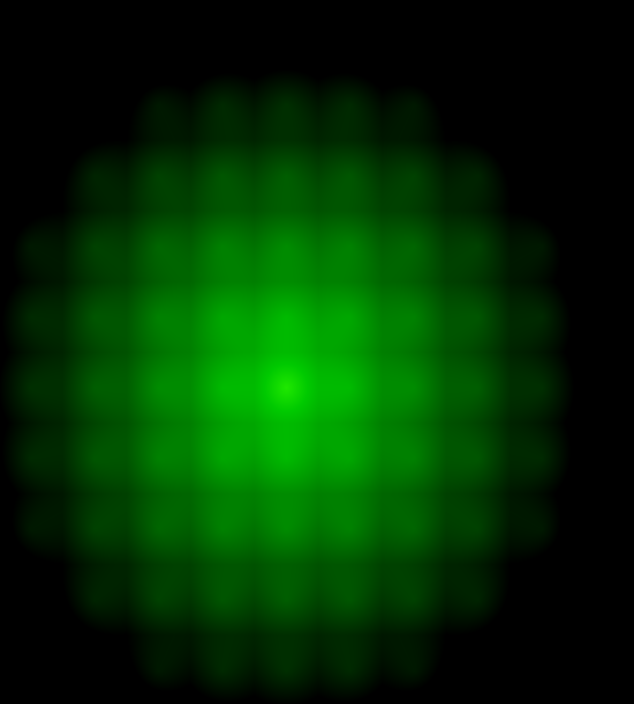
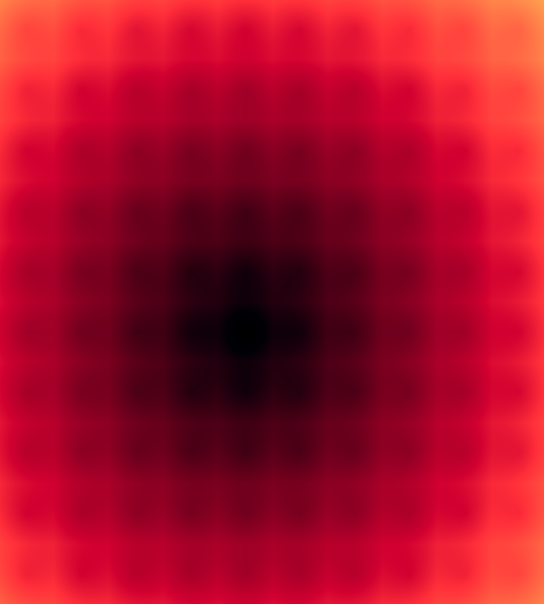

# Task 02.01 - Inspiration

### Rainforest

https://www.shadertoy.com/view/4ttSWf

### Snail

https://www.shadertoy.com/view/ld3Gz2

# Task 02.02




My shader creates a pulsating grid pattern by:

- Normalizing pixel coordinates and scaling them to create a grid
- Using the fractional parts to create repeating cells
- Calculating distance fields within cells and across the entire canvas
- Implementing a ping-pong time function for smooth oscillation
- Combining these distances with time to generate dynamic color values
- Applying different RGB channel intensities for the final pulsating effect

```
#ifdef GL_ES
precision mediump float;
#endif

uniform vec2 u_resolution;
uniform float u_time;

float SIZE = 0.1;
float SPEED = .4;

float map(float value, float fromMin, float fromMax, float toMin, float toMax) {
    return toMin + (value - fromMin) * (toMax - toMin) / (fromMax - fromMin);
}

void main()
{
    vec2 coord = gl_FragCoord.xy/u_resolution;

    float x = coord.x / SIZE ;
    float y = coord.y / SIZE;

    x -= floor(x);
    y -= floor(y);

    float dis = distance(vec2(x, y), vec2(0.5, 0.5));

    float x1 = coord.x / SIZE + 0.5;
    float y1 = coord.y / SIZE + 0.5;

    float dis1 = distance(vec2(x1, y1), vec2(1./SIZE * .5, 1./SIZE * .5));

    float t = mod(u_time * SPEED, 2.0);
    float pingpong = t < 1.0 ? t : 2.0 - t;
    float speedMultiplier = pingpong - 0.5;

    float addedDis = map((dis + dis1) * speedMultiplier, 0., 1., 0.,0.6);

    vec3 color = vec3(addedDis - speedMultiplier *.4, addedDis- speedMultiplier *3., addedDis * 0.2);

    gl_FragColor = vec4(color, 1.0);
}
```

# Task 02.04

- The challenge was to create a cognitive "map" based on the code of what the shader would look like
- Understanding the mathematical methods used and recreating them
