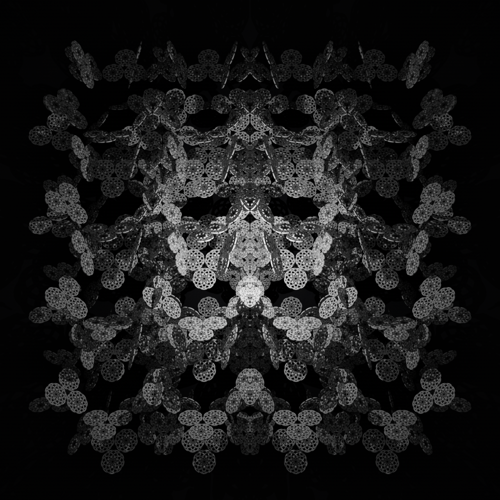

### **Task 03.02 - Tilings Implementation**

I followed the [Unreal Engine Motion Design ~ Using Multiple Cloners and Effectors](https://www.youtube.com/watch?v=wfbEAfzhTDQ) tutorial. However, on my machine, the cloner and effectors weren't working as expected. It was extremely slow and basically unusable. Then I noticed that the cloner and effectors are essentially the same as in Cinema 4D, so I proceeded with Cinema 4D instead.

### **Task 03.03**

- I attempted to use the cloner and effectors in Unreal Engine, but it was too slow. I couldn't get it to work properly.
