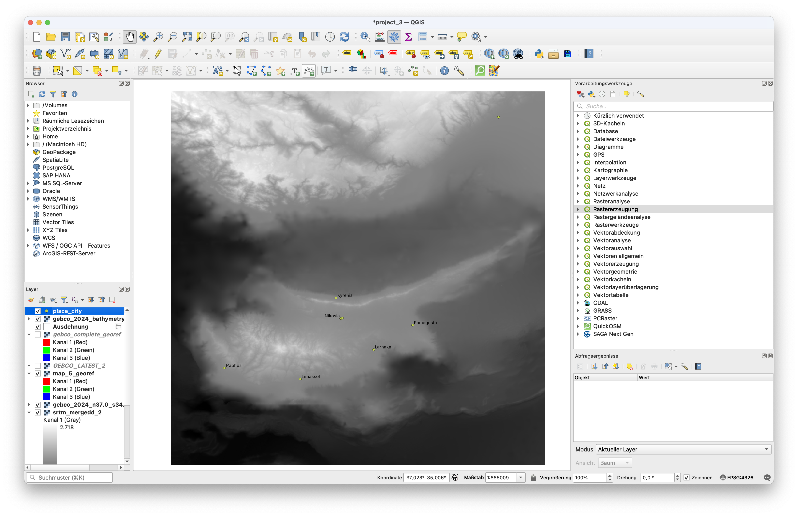
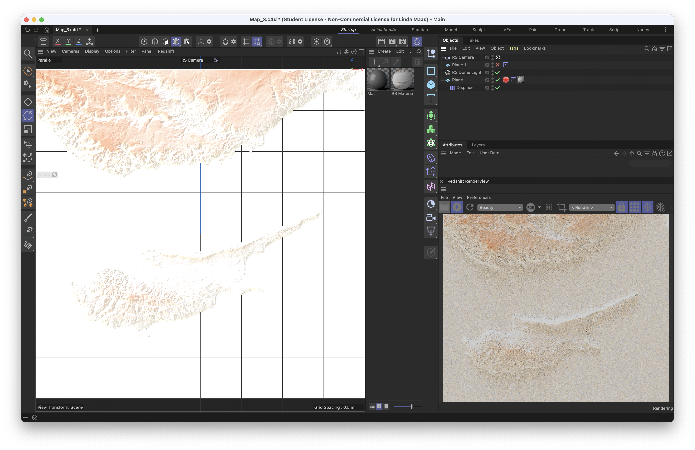
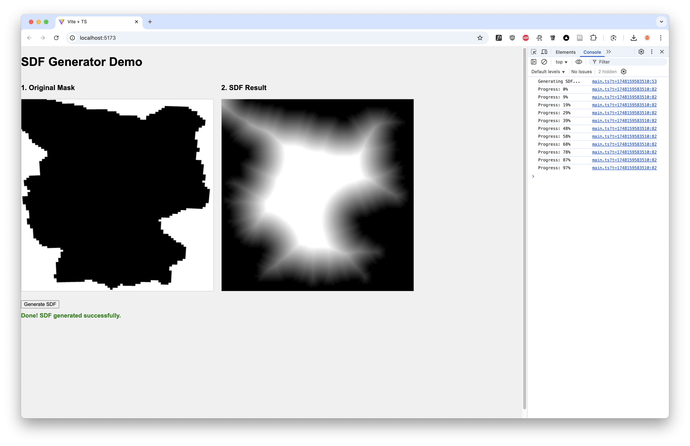
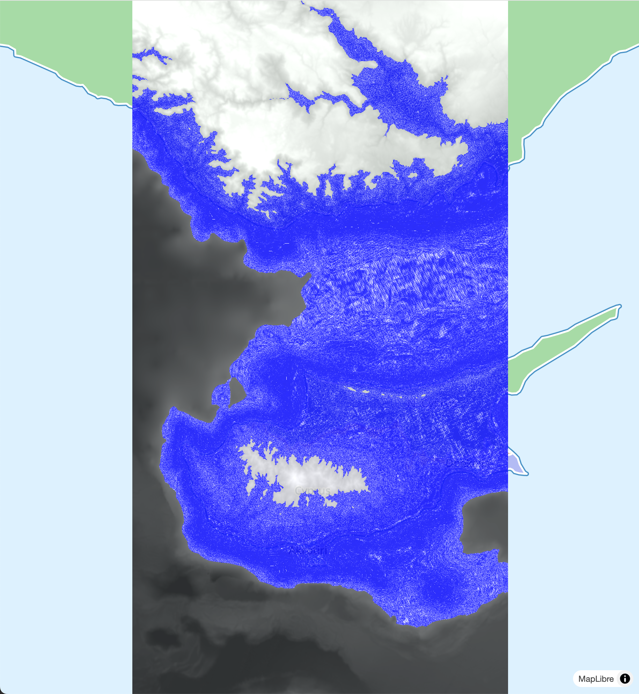
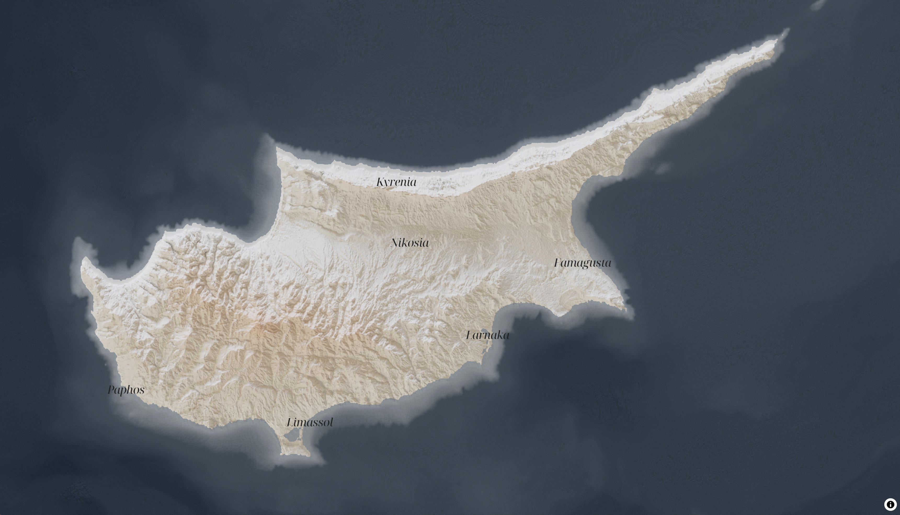

# Summary

For this project, I developed an animated water shader that can be integrated as a Custom Layer in MapLibre GL and simulates realistic water movements through procedural noise. The project combines various technologies: A DEM with bathymetry data was prepared in QGIS and rendered for an aesthetic basemap in Cinema 4D with Redshift, where the georeferencing had to be manually restored. The shader is based on a Shadertoy example but was extended to use the DEM for topography-adapted wave effects, transparency masking, and coastline definition. The implementation utilizes textures for elevation values and the correct transfer of the MapLibre projection matrix. The final result demonstrates the possibilities of custom WebGL shaders in web maps and offers a dynamic alternative to static map layers.

# Concept

I developed an animated water shader that can be embedded in map libraries like MapLibre for web applications. The shader uses noise to simulate *more realistic* wave movements and has adjustable parameters for various effects. The DEM (Digital Elevation Model) is used to adapt the noise and thus the wave movement to the topography. Additionally, the DEM is used for transparency to create a more varied, data-based visualization, and it defines the water edge where the shader should not be rendered on land areas. Through a timing variable, the water animation can be controlled. The layer thus provides variety to otherwise static map layers.

# Implementation

For the basemap, I took a DEM with bathymetry and prepared it in QGIS. Afterwards, I processed and rendered it in Cinema 4D with Redshift according to my preferences. The rendering naturally lost its georeferencing, which I then manually restored.

I also created an additional layer with city names in the region to make the map more *informative*. For this, the fonts would need to be converted to PBF format to be used in MapLibre.

To create the shader, I drew inspiration from a shader on Shadertoy that simulates similar wave movement. Additionally, I wanted to use transparency in the shader. Since I initially didn't think of simply using the DEM for this purpose, I first wanted to use a Signed Distance Field (SDF) to calculate the transparency. I created a test environment to simulate the SDF. However, this calculation was too intensive and not suitable for live map visualization. After that, I decided to use the DEM directly to calculate the transparency.

For the shader implementation, I integrated the [Shadertoy code](https://www.shadertoy.com/view/Mt2SzR) as a Custom Layer in MapLibre. This required transferring the MapLibre projection matrix to the shader to correctly transform world coordinates. The DEM is loaded as a 16-bit float texture, which delivers significantly better results than 8-bit textures, where hard edges occur during interpolation between different water depths. The `demValue` from the texture controls various shader parameters: wave strength through a `distortionFactor`, animation speed via a `speedMultiplier`, and transparency for the coastline. A limitation of MapLibre is that for water animation, the entire map must be re-rendered, not just the water layer itself. For this, I use `map.triggerRepaint()` in a `requestAnimationFrame` loop, which works but affects the performance of the entire map view.

Fragment Shader

<pre><code class="language-glsl">
#version 300 es
  precision highp float;

  uniform sampler2D u_dem_texture;
  uniform vec4 u_geo_bounds;
  uniform bool u_dem_loaded;
  uniform float u_time;

  in vec2 v_world_pos;
  out vec4 fragColor;

  float NOISE_SIZE = 0.0000008;
  float NOISE_SPEED = .00000004;

  vec3 COLOR1 = vec3(0.0824, 0.1373, 0.1686);
  vec3 COLOR2 = vec3(0.2, 0.251, 0.3922);

  float random(float x) {
      return fract(sin(x) * 43758.5453123);
  }

  float noise(vec2 p) {
      return fract(sin(dot(p, vec2(12.9898, 78.233))) * 43758.5453123);
  }

  vec2 sw(vec2 p) { return vec2(floor(p.x), floor(p.y)); }
  vec2 se(vec2 p) { return vec2(ceil(p.x), floor(p.y)); }
  vec2 nw(vec2 p) { return vec2(floor(p.x), ceil(p.y)); }
  vec2 ne(vec2 p) { return vec2(ceil(p.x), ceil(p.y)); }

  float smoothNoise(vec2 p) {
      vec2 interp = smoothstep(0.0, 1.0, fract(p));
      float s = mix(noise(sw(p)), noise(se(p)), interp.x);
      float n = mix(noise(nw(p)), noise(ne(p)), interp.x);
      return mix(s, n, interp.y);
  }

  float fractalNoise(vec2 p, float frequencyMultiplier) {
      const int OCTAVES = 3;
      const float BASE_FREQUENCY = 0.1;
      const float FREQUENCY_MULTIPLIER = 3.0;
      const float BASE_AMPLITUDE = 1.0;
      const float AMPLITUDE_DECAY = 0.7;
      const float NORMALIZATION = 3.333333;
      
      float result = 0.0;
      float amplitude = BASE_AMPLITUDE;
      float frequency = BASE_FREQUENCY * frequencyMultiplier;
      
      for(int i = 0; i < OCTAVES; i++) {
          result += smoothNoise(p * frequency) * amplitude;
          frequency *= FREQUENCY_MULTIPLIER;
          amplitude *= AMPLITUDE_DECAY;
      }
      
      return result / NORMALIZATION;
  }

  float map(float value, float min1, float max1, float min2, float max2) {
      return min2 + (value - min1) * (max2 - min2) / (max1 - min1);
  }

  void main() {
    vec2 normalizedCoord = (v_world_pos.xy - u_geo_bounds.xy) / (u_geo_bounds.zw - u_geo_bounds.xy);
    normalizedCoord.y = 1.0 - normalizedCoord.y;
    
    if (normalizedCoord.x < 0.0 || normalizedCoord.x > 1.0 || 
        normalizedCoord.y < 0.0 || normalizedCoord.y > 1.0) {
        fragColor = vec4(0.0, 0.0, 0.0, 0.0);
        return;
    }
    
    float demValue = 0.5;
    vec4 demSample = vec4(0.0);
    
    if (u_dem_loaded) {
        demSample = texture(u_dem_texture, normalizedCoord);
        if (demSample.a < 0.5) {
            fragColor = vec4(0.0, 0.0, 0.0, 0.0);
            return;
        }
        // 16-bit float textures, for better precision
        demValue = demSample.r;
    }
    
    float waterLevel = 0.56;
    float normalizedDemValue = map(demValue, 0., waterLevel, 1., 0.);

    float coastOpacity = map(demValue, waterLevel-0.05, waterLevel+0.1, 1., .0);
    float smoothedCoastOpacity = smoothstep(.0, 1., coastOpacity);
    float distortionFactor = normalizedDemValue * smoothedCoastOpacity;
    
    float refractionTime = u_time * 0.0008;
    
    vec2 wave1 = vec2(
        sin(normalizedCoord.y * 15.0 + refractionTime * 0.5) * 0.03,
        cos(normalizedCoord.x * 12.0 + refractionTime * 0.3) * 0.03
    );
    
    vec2 wave2 = vec2(
        sin(normalizedCoord.x * 25.0 - normalizedCoord.y * 20.0 + refractionTime) * 0.01,
        cos(normalizedCoord.y * 30.0 + normalizedCoord.x * 15.0 - refractionTime * 1.2) * 0.01
    );
    
    vec2 wave3 = vec2(
        sin(normalizedCoord.x * 40.0 + refractionTime * 2.0) * 0.005,
        cos(normalizedCoord.y * 45.0 - refractionTime * 1.8) * 0.005
    );
    

    vec2 totalDistortion = (wave1 + wave2 + wave3) * distortionFactor;
    
    vec2 distortedCoord = normalizedCoord + totalDistortion;
    
    if (u_dem_loaded) {
        demSample = texture(u_dem_texture, distortedCoord);
        if (demSample.a < 0.5) {
            fragColor = vec4(0.0, 0.0, 0.0, 0.0);
            return;
        }
        demValue = demSample.r;
    }
    
    float directionMultiplier = mix(-0.5, 0.5, normalizedDemValue);
    vec2 direction = normalize(vec2(directionMultiplier, directionMultiplier));
    
    // Speed multiplier based on DEM
    float speedMultiplier = mix(-1.5, .5, demValue);
    vec2 worldUV = v_world_pos + direction * u_time * NOISE_SPEED * speedMultiplier;
    
    // Size multiplier based on DEM
    float sizeMultiplier = mix(0.000011, 0.000012, normalizedDemValue);
    
    // Frequency multiplier based on DEM
    float freqMultiplier = 10.;//mix(-10., 10.0, normalizedDemValue);
    float noiseValue = fractalNoise(worldUV / sizeMultiplier, freqMultiplier);
    
    // bands based on depth
    float band = step(0., demValue) * step(demValue, waterLevel);
    
    float normalizedOpacity = map(demValue, 0., waterLevel, 1., 0.9);

    float opacity = exp(-demValue * 5.); 

    vec3 finalColor = mix(COLOR1, COLOR2, noiseValue);
    
    fragColor = vec4(finalColor,normalizedOpacity*smoothedCoastOpacity*band );
    //fragColor = vec4(demValue,demValue,demValue,1.);
}
</code></pre>

First version of the shader, without basemap and parameter fine-tuning.

# Results

## Video

https://github.com/user-attachments/assets/ff1f4ce1-823f-4eb5-9915-c30691f6afdb

## Source Code
Big files are not included in the folder, so the code can not be run directly.
[Go to Source Code](./final-project-vite)

# Project Reflection & Discussion

I think the final product turned out well and demonstrates how far you can push MapLibre with shaders. It also shows the limitations of libraries like MapLibre and Mapbox, which are not designed for shader animations. A professional workflow would be to use libraries like deck.gl, which are specifically developed for shader animations in maps.

# Lessons Learned

- Integration of shaders in map libraries like MapLibre
- Transferring the projection matrix from MapLibre to the shader
- Utilizing float textures for better precision
- Using textures for shader parameters
- Performance optimization for shader animations in maps
- Dealing with limitations of map libraries in shader animations
- Georeferencing of renderings
- Practice in implementing GLSL shaders
