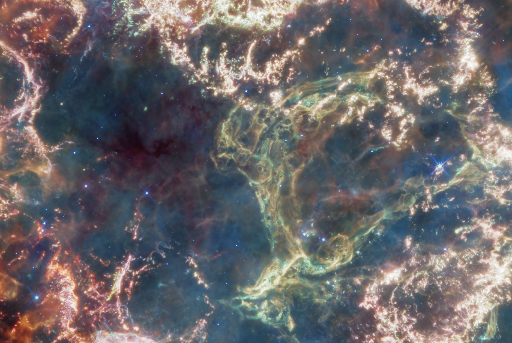

# Procedural Generation and Simulation

Prof. Dr. Lena Gieseke \| l.gieseke@filmuniversitaet.de   

---

  
[[Cassiopeia A; 2023, NASA, ESA, CSA]](https://webbtelescope.org/contents/media/images/2023/121/01GWQBBY77MHGFV3M3N63KDCEJ?itemsPerPage=100&page=1&filterUUID=91dfa083-c258-4f9f-bef1-8f40c26f4c97), [[Zoom into the image →]](https://webbtelescope.org/resource-gallery/images/zoomable-cassiopeia-a)

<!-- 
Cassiopeia A (Cas A) is a supernova remnant located about 11,000 light-years from Earth in the constellation Cassiopeia. It spans approximately 10 light-years. This new image uses data from Webb’s Mid-Infrared Instrument (MIRI) to reveal Cas A in a new light.
On the remnant’s exterior, particularly at the top and left, lie curtains of material appearing orange and red due to emission from warm dust. This marks where ejected material from the exploded star is ramming into surrounding circumstellar material. 
Interior to this outer shell lie mottled filaments of bright pink studded with clumps and knots. This represents material from the star itself, and likely shines due to a mix of various heavy elements and dust emission. The stellar material can also be seen as fainter wisps near the cavity’s interior.
A loop represented in green extends across the right side of the central cavity. Its shape and complexity are unexpected and challenging for scientists to understand.
This image combines various filters with the color red assigned to 25.5 microns (F2550W), orange-red to 21 microns (F2100W), orange to 18 microns (F1800W), yellow to 12.8 microns (F1280W), green to 11.3 microns (F1130W), cyan to 10 microns (F1000W), light blue to 7.7 microns (F770W), and blue to 5.6 microns (F560W). The data comes from general observer program 1947
.  
MIRI was contributed by NASA and ESA, with the instrument designed and built by a consortium of nationally funded European Institutes (the MIRI European Consortium) and NASA’s Jet Propulsion Laboratory, in partnership with the University of Arizona.
Zoomable image
IMAGE: NASA, ESA, CSA, Danny Milisavljevic (Purdue University), Tea Temim (Princeton University), Ilse De Looze (UGent)
IMAGE PROCESSING: Joseph DePasquale (STScI) 
 -->

## Syllabus

* [Procedural Generation and Simulation](#procedural-generation-and-simulation)
    * [Syllabus](#syllabus)
    * [Learning Objectives](#learning-objectives)
    * [Time and Place](#time-and-place)
    * [Topics](#topics)
    * [Method of Instruction](#method-of-instruction)
    * [Organisation](#organisation)
        * [Sessions](#sessions)
    * [Final Session](#final-session)
    * [Evaluation](#evaluation)
        * [Grading](#grading)
        * [Criteria](#criteria)
    * [Materials](#materials)
        * [Structure](#structure)
    * [Policies](#policies)
    * [Inclusivity Statement](#inclusivity-statement)
    * [Stress Culture](#stress-culture)

This course introduces participants to procedural and simulation algorithms for 2D and 3D graphics. Focus lies on the creation of patterns and abstracted aesthetics. Topics are reflected from all sides: their underlying formal theories, their practical implementations as well as their design. Different implementation frameworks can be used, however, the course focuses on Unreal Engine 5.

## Learning Objectives

* Overview about techniques and their capabilities
* Understanding of formal theories and algorithms
* Practical implementation experiences
* Implementation of specific design goals

## Time and Place

* Wednesdays, Thursdays, 10.00-13.30, room 6119
* 9 sessions
* 3 SWS, 4 ECTS (120h in total)
    * ~4h (36h in total) for each class
    * ~6h (36h in total) for each exercise
    * ~40h (= 5 working days) for the final project at the end of the semester

## Topics  

| Date   | Chapter | Title           | Topic           |
| ------ | ------- | --------------- | --------------- |
| 09.04. | **1**   | Introduction    | Topics          |
|        |         |                 | Tools           |
|        |         |                 | Abstraction     |
| 10.04. | **2**   | Beauty in Maths | Numbers         |
|        |         |                 | Formulas        |
| 16.04. | **3**   | Pattern         | Function Design |
| 17.04. | **4**   | Tilings         | Islamic Designs |
| 30.04. | **5**   | Noise           | Properties      |
|        |         |                 | Function        |
|        |         |                 | Cellular        |
| 07.05. | **6**   | Dynamics        | Forces          |
| 14.05. | **7**   | Agency          | Particles I     |
| 15.05. | **8**   | Complex Systems | Particles II    |
| 21.05. | **9**   |                 | tba             |
| 22.05. |         |                 |                 |

Please note that schedule and topics are under constant development and subject to change!

## Method of Instruction

The class is conducted as lectures with exercises. Exercises are given out weekly. The attendance of the lectures is not mandatory. However, I do not guarantee that all lecture content is given by the scripts and exercises. Also, you are responsible to stay up to date.

## Organisation

* Each class is an entity and refers to one topic.
* Each week one assignment (called session) is given out. The session covers two classes.
* You have to work through all tasks of the sessions on your own time.
* You need to upload the session's results by the given deadline. 
* I will allow a grace period for addressing issues on a case-by-case basis. However, for your submission to count, you have to have at least 50% of the points by the given deadline. 
* We will take a look at your submissions and wrap up the session after the deadline in the following class.

### Sessions

Unless stated otherwise:

* For each week, you have to submit something self-contained, as weekly sessions are not meant to be connected.
* A session concludes with the question about your own personal learnings and how you challenged yourself in that session. This question also receives points.
* You are allowed to work in groups for the practical tasks, but each group member has to submit its own learnings.
* You can submit session assignments up until **July 31st**. For submissions after the given deadline (usually the next class), I reduce **15% of the total points**. 

## Final Session

* The last session is mandatory to pass the class.
* For the final project there are approximately **40h** allocated, meaning five days of work.
* The project should refer to one of the lecture topics. You must come up with your own task.
* You can also base your project on a tutorial from the internet. The result of the tutorial will not be enough though, you have to develop the project somehow further and make it your own. 
* The result must be polished.
* The (hard) deadline for the final project is **July 31st**.
* The official work period for the final session is June 1st - July 31st. 
    * The deadline for the final project is strict and for a late submission, I reduce **15% of the total points**.
    * If you are sick within the official work period, you can get a deadline extension based on a doctor's note ("Attest").

## Evaluation

The requirements to pass the course are

* more than 50% of all assignment points, 
* less than two exercises with 0 points, and
* the final session, which is an individually chosen task.

There will be a grade.

### Grading

The grade is computed from the assignment points (50%) and the final exercise (50%).
  

### Criteria

As the exercises might be relatively open-ended problems, the grading criteria are based on

* your personal learnings,
* conceptual mastery and idea,
* the (e.g. visual) quality / the design,
* engineering effort, code organization, code quality, and
* the amount of work put in.

Some tasks might have specific grading criteria, which are then indicated per task.

## Materials

* All materials are handled through the GitHub repository `lecture_ss24_procedural_generation_and_simulation` and you also hand in your results through GitHub.
* I usually give clear instructions on where to save your files and how to name them. Please follow these instructions. Having everything neat and well structured will greatly improve my peace of mind.
* Usually all session materials are published the morning before the session. Some materials might be updated after the session. I will let you know of any relevant updates.

### Structure

Materials are structured as follows:

* In [`Sessions`](01_sessions) you find a [folder](01_sessions/01/) with an index for each week (session = week).
    * The [README.md](01_sessions/01_intro/README.md) in each session folder gives you an overview of all the readings, assignments, practical exercises, etc. that you have to do for that week - it is your todo list! I recommend to start your work with going through that file.
* In [`Scripts`](02_scripts) you find all scripts.
    * Scripts are organized by topic. This means that I might continuously add content to an existing script, e.g. the setup script, across multiple sessions.
    * Scripts might go more into detail and might add additional content to what has been discussed in class. It is always worth to have a look!
* In [`Slides`](03_slides) you find all slides. 
    * I am always updating the slides before the scripts and sometimes do not get around to work on the scripts. This means that on some occasions the script might not be in line with the slides and might contain content from the previous years. If in doubt, refer to the slides.
* In [`Submissions`](04_submissions) you submit your work each week to the folder with your last name and a folder with the session index. You will submit all assignments to the same folder (the one with your last name).
    * Please do not submit files larger than 25 MB. Upload large files, e.g., in an Owncloud folder. Follow the same folder naming scheme as in Github.

## Policies

* **Plagiarism**: in programming and in times of AI-tools, the concept of plagiarism is relatively elusive. We are working with open-source tools and libraries, building upon the work of a multitude of people. You are encouraged and expected to tap into resources available online, copy-paste and tweak code you may not fully understand. However, it is categorically forbidden to outsource work to people outside the course (e.g. your friend from CS) or copy & paste, meaning plagiarize, assignments as a whole from others. 
* **Tools and utilities**: In general, you are allowed to use any tools you want, also AI-tools, but you are required to list and briefly describe the usage of such tools in your submission. However, in this class, I recommend that you follow my guidance on when to employ the help of an AI-tool and when not. Please, always make sure to utilize such tools for supporting your learning! 
* **Absences**: you are responsible for what happens in class whether you are here or not. I do not repeat content for you that you have missed because you were not in class.
* **Participation**: you are invited, encouraged, and expected to engage actively in discussion, reflection and activities. Also, you can exist for a few hours without chatting, texting or emailing on your computer and cellphone. I notice it and perceive it as rude if you don't pay attention, and I prefer that you only come to class if you are actually participating. 
* **Recording**: There are no recordings of the classes. No student may record any classroom activity without consent from me. If you have a disability such that you think you need to record classroom activities, get in touch with me.

[*Adapted from P. Pedercini with permission.*]

## Inclusivity Statement

It is my intent that students from all diverse backgrounds and perspectives be well served by this course, and that the diversity that students bring to this class be viewed as a resource, strength and benefit.  

It is my intent to present activities that accommodate and value a diversity of gender, sexuality, disability, age, socioeconomic status, ethnicity, race, and culture. I will gladly honor your request to address you by your preferred name and gender pronoun. I commit to make individual arrangements to address disabilities or religious needs (e.g. religious events in conflict with class meetings and deadlines). Please advise me of these preferences and needs early in the semester so that I may make appropriate changes to my plans and records.  

Debate and free exchange of ideas is encouraged, but I will not tolerate harassment, i.e. a pattern of behavior directed against a particular individual with the intent of humiliating or intimidating.

[*Adapted from P. Pedercini with permission.*]

## Stress Culture

This class is demanding as I want you to further develop your skills, thinking and views of the world. This is hard. Also, as we are an interdisciplinary group, there is probably for each topic someone who you think is doing a much better job than you. Please focus on your own journey and trust the process.
  
Nevertheless, take care of yourself. All of us benefit from support during times of struggle. You are not alone. There are many helpful resources available at Filmuni, and an important part of the university experience is learning how to ask for help. If you or anyone you know experiences any unbearable academic stress, difficult life events, or feelings like anxiety or depression, I strongly encourage you to seek support. The Filmuni offers different [services and counseling](https://www.filmuniversitaet.de/en/university/counseling-services) for you. 

[*Adapted from P. Pedercini with permission.*]